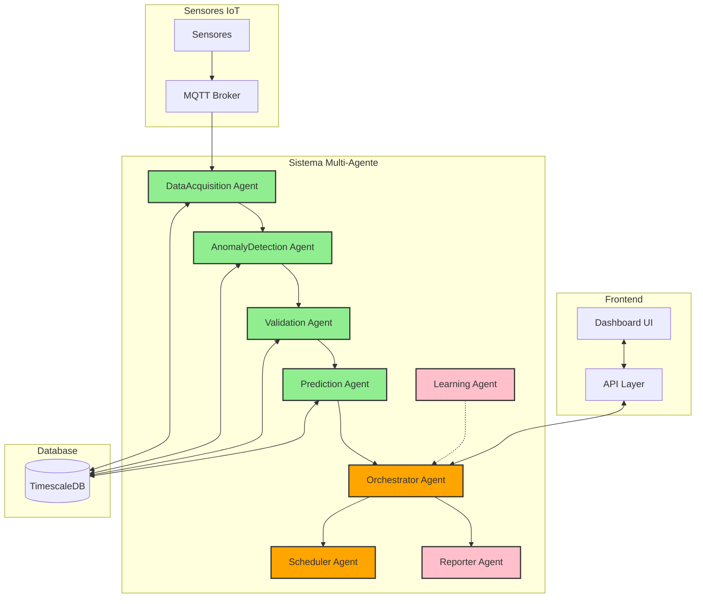

# Smart Maintenance SaaS

<h3>
    Uma Solução Vanguardista de Manutenção Preditiva Industrial Potencializada por Multi-Agentic AI Systems, MCP & A2A
</h3>

[Relatório Técnico](./system_documentation_and_architecture.md)

## 🎯 Sobre o Projeto

O **Smart Maintenance SaaS** é uma solução inovadora de manutenção preditiva para o setor industrial, desenvolvida como parte do desafio FIAP SP em parceria com a Hermes Reply. O projeto utiliza tecnologias avançadas de IoT, IA e análise de dados em tempo real para transformar a gestão de ativos industriais.

### 🚀 Backend Multi-Agente: Fundação Concluída

O core do projeto é um robusto **sistema multi-agente orientado a eventos** que fornece uma base sólida para ingestão de dados de sensores, detecção de anomalias, validação de alertas, previsão de falhas e orquestração de fluxos de trabalho de manutenção. A fase inicial de desenvolvimento (Fase 1) foi concluída com:

- **Arquitetura Completa**: Sistema orientado a eventos com comunicação assíncrona entre agentes
- **Agentes Core Implementados**: Aquisição de Dados, Detecção de Anomalias (ML + Estatística), Validação (Regras + Contexto Histórico), Predição (Prophet ML)
- **Pipeline Completo**: Da ingestão de dados até recomendações de manutenção preditiva
- **Framework de Testes**: 209/209 testes passando, incluindo testes unitários e de integração

[📝 Detalhes Técnicos do Backend](./smart-maintenance-saas/README.md)

## ⭐ Funcionalidades Principais

| Funcionalidade | Descrição | Status |
|---------------|-----------|--------|
| 🔍 **Monitoramento IoT** | Monitoramento contínuo e validação de dados de sensores via sistema de aquisição de dados | ✅ Implementado |
| 🤖 **ML Predictions** | Detecção de anomalias (dual-method) e previsão de falhas com Machine Learning (Isolation Forest + Prophet) | ✅ Implementado |
| 🛡️ **Validação Inteligente** | Validação avançada com ajuste de confiança baseado em regras e análise de contexto histórico | ✅ Implementado |
| ⚡ **Smart Scheduling** | Recomendações de manutenção baseadas em previsões de time-to-failure (implementação parcial) | 🔄 Parcial |
| 📊 **Analytics** | Dashboard interativo e relatórios inteligentes | 🔄 Em Progresso |
| ⚙️ **Multi-Agentic System** | Sistema multi-agente orquestrado com arquitetura escalável e comunicação evento-orientada | ✅ Framework Base Implementado |

## 🛠️ Stack Tecnológico

🌐 IoT e Edge Computing

- **ESP32** - Aquisição de dados em tempo real
- **MQTT** - Protocolo de comunicação leve e eficiente
- **Apache Kafka** - Streaming de dados escalável
- **AWS IoT Greengrass** - Processamento na borda otimizado

🧠 Backend (Sistema Multi-Agente)

- **Python 3.11+** - Linguagem moderna com suporte completo a async/await
- **FastAPI** - Framework web assíncrono de alta performance
- **Pydantic v2** - Validação de dados avançada e gerenciamento de configurações
- **SQLAlchemy 2.0** - ORM moderno com segurança de tipos
- **TimescaleDB** - Banco de dados otimizado para séries temporais
- **EventBus Customizado** - Comunicação assíncrona entre agentes
- **Prophet** - Previsões de time-to-failure e manutenção preditiva
- **Isolation Forest** - Detecção de anomalias não supervisionada
- **LangChain/CrewAI** - Framework para implementação de agentes (planejado)
- **MCP & A2A** - Comunicação inter-agêntica (planejado)

[🔗 Ver Stack Completa do Backend](./smart-maintenance-saas/README.md#tech-stack)

🎨 Frontend

- **Next.js** - Framework React moderno com SSR
- **TypeScript** - Desenvolvimento tipado e seguro
- **Tailwind CSS** - Design responsivo e customizável
- **D3.js** - Visualizações de dados interativas

💾 Banco de Dados

- **PostgreSQL/TimescaleDB** - Armazenamento otimizado para séries temporais
- **Amazon S3** - Data Lake escalável e durável

☁️ Infraestrutura Cloud

- **AWS Suite** - IoT Core, EC2, RDS, Lambda, SNS, ECS
- **Container Stack** - Docker + Kubernetes para orquestração

## 🏗️ Arquitetura

### Sistema Multi-Agente Especializado

| Agente | Responsabilidade | Tecnologias | Status |
|--------|-----------------|-------------|--------|
| 🔄 **DataAcquisition** | Aquisição de dados | Validação, Enriquecimento, EventBus | ✅ Completo |
| 🔍 **AnomalyDetection** | Detecção de anomalias | Isolation Forest, Estatística | ✅ Completo |
| ✅ **Validation** | Validação de anomalias | Regras, Análise de Contexto Histórico | ✅ Completo |
| 🔮 **Prediction** | Previsão de falhas | Prophet, Time-to-Failure | ✅ Completo |
| 🎯 **Orchestrator** | Coordenação de decisões | Event-driven Workflows, State Management | ✅ Completo |
| 📅 **Scheduler** | Agendamento de manutenções | MCP, Calendar Integration | 🔄 Em Progresso |
| 📊 **Reporter** | Geração de relatórios | NLP, Data Visualization | 🔄 Planejado |
| 🧠 **Learning** | Otimização contínua | RAG, Feedback Loop | 🔄 Planejado |

## 📊 Visão Geral da Arquitetura

**Legenda:**

- 🟢 Verde - Agentes implementados e testados
- 🟠 Laranja - Agentes em desenvolvimento
- 🔴 Rosa - Agentes planejados

Para uma arquitetura detalhada, consulte a [documentação completa](./system_documentation_and_architecture.md#23-diagrama-de-arquitetura-geral).

## 👥 Equipe

| Membro | Registro |
|--------|-----------|
| **Yan Pimentel Cotta** | RM: 562836 |

## 📊 Status do Projeto

| Fase | Status | Detalhe | Data |
|------|--------|---------|------|
| ✅ **Fase 1: Documentação e Fundação do Backend** | `Concluído` | Arquitetura, documentação e implementação dos agentes core | Maio 2025 |
| 🔄 **Fase 2: Expansão do Sistema Multi-Agente** | `Em Progresso` | Implementação dos agentes de orquestração e scheduling | Junho 2025 |
| 🔜 **Fase 3: Frontend e Integração** | `Planejado` | Desenvolvimento da interface e integração completa | Julho 2025 |

## 🔬 Métricas do Sistema

| Métrica | Valor | Detalhe |
|---------|-------|---------|
| 🧪 **Testes** | 209/209 | Testes unitários e de integração passando |
| ⚡ **Performance** | <5ms | Tempo de processamento por leitura de sensor |
| 🔄 **Agentes Completos** | 4/8 | Agentes core implementados e testados |
| 📊 **Cobertura** | >90% | Cobertura de código atual |

## 📜 Licença

Este projeto está licenciado sob a [Licença MIT](LICENSE) - veja o arquivo LICENSE para detalhes.

## 📚 Documentação

| Documento | Descrição | Link |
|-----------|-----------|------|
| **Arquitetura do Sistema** | Visão completa da arquitetura, stack e fluxos de dados | [📝 Documentação Técnica](./system_documentation_and_architecture.md) |
| **Documentação do Backend** | Detalhes técnicos do sistema multi-agente, API e banco de dados | [🔧 README do Backend](./smart-maintenance-saas/README.md) |
| **API Reference** | Especificação da API e endpoints disponíveis | [🔌 Documentação da API](./smart-maintenance-saas/docs/api.md) |

Para informações detalhadas sobre a arquitetura e implementação técnica, consulte nossa [Documentação Completa](./system_documentation_and_architecture.md).

---

**Data de Entrega:** `08 de Maio de 2025` | **Versão:** `1.3`
