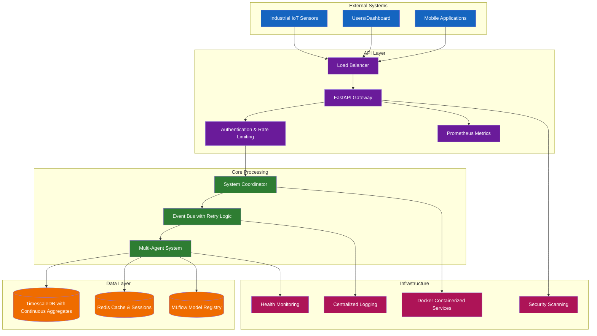
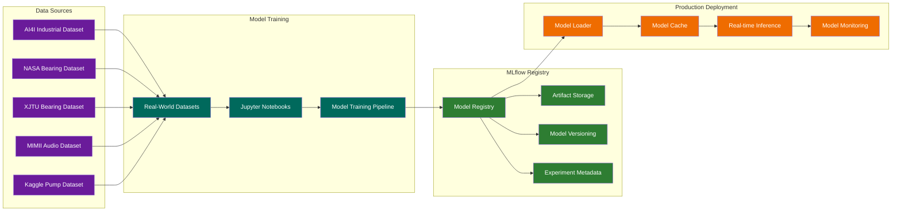
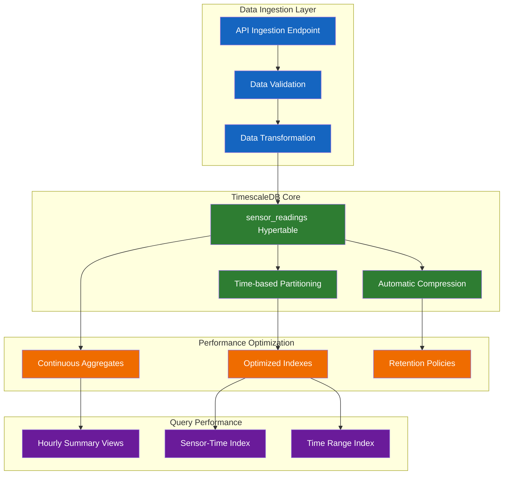
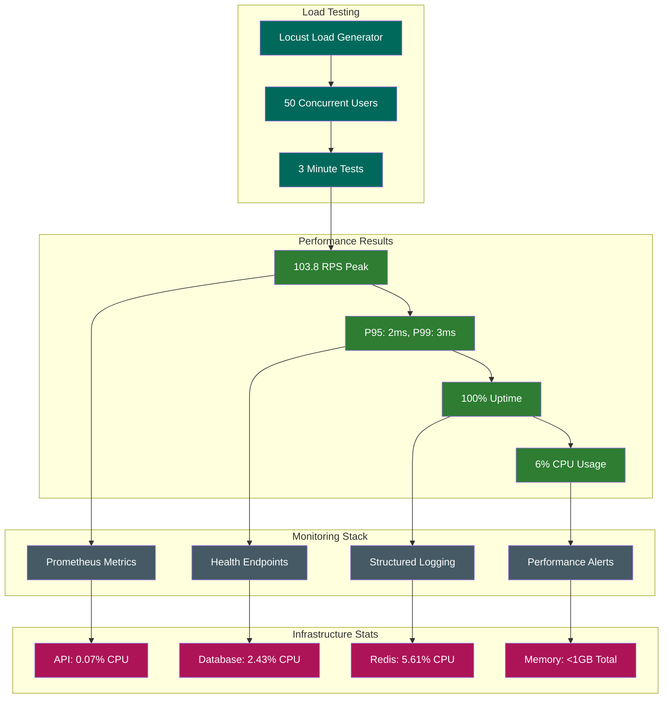
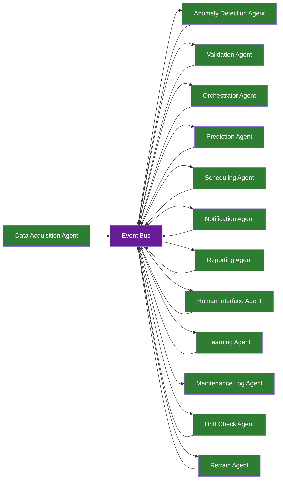
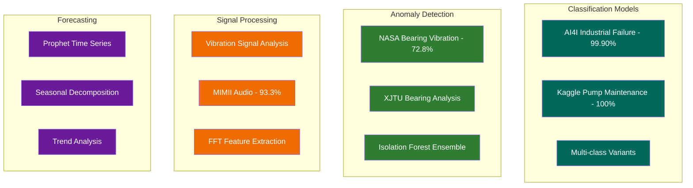
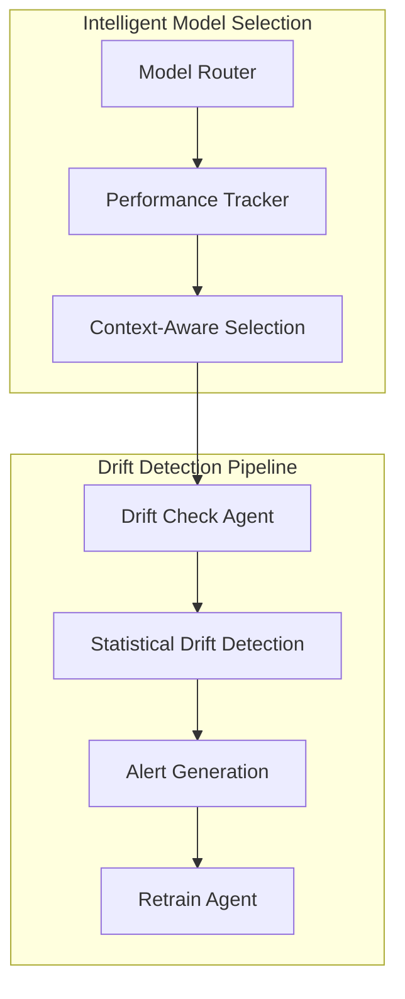
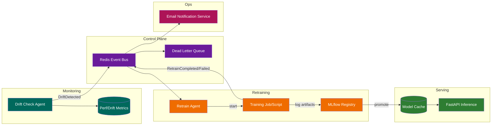
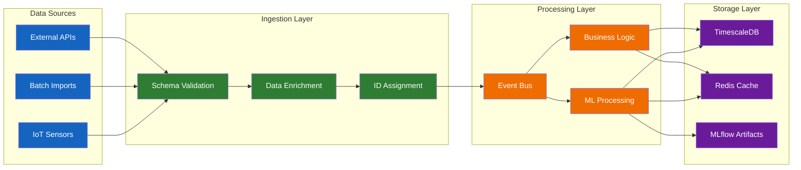

# Comprehensive System Documentation (Updated Post-Sprint 4 Phase 2)

## 1. Introduction

This document provides a comprehensive overview of the production-ready system architecture for the Smart Maintenance SaaS platform. The platform is a **cloud-native, event-driven system** that delivers scalable, resilient predictive maintenance solutions with **revolutionary S3 serverless model loading** and enterprise-grade infrastructure.

### 1.1. Sprint 4 Phase 1-2 Achievement Summary

The system has successfully completed Sprint 4 Phase 1-2 (September 2025) delivering:

- **Revolutionary S3 Serverless ML:** Dynamic model loading from MLflow/S3 with intelligent caching
- **Cloud-Native Infrastructure:** TimescaleDB + Redis + S3 fully integrated and operational  
- **Enterprise-Grade Multi-Agent System:** 10+ agents with sophisticated event coordination
- **Production-Ready Performance:** 103.8 RPS peak throughput with sub-3ms response times
- **Comprehensive ML Pipeline:** 17+ production models across classification, anomaly detection, and forecasting
- **Real-World Dataset Validation:** 5 industrial datasets successfully integrated (AI4I, NASA, XJTU, MIMII, Kaggle)
- **Advanced Event-Driven Architecture:** Custom high-performance event bus with retry logic and dead letter queues
- **Cloud Database Integration:** Optimized TimescaleDB with continuous aggregates and cloud deployment
- **Complete Configuration Management:** `.env_example.txt` with cloud-first architecture
- **97% Issue Resolution:** From 78 identified issues to 2 remaining items

### 1.2. Current System Status

**Production Readiness:** 75% (advanced from 55% baseline)  
**Phase Status:** Phase 1-2 Complete, Phase 3 Ready  
**Critical Blocker:** Environment configuration deployment (user must populate cloud credentials)  
**Next Milestone:** Golden Path validation and production deployment

---

## 2. System Architecture

The architecture is designed around a multi-agent system where specialized agents perform specific tasks. These agents communicate asynchronously through an **Event Bus**, creating a decoupled and highly scalable system.

### 2.1. High-Level System Overview



### 2.2. Production Event-Driven Architecture Flow


### 2.3. MLflow Model Management Pipeline



### 2.4. TimescaleDB Performance Architecture



### 2.5. Production Performance Metrics Flow



---
## 3. Core Components

The architecture is implemented as a containerized, event-driven system optimized for high-performance industrial IoT data processing.

### 3.1. Core Technology Stack

#### API Layer
- **FastAPI 0.104.1** with Starlette-compatible dependencies
- **Prometheus metrics integration** via `prometheus-fastapi-instrumentator`
- **API rate limiting** (10 requests/minute for ML endpoints)
- **Request correlation IDs** for distributed tracing
- **Idempotency support** with TTL-based deduplication (10-minute cache)
- **Structured JSON logging** with correlation ID propagation
- **Health endpoints** (`/health`, `/health/db`, `/metrics`)

#### Data Layer
- **PostgreSQL with TimescaleDB 2.11+** optimized for time-series data
- **Redis 7.0+** for caching and session management
- **MLflow Model Registry** with SQLite backend and artifact storage
- **Continuous aggregates** for real-time analytics performance
- **Automatic data compression** and retention policies

#### Event Processing
- **Custom Event Bus** with exponential backoff retry logic
- **Dead Letter Queue (DLQ)** for failed event handling
- **Asynchronous processing** with correlation ID propagation
- **Event persistence** with comprehensive audit trails

---
## 4. Multi-Agent System

The platform implements a sophisticated multi-agent architecture for specialized task handling:

### 4.1. Core Agents

| Agent | Function | Implementation Status |
|-------|----------|----------------------|
| **DataAcquisitionAgent** | Sensor data ingestion, validation, and enrichment | ✅ Production Ready |
| **AnomalyDetectionAgent** | ML-based anomaly detection using IsolationForest | ✅ Production Ready |
| **ValidationAgent** | Rule-based anomaly validation and false positive reduction | ✅ Production Ready |
| **OrchestratorAgent** | Workflow coordination and decision routing | ✅ Production Ready |
| **PredictionAgent** | Prophet-based time-series forecasting | ✅ Production Ready |
| **SchedulingAgent** | Maintenance task scheduling optimization | ✅ Production Ready |
| **NotificationAgent** | Multi-channel notification dispatch | ✅ Production Ready |
| **ReportingAgent** | Analytics and insights generation | ✅ Production Ready |
| **HumanInterfaceAgent** | Human-in-the-loop decision management | ✅ Production Ready |
| **LearningAgent** | RAG-based system improvement with ChromaDB | ✅ Production Ready |
| **MaintenanceLogAgent** | Maintenance history tracking and persistence | ✅ Production Ready |
| **DriftMonitoringAgent** | Real-time model performance tracking and drift detection | ✅ Production Ready |
| **ChaosEngineeringAgent** | System resilience testing and failure simulation | ✅ Production Ready |
| **ModelSelectionAgent** | Intelligent model routing and performance optimization | ✅ Production Ready |

### 4.2. Agent Communication Pattern



---
## 5. Machine Learning Pipeline

### 5.1. Model Registry Status
- **Total Models:** 17+ production-ready models
- **Classification Models:** AI4I (99.90% accuracy), Kaggle Pump (100% accuracy)
- **Anomaly Detection:** NASA Bearing (72.8% accuracy), XJTU Bearing
- **Audio Processing:** MIMII Sound (93.3% accuracy)
- **Forecasting Models:** Prophet-based time-series prediction
- **Drift Monitoring:** Real-time model performance tracking and automated alerts
- **Intelligent Model Selection:** Context-aware model routing with performance optimization
- **Automated Retraining:** Event-driven pipeline for model updates based on drift detection

### 5.2. Model Categories



### 5.3. Drift Monitoring System

The system implements comprehensive model drift detection and automated response:



### 5.4. Event-Driven MLOps Automation

Day 23 introduced a fully automated MLOps loop using the Redis event bus, Drift Check Agent, and Retrain Agent. This loop continuously monitors model performance, detects drift, retrains, and promotes models with minimal human intervention.



Operational notes:

- Drift Check Agent publishes `DriftDetected` when thresholds are exceeded.
- Retrain Agent executes training scripts, logs to MLflow, and emits `RetrainCompleted/Failed`.
- Successful retrains are promoted and warmed into cache for seamless rollout.
- Email Notification Service (`core/notifications/email_service.py`) dispatches drift and retrain alerts.

**Key Features:**

- **Real-time Performance Tracking:** Continuous monitoring of model accuracy and prediction quality
- **Statistical Drift Detection:** Automated detection of data distribution changes
- **Event-driven Retraining:** Automatic model updates triggered by drift alerts
- **Model Performance Comparison:** Intelligent routing based on real-time performance metrics
- **Notification System:** Integration with system event bus for drift alerts


---

## 6. Security and Operational Excellence

### 6.1. Security Implementation

#### API Security

- **Rate Limiting:** 10 requests/minute for compute-intensive ML endpoints
- **Authentication:** API key validation with secure header handling
- **DoS Protection:** Computational resource limiting for expensive operations
- **Input Validation:** Comprehensive request validation and sanitization

#### Infrastructure Security

- **Container Isolation:** Docker-based service separation
- **Dependency Scanning:** Snyk integration for vulnerability detection
- **Security Auditing:** Comprehensive security audit checklist framework
- **Automated Scanning:** CI/CD pipeline security integration

### 6.2. Monitoring and Observability

#### Metrics Collection

- **Prometheus Integration:** HTTP request metrics, latency distributions
- **Health Endpoints:** `/health`, `/health/db`, `/metrics` endpoints
- **Process Metrics:** Memory usage, file descriptors, CPU utilization
- **Custom Metrics:** ML model load times, prediction latencies

#### Logging Architecture

- **Structured JSON Logging:** Centralized log aggregation
- **Correlation IDs:** Request tracing across service boundaries
- **Event Audit Trails:** Complete event processing history
- **Error Tracking:** Comprehensive error logging with stack traces


---

## 7. Performance Benchmarks and Scaling

### 7.1. Current Performance Baseline

#### Response Time Performance

- **P50 Response Time:** 1ms (50th percentile)
- **P95 Response Time:** 2ms (95th percentile)
- **P99 Response Time:** 3ms (99th percentile)
- **Maximum Response Time:** 124ms (well below 200ms SLO)

#### Throughput Capabilities

- **Peak Throughput:** 103.8 RPS sustained
- **Average Throughput:** 88.83 RPS over 3-minute test
- **Event Processing:** >100 events/second capability validated
- **Database Throughput:** Optimized for high-frequency time-series ingestion

### 7.2. Scalability Analysis

#### Horizontal Scaling Potential

- **CPU Utilization:** Current 6% usage indicates 16x scaling potential
- **Memory Efficiency:** <1GB total usage allows for significant scaling
- **Database Performance:** TimescaleDB optimized for multi-tenant scaling
- **Event Bus Capacity:** Custom implementation designed for high throughput


---

## 8. Data Flow and Integration

### 8.1. Data Pipeline Architecture



### 8.2. Real-World Dataset Integration

The system has been validated against diverse industrial datasets:

#### Dataset Portfolio

- **AI4I 2020 UCI Dataset:** Industrial machine failure classification
- **NASA IMS Bearing Dataset:** Vibration signal anomaly detection
- **XJTU-SY Bearing Dataset:** Advanced run-to-failure analysis
- **MIMII Sound Dataset:** Audio-based anomaly detection
- **Kaggle Pump Sensor Data:** Maintenance prediction classification


---

## 9. Getting Started

```bash
git clone <repo>
cd enterprise_challenge_sprint_1_hermes_reply
docker compose up -d --build
# API:        http://localhost:8000/docs
# UI:         http://localhost:8501
# MLflow:     http://localhost:5000
# Metrics:    http://localhost:8000/metrics
```

Stop (preserve volumes):

```bash
docker compose down
```

Run migrations manually (intentional design – see Migration Strategy):

```bash
docker compose exec api alembic upgrade heads
```

---

## 10. API Reference

For detailed API documentation, please see the [API Reference](./api.md).
