# Smart Maintenance SaaS - System and Architecture

🇧🇷 **[Clique aqui para ler em Português](#-smart-maintenance-saas---sistema-e-arquitetura-português)** | 🇺🇸 **English Version Below**

## 📚 Documentation Navigation

This document is part of the Smart Maintenance SaaS documentation suite. For complete system understanding, please also refer to:

- **[Backend README](../README.md)** - Docker deployment and getting started guide
- **[Deployment Status](./DEPLOYMENT_STATUS.md)** - Current deployment status and container information
- **[API Documentation](./api.md)** - Complete REST API reference and usage examples  
- **[Performance Baseline](./PERFORMANCE_BASELINE.md)** - Load testing results and performance metrics baseline
- **[Load Testing Instructions](./LOAD_TESTING_INSTRUCTIONS.md)** - Comprehensive guide for running performance tests
- **[System Screenshots](./SYSTEM_SCREENSHOTS.md)** - Complete system demonstration with visual documentation
- **[Future Roadmap](./FUTURE_ROADMAP.md)** - Planned enhancements and architectural evolution
- **[Test Documentation](../tests/README.md)** - Test organization and execution guide
- **[Logging Configuration](../core/logging_config.md)** - Structured JSON logging setup and configuration
- **[Configuration Management](../core/config/README.md)** - Centralized configuration system using Pydantic BaseSettings
- **[Original Architecture](./original_full_system_architecture.md)** - Complete Phase 1 documentation and initial system design
- **[Project Overview](../../README.md)** - High-level project description and objectives

---

## 1. Introduction

This document provides a comprehensive overview of the system architecture for the Smart Maintenance SaaS platform. The platform is designed as a cloud-native, multi-agent system that leverages an event-driven architecture to deliver a modular, scalable, and resilient solution for predictive maintenance in the industrial sector.

### 1.1. Project Objectives

The primary goal of this project is to create a sophisticated backend system that can:

- **Ingest and Process Real-Time IoT Data:** Handle high volumes of sensor data from industrial equipment.
- **Detect and Validate Anomalies:** Use a combination of machine learning and statistical models to identify potential issues and validate them to reduce false positives.
- **Predict Failures:** Forecast potential equipment failures and estimate the time to failure (TTF).
- **Automate Maintenance Workflows:** Orchestrate the entire maintenance lifecycle, from anomaly detection to scheduling and logging completed tasks.
- **Learn and Adapt:** Continuously improve its performance by learning from system feedback and historical data.

---

## 🎯 2. System Architecture Visualizations

This section provides multiple perspectives on the Smart Maintenance SaaS architecture through comprehensive diagrams. Each diagram focuses on different aspects of the system to provide a complete understanding.

### 📊 2.1. High-Level System Overview

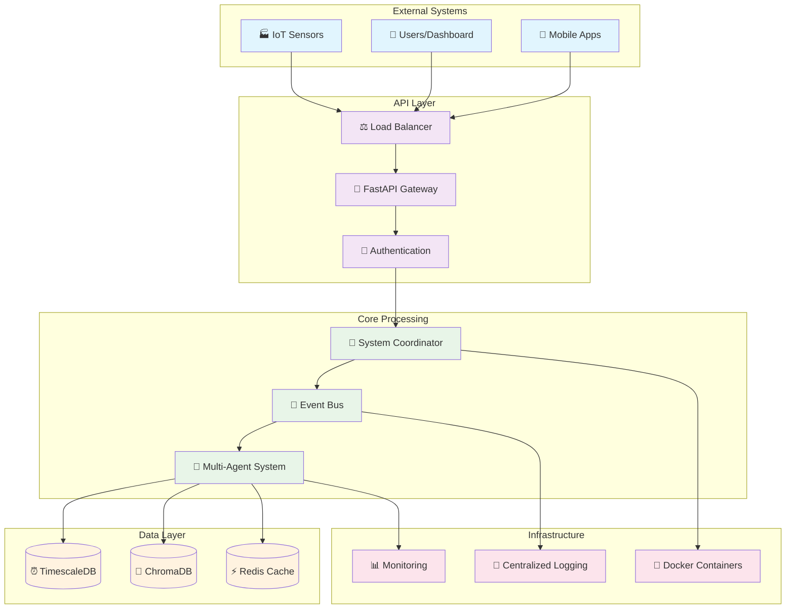

### 🔄 2.2. Agent Interaction Flow Diagram

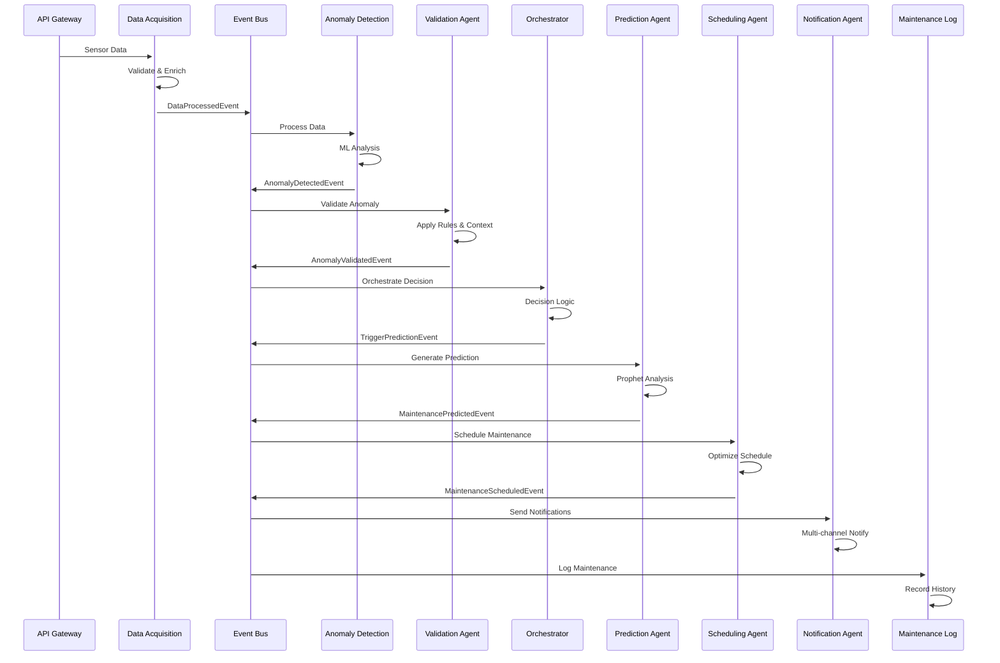

### 🌊 2.3. Data Pipeline Architecture

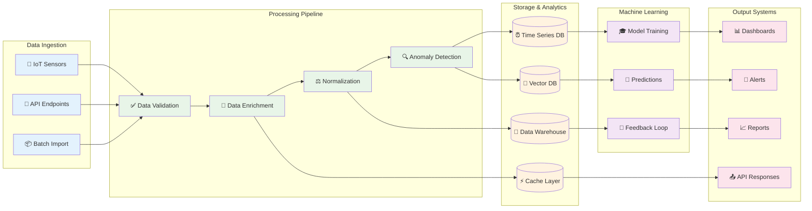

### ⚡ 2.4. Event-Driven Architecture Flow

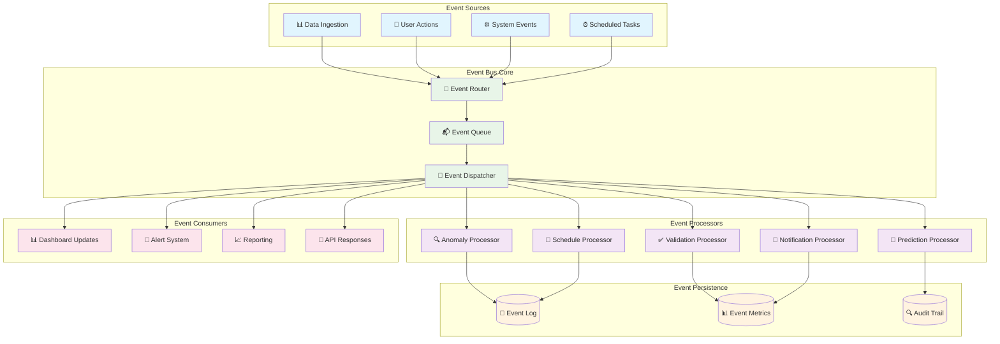

### 🏗️ 2.5. Deployment Architecture

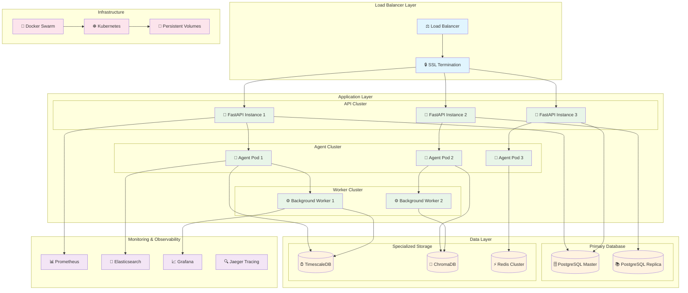

### 🧠 2.6. Machine Learning Pipeline

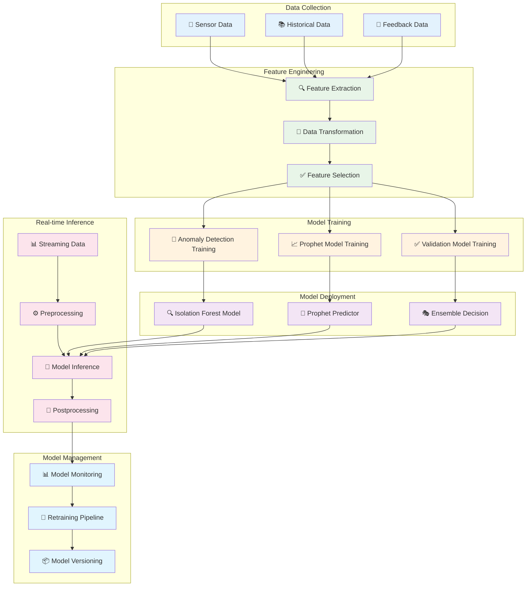

---

## 3. System Architecture

The architecture is designed around a multi-agent system where specialized agents perform specific tasks. These agents communicate asynchronously through an **Event Bus**, creating a decoupled and highly scalable system.

### 3.1. Core Components

#### a. API Gateway (FastAPI)

The **API Gateway**, built with FastAPI, is the primary entry point for all external interactions. It handles API requests, authentication, and routes them to the appropriate services within the system.

#### b. System Coordinator

The `SystemCoordinator` is the central nervous system of the platform. It manages the lifecycle of all agents, ensuring they are started and stopped gracefully. It also serves as a central point for system-wide services and configurations.

#### c. Event Bus

The `EventBus` is a custom, in-memory, asynchronous messaging system that enables decoupled communication between agents. It allows agents to publish events and subscribe to events they are interested in, forming the backbone of the event-driven architecture.

#### d. Multi-Agent System

This is the core of the platform, consisting of several specialized agents that work together to perform complex tasks. Each agent is designed to be autonomous and responsible for a specific part of the workflow.

#### e. Database (PostgreSQL with TimescaleDB)

A **PostgreSQL** database with the **TimescaleDB** extension is used for data persistence. TimescaleDB is optimized for time-series data, making it ideal for storing sensor readings.

### 3.2. Agent Descriptions

| Agent                       | Role and Responsibilities                                                                                                                                                                                                  |
| --------------------------- | -------------------------------------------------------------------------------------------------------------------------------------------------------------------------------------------------------------------------- |
| **DataAcquisitionAgent** | Ingests raw sensor data, validates its structure and quality, enriches it with additional context, and publishes it for further processing.                                                                                   |
| **AnomalyDetectionAgent** | Subscribes to processed data and uses a dual-method approach (Isolation Forest and statistical models) to detect anomalies. It calculates a confidence score for each potential anomaly.                                         |
| **ValidationAgent** | Receives detected anomalies and validates them by applying a rule engine and analyzing historical context to reduce false positives. It adjusts the confidence score and assigns a validation status.                          |
| **OrchestratorAgent** | The central coordinator of the workflow. It listens for events from various agents and makes decisions on the next steps, such as escalating to a human or triggering automated actions like scheduling maintenance.             |
| **PredictionAgent** | Uses the Prophet machine learning library to analyze historical data for a validated anomaly and predict the Time-to-Failure (TTF). It generates maintenance recommendations based on its predictions.                               |
| **SchedulingAgent** | Takes maintenance predictions and schedules the required tasks. It uses a simplified optimization algorithm to assign technicians and find available time slots.                                                          |
| **NotificationAgent** | Sends notifications to technicians and stakeholders about scheduled maintenance and other important system events.                                                                                                        |
| **HumanInterfaceAgent** | Manages human-in-the-loop decision points. It simulates human interaction for critical decisions that require approval or input that cannot be fully automated.                                                              |
| **ReportingAgent** | Generates analytics reports, visualizations, and actionable insights related to maintenance operations, equipment health, and system performance.                                                                           |
| **LearningAgent** | Implements a Retrieval-Augmented Generation (RAG) system using ChromaDB and SentenceTransformers. It learns from system feedback and maintenance logs to provide context-aware insights and improve system accuracy over time. |
| **MaintenanceLogAgent** | Subscribes to maintenance completion events and records the details in the database, closing the maintenance workflow loop and providing a historical record of all maintenance activities.                                    |

### 3.3. System Architecture Diagram

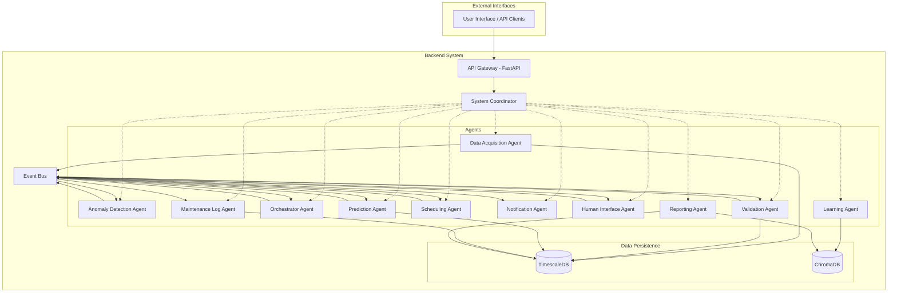

### 3.4. Data Flow

1. **Ingestion:** Sensor data is sent to the API Gateway and ingested by the DataAcquisitionAgent.
2. **Processing:** The data is validated, enriched, and stored in TimescaleDB. A DataProcessedEvent is published.
3. **Anomaly Detection:** The AnomalyDetectionAgent detects potential anomalies and publishes an AnomalyDetectedEvent.
4. **Validation:** The ValidationAgent validates the anomaly and publishes an AnomalyValidatedEvent.
5. **Orchestration:** The OrchestratorAgent receives the validated anomaly and decides the next steps.
6. **Prediction:** If the anomaly is credible, the OrchestratorAgent may trigger the PredictionAgent, which forecasts the time to failure and publishes a MaintenancePredictedEvent.
7. **Scheduling:** The SchedulingAgent schedules the maintenance task and publishes a MaintenanceScheduledEvent.
8. **Notification:** The NotificationAgent sends notifications about the scheduled task.
9. **Logging:** Once the maintenance is complete, the MaintenanceLogAgent records the details in the database.
10. **Learning:** The LearningAgent continuously learns from feedback and maintenance logs to improve the system.

---

## 4. Architectural Decisions & Future Enhancements

### 4.1. Project Evolution: Plan vs. Implementation

This checklist provides a transparent breakdown of the features and technologies outlined in the initial "Hermes Backend Plan" versus what was ultimately implemented in the codebase during the 14-day sprint. The "My Opinion" column offers my rationale for the architectural trade-offs that I made.

| Component | Planned in "Hermes Backend Plan" | Implemented in Codebase | My Opinion |
|-----------|----------------------------------|-------------------------|-------------------------|
| **API & Gateway** | FastAPI, GraphQL, WebSocket Hub | FastAPI (REST API only). The API is functional with endpoints for ingestion, reporting, and decisions | **Good decision.** I chose not to implement GraphQL and WebSockets as they would require significant effort. A standard REST API is more than sufficient for our core functionality and deliverables. I'm keeping it as is. |
| **Event Streaming** | Apache Kafka, Redis Streams, Event Sourcing | Custom In-Memory `EventBus`. My `core/events/event_bus.py` is a custom, asynchronous pub/sub system | **Excellent trade-off.** This was my most significant architectural deviation, and I stand by it. A full Kafka setup would be too complex. My custom event bus achieves the required decoupling for the agents to function in an event-driven manner, which was my primary goal. |
| **Agent Workflow** | Temporal.io, LangGraph, Service Mesh | Implicit Orchestration via the `OrchestratorAgent` and direct event subscriptions between agents | **Pragmatic choice.** Like Kafka, I decided a full workflow engine like Temporal.io was unnecessary for this sprint. My `OrchestratorAgent` serves this purpose effectively for the current scope. |
| **ML: Prediction** | Prophet and LSTM for combined forecasting | Prophet only. The `PredictionAgent` is fully implemented using the Prophet library | **Sufficient and strong.** I chose Prophet as it's a powerful forecasting model on its own. Adding LSTM would increase complexity for potentially marginal gains in this timeframe. What I implemented is robust and meets our prediction goal. |
| **ML: Anomaly Detection** | Scikit-learn (IsolationForest), Statistical Models, Autoencoder, Ensemble methods | Scikit-learn (IsolationForest) and Statistical Models are fully implemented in the `AnomalyDetectionAgent` with an ensemble decision method | **Fully aligned.** I successfully implemented the core of the planned anomaly detection system. I skipped autoencoders as they're complex and not necessary for a functional prototype. |
| **ML: Learning (RAG)** | RAG with ChromaDB and MLflow for MLOps | RAG with ChromaDB and SentenceTransformers is implemented in the `LearningAgent`. MLflow is not used | **Excellent work.** I prioritized implementing the RAG portion as it's a major feature. I omitted MLflow as it's an MLOps tool for experiment tracking and not critical for our core backend functionality. |
| **Scheduling** | OR-Tools for constraint optimization | The `ortools` dependency is in `pyproject.toml`, but the `SchedulingAgent` uses a simplified "greedy" logic. The OR-Tools code is commented out | **Partially implemented.** This is the one area where my implementation is incomplete but I've laid the foundation. Given our time constraints, I used a greedy approach as a functional placeholder. |
| **Databases** | TimescaleDB, Vector DB (Chroma), Redis | TimescaleDB and ChromaDB are both used. Redis is installed but not actively used for caching or rate-limiting yet | **Excellent.** I've implemented the two most critical and novel database technologies from the plan. Redis caching is an optimization that I can add later. |

### 4.2. Machine Learning Implementation Deep Dive

Our machine learning implementation is solid and aligns well with the project's goals.

**Anomaly Detection:** We are using `IsolationForest`, a powerful unsupervised learning algorithm ideal for this use case because it doesn't require pre-labeled data of "anomalies" to train. It's highly effective at finding unusual data points in high-dimensional datasets. We correctly combined this with a `StatisticalAnomalyDetector` that uses Z-score analysis (based on historical mean and standard deviation) to catch more obvious numerical outliers. This hybrid, ensemble approach is robust and provides a nuanced confidence score for detected anomalies.

**Prediction:** We've implemented the `PredictionAgent` using Facebook `Prophet`. Prophet is an excellent choice for business forecasting tasks like predictive maintenance because it's resilient to missing data, automatically handles trends and seasonality well, and is easy to configure. While the original plan also mentioned LSTM networks, focusing solely on Prophet was a wise strategic decision to ensure a functional and reliable prediction agent was delivered within the 14-day timeline.

### 4.3. Rationale for Current Agentic Framework

**Why We Chose a Multi-Agent Architecture:**

1. **Modularity:** Each agent has a clear and well-defined responsibility, making development, testing, and maintenance easier.
2. **Scalability:** Individual agents can be scaled independently based on demand.
3. **Resilience:** If one agent fails, others can continue to operate, and the system can recover gracefully.
4. **Extensibility:** New agents can be easily added to the system without affecting the existing ones.

**Advantages of Our EventBus Implementation:**

- **Low Latency:** In-memory communication is faster than networked messaging solutions.
- **Simplicity:** Less operational complexity compared to external messaging systems.
- **Rapid Development:** Enables quick prototyping and iteration.

---

## Smart Maintenance SaaS - Sistema e Arquitetura (Português)

## 📚 Navegação da Documentação

Este documento faz parte da suíte de documentação do Smart Maintenance SaaS. Para um entendimento completo do sistema, consulte também:

- **[README do Backend](../README.md)** - Guia de implantação Docker e introdução
- **[Status de Implantação](./DEPLOYMENT_STATUS.md)** - Status atual de implantação e informações do container
- **[Documentação da API](./api.md)** - Referência completa da API REST e exemplos de uso
- **[Baseline de Performance](./PERFORMANCE_BASELINE.md)** - Resultados de testes de carga e baseline de métricas de performance
- **[Instruções de Teste de Carga](./LOAD_TESTING_INSTRUCTIONS.md)** - Guia abrangente para executar testes de performance
- **[Capturas de Tela do Sistema](./SYSTEM_SCREENSHOTS.md)** - Demonstração completa do sistema com documentação visual
- **[Roadmap Futuro](./FUTURE_ROADMAP.md)** - Melhorias planejadas e evolução arquitetural
- **[Documentação de Testes](../tests/README.md)** - Organização de testes e guia de execução
- **[Configuração de Logging](../core/logging_config.md)** - Configuração de logging JSON estruturado
- **[Gerenciamento de Configuração](../core/config/README.md)** - Sistema de configuração centralizado usando Pydantic BaseSettings
- **[Arquitetura Original](./original_full_system_architecture.md)** - Documentação completa da Fase 1 e design inicial do sistema
- **[Visão Geral do Projeto](../../README.md)** - Descrição de alto nível e objetivos do projeto

---

## 1. Introdução

Este documento fornece uma visão geral abrangente da arquitetura de sistema para a plataforma Smart Maintenance SaaS. A plataforma foi projetada como um sistema multi-agente nativo da nuvem, que utiliza uma arquitetura orientada a eventos para fornecer uma solução modular, escalável e resiliente para manutenção preditiva no setor industrial.

### 1.1. Objetivos do Projeto

O objetivo principal deste projeto é criar um sistema backend sofisticado que possa:

- **Ingerir e Processar Dados IoT em Tempo Real:** Lidar com grandes volumes de dados de sensores de equipamentos industriais.
- **Detectar e Validar Anomalias:** Usar uma combinação de aprendizado de máquina e modelos estatísticos para identificar problemas potenciais e validá-los para reduzir falsos positivos.
- **Prever Falhas:** Prever falhas potenciais de equipamentos e estimar o tempo até a falha (TTF).
- **Automatizar Fluxos de Trabalho de Manutenção:** Orquestrar todo o ciclo de vida da manutenção, desde a detecção de anomalias até o agendamento e registro de tarefas concluídas.
- **Aprender e Adaptar:** Melhorar continuamente seu desempenho aprendendo com o feedback do sistema e dados históricos.

---

## 🎯 2. Visualizações da Arquitetura do Sistema

Esta seção fornece múltiplas perspectivas da arquitetura do Smart Maintenance SaaS através de diagramas abrangentes. Cada diagrama foca em diferentes aspectos do sistema para fornecer uma compreensão completa.

### 📊 2.1. Visão Geral do Sistema de Alto Nível

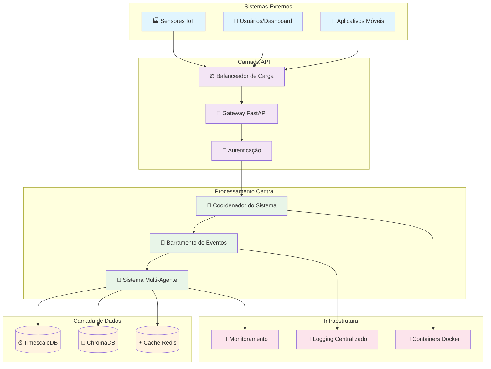

### 🔄 2.2. Diagrama de Fluxo de Interação dos Agentes

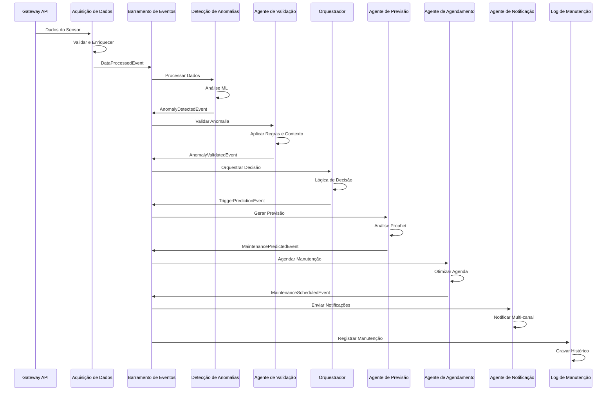

### 🌊 2.3. Arquitetura do Pipeline de Dados

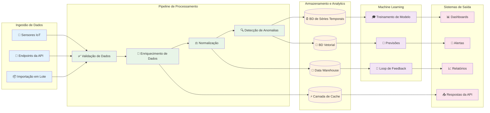

### ⚡ 2.4. Fluxo da Arquitetura Orientada a Eventos

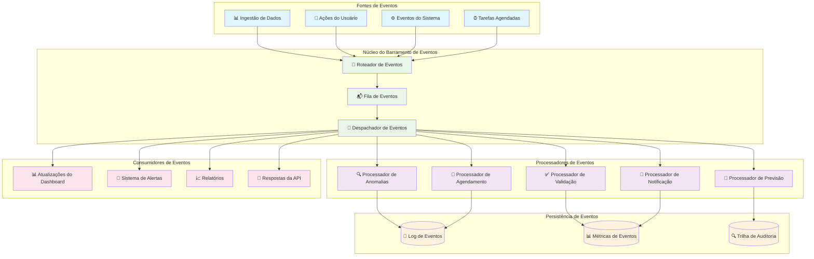

### 🏗️ 2.5. Arquitetura de Implantação

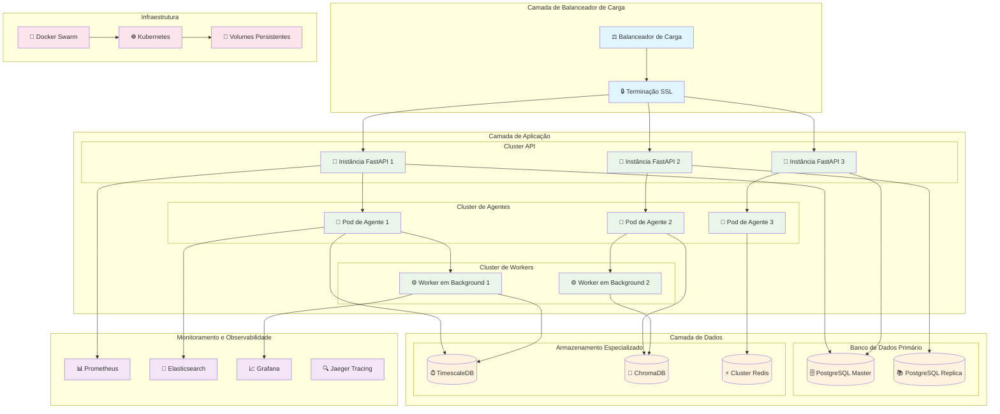

### 🧠 2.6. Pipeline de Machine Learning

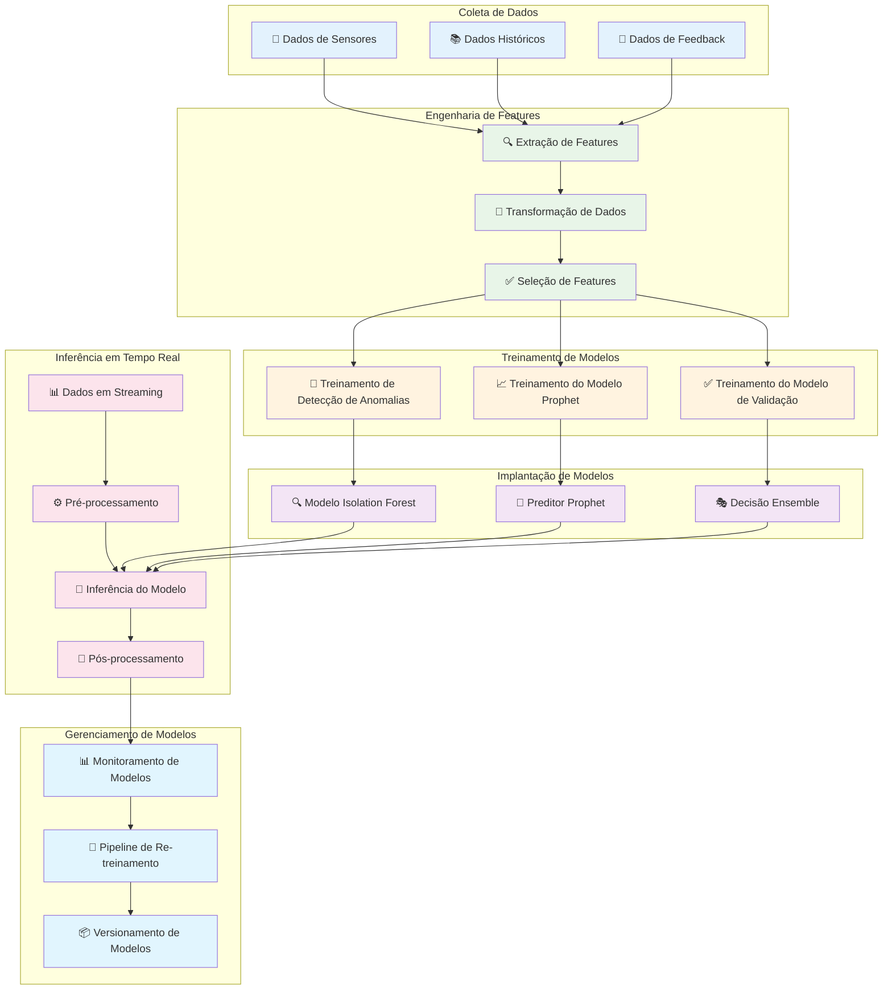

---

## 3. Arquitetura e Componentes Principais

A arquitetura é projetada em torno de um sistema multi-agente, onde agentes especializados executam tarefas específicas. Esses agentes se comunicam de forma assíncrona através de um Barramento de Eventos (Event Bus), criando um sistema desacoplado e altamente escalável.

### 3.1. Gateway da API (FastAPI)

O Gateway da API, construído com FastAPI, é o ponto de entrada principal para todas as interações externas. Ele lida com as requisições da API, autenticação e as encaminha para os serviços apropriados dentro do sistema.

### 3.2. Coordenador do Sistema (SystemCoordinator)

O SystemCoordinator é o sistema nervoso central da plataforma. Ele gerencia o ciclo de vida de todos os agentes, garantindo que sejam iniciados e parados de forma elegante. Ele também serve como um ponto central para serviços e configurações de todo o sistema.

### 3.3. Barramento de Eventos (EventBus)

O EventBus é um sistema de mensagens assíncrono personalizado, em memória, que permite a comunicação desacoplada entre os agentes. Ele permite que os agentes publiquem eventos e se inscrevam nos eventos de seu interesse, formando a espinha dorsal da arquitetura orientada a eventos.

### 3.4. Sistema Multi-Agente

Este é o núcleo da plataforma, consistindo em vários agentes especializados que trabalham juntos para realizar tarefas complexas. Cada agente é projetado para ser autônomo e responsável por uma parte específica do fluxo de trabalho.

### 3.5. Banco de Dados (PostgreSQL com TimescaleDB)

Um banco de dados PostgreSQL com a extensão TimescaleDB é usado para a persistência de dados. O TimescaleDB é otimizado para dados de séries temporais, tornando-o ideal para armazenar leituras de sensores.

### 4. Descrição dos Agentes

| Agente | Papel e Responsabilidades |
| ------ | ------------------------- |
| **DataAcquisitionAgent** | Ingesta dados brutos de sensores, valida sua estrutura e qualidade, enriquece-os com contexto adicional e os publica para processamento posterior. |
| **AnomalyDetectionAgent** | Inscreve-se para receber dados processados e utiliza uma abordagem de método duplo (Isolation Forest e modelos estatísticos) para detectar anomalias. Calcula uma pontuação de confiança para cada anomalia potencial. |
| **ValidationAgent** | Recebe anomalias detectadas e as valida aplicando um motor de regras e analisando o contexto histórico para reduzir falsos positivos. Ajusta a pontuação de confiança e atribui um status de validação. |
| **OrchestratorAgent** | O coordenador central do fluxo de trabalho. Ouve eventos de vários agentes e toma decisões sobre os próximos passos, como escalar para um humano ou acionar ações automatizadas, como o agendamento de manutenção. |
| **PredictionAgent** | Utiliza a biblioteca de aprendizado de máquina Prophet para analisar dados históricos de uma anomalia validada e prever o Tempo Até a Falha (TTF). Gera recomendações de manutenção com base em suas previsões. |
| **SchedulingAgent** | Pega as previsões de manutenção e agenda as tarefas necessárias. Utiliza um algoritmo de otimização simplificado para atribuir técnicos e encontrar horários disponíveis. |
| **NotificationAgent** | Envia notificações para técnicos e partes interessadas sobre manutenções agendadas e outros eventos importantes do sistema. |
| **HumanInterfaceAgent** | Gerencia os pontos de decisão humano-no-ciclo. Simula a interação humana para decisões críticas que requerem aprovação ou entrada que não pode ser totalmente automatizada. |
| **ReportingAgent** | Gera relatórios analíticos, visualizações e insights acionáveis relacionados às operações de manutenção, saúde do equipamento e desempenho do sistema. |
| **LearningAgent** | Implementa um sistema de Geração Aumentada por Recuperação (RAG) usando ChromaDB e SentenceTransformers. Aprende com o feedback do sistema e os registros de manutenção para fornecer insights com reconhecimento de contexto e melhorar a precisão do sistema ao longo do tempo. |
| **MaintenanceLogAgent** | Inscreve-se em eventos de conclusão de manutenção e registra os detalhes no banco de dados, fechando o ciclo do fluxo de trabalho de manutenção e fornecendo um registro histórico de todas as atividades de manutenção. |

### 5. Diagrama da Arquitetura do Sistema

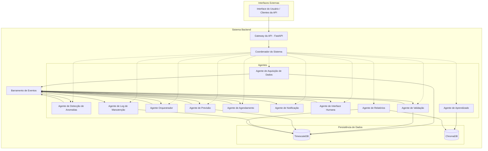

### 6. Fluxo de Dados

1. **Ingestão:** Os dados do sensor são enviados para o Gateway da API e ingeridos pelo DataAcquisitionAgent.
2. **Processamento:** Os dados são validados, enriquecidos e armazenados no TimescaleDB. Um evento DataProcessedEvent é publicado.
3. **Detecção de Anomalias:** O AnomalyDetectionAgent detecta anomalias potenciais e publica um AnomalyDetectedEvent.
4. **Validação:** O ValidationAgent valida a anomalia e publica um AnomalyValidatedEvent.
5. **Orquestração:** O OrchestratorAgent recebe a anomalia validada e decide os próximos passos.
6. **Previsão:** Se a anomalia é credível, o OrchestratorAgent pode acionar o PredictionAgent, que prevê o tempo até a falha e publica um MaintenancePredictedEvent.
7. **Agendamento:** O SchedulingAgent agenda a tarefa de manutenção e publica um MaintenanceScheduledEvent.
8. **Notificação:** O NotificationAgent envia notificações sobre a tarefa agendada.
9. **Registro:** Uma vez que a manutenção é concluída, o MaintenanceLogAgent registra os detalhes no banco de dados.
10. **Aprendizado:** O LearningAgent aprende continuamente com o feedback e os registros de manutenção para melhorar o sistema.

---

## 7. Decisões Arquiteturais e Melhorias Futuras (Português)

### 7.1. Evolução do Projeto: Plano vs. Implementação

Esta lista de verificação fornece uma análise transparente das funcionalidades e tecnologias delineadas no "Plano Backend Hermes" inicial versus o que foi efetivamente implementado no código durante o sprint de 14 dias. A coluna "Minha Opinião" oferece minha justificativa para as decisões arquiteturais que tomei.

| Componente | Planejado no "Plano Backend Hermes" | Implementado no Código | Minha Opinião |
| :--- | :--- | :--- | :--- |
| **API & Gateway** | FastAPI, GraphQL, Hub WebSocket. | FastAPI (apenas REST API). A API é funcional com endpoints para ingestão, relatórios e decisões. | **Boa decisão.** Optei por não implementar GraphQL e WebSockets pois seria um esforço significativo. Uma API REST padrão é mais que suficiente para nossa funcionalidade principal e entregáveis. Vou manter assim. |
| **Event Streaming** | Apache Kafka, Redis Streams, Event Sourcing. | `EventBus` customizado em memória. Meu `core/events/event_bus.py` é um sistema pub/sub assíncrono personalizado. | **Excelente trade-off.** Este foi meu desvio arquitetural mais significativo, e tenho certeza que foi a escolha certa. Uma configuração completa do Kafka seria muito complexa. Meu event bus personalizado alcança o desacoplamento necessário para os agentes funcionarem de maneira orientada a eventos, que era meu objetivo principal. |
| **Agent Workflow** | Temporal.io, LangGraph, Service Mesh. | Orquestração implícita via `OrchestratorAgent` e assinaturas diretas de eventos entre agentes. | **Escolha pragmática.** Como o Kafka, decidi que um motor de workflow completo como Temporal.io seria desnecessário para este sprint. Meu `OrchestratorAgent` serve efetivamente a este propósito para o escopo atual. |
| **ML: Previsão** | Prophet e LSTM para previsão combinada. | Prophet apenas. O `PredictionAgent` está totalmente implementado usando a biblioteca Prophet. | **Suficiente e forte.** Escolhi Prophet pois é um modelo de previsão poderoso por si só. Adicionar LSTM aumentaria a complexidade para ganhos potencialmente marginais neste prazo. O que implementei é robusto e atende ao objetivo de predição. |
| **ML: Detecção de Anomalias** | Scikit-learn (IsolationForest), Modelos Estatísticos, Autoencoder, métodos Ensemble. | Scikit-learn (IsolationForest) e Modelos Estatísticos estão totalmente implementados no `AnomalyDetectionAgent` com um método de decisão ensemble. | **Totalmente alinhado.** Implementei com sucesso o núcleo do sistema de detecção de anomalias planejado. Deixei de fora os autoencoders pois são complexos e não necessários para um protótipo funcional. |
| **ML: Aprendizado (RAG)** | RAG com ChromaDB e MLflow para MLOps. | RAG com ChromaDB e SentenceTransformers está implementado no `LearningAgent`. MLflow não é usado. | **Excelente trabalho.** Priorizei implementar a parte RAG pois é uma funcionalidade importante. Omiti o MLflow pois é uma ferramenta MLOps para rastreamento de experimentos e não é crítica para a funcionalidade principal do backend. |
| **Agendamento** | OR-Tools para otimização com restrições. | A dependência `ortools` está no `pyproject.toml`, mas o `SchedulingAgent` usa uma lógica "greedy" simplificada. O código OR-Tools está comentado. | **Parcialmente implementado.** Esta é a única área onde minha implementação está incompleta, mas estabeleci a base. Dados os constrangimentos de tempo, usei uma abordagem greedy como um placeholder funcional. |
| **Bancos de Dados** | TimescaleDB, Vector DB (Chroma), Redis. | TimescaleDB e ChromaDB são ambos usados. Redis está instalado mas não usado ativamente para cache ou rate-limiting ainda. | **Excelente.** Implementei as duas tecnologias de banco de dados mais críticas e inovadoras do plano. O cache Redis é uma otimização que posso adicionar depois. |

### 7.2. Aprofundamento na Implementação de Machine Learning

Nossa implementação de machine learning é sólida e se alinha bem com os objetivos do projeto.

**Detecção de Anomalias:** Estamos usando `IsolationForest`, um algoritmo de aprendizado não supervisionado poderoso, ideal para este caso de uso porque não requer dados pré-rotulados de "anomalias" para treinar. É altamente eficaz em encontrar pontos de dados incomuns em conjuntos de dados de alta dimensionalidade. Combinamos corretamente isso com um `StatisticalAnomalyDetector` que usa análise Z-score (baseada na média histórica e desvio padrão) para capturar outliers numéricos mais óbvios. Esta abordagem híbrida, ensemble, é robusta e fornece uma pontuação de confiança nuançada para anomalias detectadas.

**Previsão:** Implementamos o `PredictionAgent` usando o `Prophet` do Facebook. Prophet é uma excelente escolha para tarefas de previsão empresarial como manutenção preditiva porque é resiliente a dados faltantes, lida automaticamente bem com tendências e sazonalidade, e é fácil de configurar. Embora o plano original também mencionasse redes LSTM, focar apenas no Prophet foi uma decisão estratégica sábia para garantir que um agente de previsão funcional e confiável fosse entregue dentro do prazo de 14 dias.

### 7.3. Justificativa para o Framework Agêntico Atual

**Por que Escolhemos uma Arquitetura Multi-Agente:**

1. **Modularidade:** Cada agente tem uma responsabilidade clara e bem definida, facilitando desenvolvimento, teste e manutenção.
2. **Escalabilidade:** Agentes individuais podem ser escalados independentemente com base na demanda.
3. **Resiliência:** Se um agente falhar, outros podem continuar operando, e o sistema pode se recuperar graciosamente.
4. **Extensibilidade:** Novos agentes podem ser facilmente adicionados ao sistema sem afetar os existentes.

**Vantagens da Nossa Implementação EventBus:**

- **Baixa Latência:** Comunicação em memória é mais rápida que soluções de rede.
- **Simplicidade:** Menos complexidade operacional comparado a sistemas de mensageria externos.
- **Desenvolvimento Rápido:** Permite prototipagem e iteração rápidas.
