# Smart Maintenance SaaS - System and Architecture

**Date:** September 25, 2025 (V1.0 Production Ready)  
**Status:** Production-Ready Architecture with Cloud-Native Infrastructure  
**Authority:** Aligned with UNIFIED_SYSTEM_DOCUMENTATION.md  
**System Status:** 80% Production Ready (Backend 95% | UI 65%)

## 1. Introduction

This document provides a comprehensive overview of the system architecture for the Smart Maintenance SaaS platform. The platform is a **cloud-native, event-driven system** with **revolutionary S3 serverless model loading** that delivers scalable, resilient predictive maintenance solutions for industrial applications.

### 1.1. Architecture Overview

The Smart Maintenance SaaS platform is built on a cloud-native, event-driven architecture that provides:

- **🚀 Revolutionary S3 Serverless Model Loading:** Dynamic model selection from MLflow/S3 with intelligent caching
- **☁️ Cloud-Native Infrastructure:** TimescaleDB + Redis + S3 fully integrated and operational
- **🤖 Enterprise-Grade Multi-Agent System:** 12 agents across 4 categories with sophisticated event coordination  
- **⚡ Production-Ready Performance:** 103.8 RPS peak throughput with sub-3ms response times
- **🧠 Comprehensive ML Pipeline:** 17+ production models across classification, anomaly detection, and forecasting
- **🔄 Advanced Event-Driven Architecture:** Custom high-performance event bus with retry logic and dead letter queues
- **🗄️ Cloud Database Integration:** Optimized TimescaleDB with continuous aggregates and cloud deployment

### 1.2. Current Architecture Status

**Backend Architecture:** Production-ready and fully operational (95% complete)  
**Cloud Infrastructure:** Fully deployed with managed services  
**Multi-Agent System:** 12 agents operational across core, decision, interface, and learning categories  
**API Layer:** FastAPI with authentication, rate limiting, and comprehensive endpoints  

*For current system status and development roadmap, see [UNIFIED_SYSTEM_DOCUMENTATION.md](./UNIFIED_SYSTEM_DOCUMENTATION.md)*

---

## 2. System Architecture Visualizations

### 2.1. High-Level System Overview


### 2.2. Production Event-Driven Architecture Flow


### 2.3. MLflow Model Management Pipeline


### 2.4. TimescaleDB Performance Architecture


### 2.5. Production Performance Metrics Flow


---

## 3. Production System Architecture

The architecture is implemented as a containerized, event-driven system optimized for high-performance industrial IoT data processing.

### 3.1. Core Technology Stack

#### API Layer
- **FastAPI 0.104.1** with Starlette-compatible dependencies
- **Prometheus metrics integration** via `prometheus-fastapi-instrumentator`
- **API rate limiting** (10 requests/minute for ML endpoints)
- **Request correlation IDs** for distributed tracing
- **Idempotency support** with TTL-based deduplication (10-minute cache)
- **Structured JSON logging** with correlation ID propagation
- **Health endpoints** (`/health`, `/health/db`, `/metrics`)

#### Data Layer
- **PostgreSQL with TimescaleDB 2.11+** optimized for time-series data
- **Redis 7.0+** for caching and session management
- **MLflow Model Registry** with SQLite backend and artifact storage
- **Continuous aggregates** for real-time analytics performance
- **Automatic data compression** and retention policies

#### Event Processing
- **Custom Event Bus** with exponential backoff retry logic
- **Dead Letter Queue (DLQ)** for failed event handling
- **Asynchronous processing** with correlation ID propagation
- **Event persistence** with comprehensive audit trails

### 3.2. Performance Characteristics

#### Load Testing Results (Day 17)
- **Peak Throughput:** 103.8 RPS with 50 concurrent users
- **Response Times:** P50: 1ms, P95: 2ms, P99: 3ms
- **Resource Efficiency:** <6% CPU usage across all containers
- **Memory Usage:** <1GB total across entire stack
- **Stability:** 100% uptime during 3-minute sustained load tests

#### Database Performance
- **TimescaleDB Optimization:** 37.3% performance improvement via indexing
- **Continuous Aggregates:** Real-time hourly summaries for ML queries
- **Query Optimization:** Composite indexes for sensor-time range queries
- **Compression:** Automatic compression for data older than 7 days

### 3.3. Multi-Agent System

The platform implements a sophisticated multi-agent architecture for specialized task handling:

#### Core Agents

| Agent | Function | Implementation Status |
|-------|----------|----------------------|
| **DataAcquisitionAgent** | Sensor data ingestion, validation, and enrichment | ✅ Production Ready |
| **AnomalyDetectionAgent** | ML-based anomaly detection using IsolationForest | ✅ Production Ready |
| **ValidationAgent** | Rule-based anomaly validation and false positive reduction | ✅ Production Ready |
| **OrchestratorAgent** | Workflow coordination and decision routing | ✅ Production Ready |
| **PredictionAgent** | Prophet-based time-series forecasting | ✅ Production Ready |
| **SchedulingAgent** | Maintenance task scheduling optimization | ✅ Production Ready |
| **NotificationAgent** | Multi-channel notification dispatch | ✅ Production Ready |
| **ReportingAgent** | Analytics and insights generation | ✅ Production Ready |
| **HumanInterfaceAgent** | Human-in-the-loop decision management | ✅ Production Ready |
| **LearningAgent** | RAG-based system improvement with ChromaDB | ✅ Production Ready |
| **MaintenanceLogAgent** | Maintenance history tracking and persistence | ✅ Production Ready |
| **DriftMonitoringAgent** | Real-time model performance tracking and drift detection | ✅ Production Ready |
| **ChaosEngineeringAgent** | System resilience testing and failure simulation | ✅ Production Ready |
| **ModelSelectionAgent** | Intelligent model routing and performance optimization | ✅ Production Ready |

#### Agent Communication Pattern


### 3.4. Machine Learning Pipeline

#### Model Registry Status

- **Total Models:** 17+ production-ready models
- **Classification Models:** AI4I (99.90% accuracy), Kaggle Pump (100% accuracy)
- **Anomaly Detection:** NASA Bearing (72.8% accuracy), XJTU Bearing
- **Audio Processing:** MIMII Sound (93.3% accuracy)
- **Forecasting Models:** Prophet-based time-series prediction
- **Drift Monitoring:** Real-time model performance tracking and automated alerts
- **Intelligent Model Selection:** Context-aware model routing with performance optimization
- **Automated Retraining:** Event-driven pipeline for model updates based on drift detection

#### Model Categories


#### Drift Monitoring System

The system implements comprehensive model drift detection and automated response:


**Key Features:**
- **Real-time Performance Tracking:** Continuous monitoring of model accuracy and prediction quality
- **Statistical Drift Detection:** Automated detection of data distribution changes
- **Event-driven Retraining:** Automatic model updates triggered by drift alerts
- **Model Performance Comparison:** Intelligent routing based on real-time performance metrics
- **Notification System:** Integration with system event bus for drift alerts

### 3.5. Event-Driven MLOps Automation

Day 23 added a fully automated MLOps loop powered by the Redis-backed event bus, a Drift Check Agent, and a Retrain Agent.


Operational notes:

- Drift Check Agent publishes `DriftDetected` when monitored metrics breach thresholds.
- Retrain Agent executes training scripts, logs to MLflow, and emits `RetrainCompleted/Failed` events.
- Successful models are promoted in MLflow and pre-warmed into the model cache for safe rollout.
- Email Notification Service (`core/notifications/email_service.py`) dispatches drift and retraining notifications.

---

## 4. Security and Operational Excellence

### 4.1. Security Implementation

#### API Security

- **Rate Limiting:** 10 requests/minute for compute-intensive ML endpoints
- **Authentication:** API key validation with secure header handling
- **DoS Protection:** Computational resource limiting for expensive operations
- **Input Validation:** Comprehensive request validation and sanitization

#### Infrastructure Security

- **Container Isolation:** Docker-based service separation
- **Dependency Scanning:** Snyk integration for vulnerability detection
- **Security Auditing:** Comprehensive security audit checklist framework
- **Automated Scanning:** CI/CD pipeline security integration

### 4.2. Monitoring and Observability

#### Metrics Collection

- **Prometheus Integration:** HTTP request metrics, latency distributions
- **Health Endpoints:** `/health`, `/health/db`, `/metrics` endpoints
- **Process Metrics:** Memory usage, file descriptors, CPU utilization
- **Custom Metrics:** ML model load times, prediction latencies

#### Logging Architecture

- **Structured JSON Logging:** Centralized log aggregation
- **Correlation IDs:** Request tracing across service boundaries
- **Event Audit Trails:** Complete event processing history
- **Error Tracking:** Comprehensive error logging with stack traces

### 4.3. Deployment Architecture

#### Microservice Migration Strategy

The system implements a comprehensive microservice scaffolding strategy for modular deployment:

**Service Decomposition Pattern:**
- **API Gateway:** Central routing and authentication service
- **ML Service:** Dedicated model inference and training service
- **Data Service:** Sensor data ingestion and processing
- **Agent Service:** Multi-agent workflow orchestration
- **Notification Service:** Event-driven notification management

**Implementation Benefits:**
- **Independent Scaling:** Each service can scale based on specific load patterns
- **Technology Diversity:** Services can use optimal technology stacks
- **Fault Isolation:** Service failures don't cascade across the system
- **Team Autonomy:** Different teams can own and deploy services independently

#### Container Architecture

```yaml
services:
  api:          # FastAPI application server
  db:           # PostgreSQL with TimescaleDB
  redis:        # Cache and session storage
  mlflow:       # Model registry and tracking
  ui:           # Web interface (if applicable)
  notebook_runner: # Jupyter execution environment
```

#### Resource Allocation

- **API Container:** 300MB memory limit, optimized for request handling
- **Database Container:** 1GB memory, SSD storage for time-series data
- **Redis Container:** 100MB memory, in-memory caching optimization
- **MLflow Container:** 500MB memory, artifact storage management

---

## 5. Performance Benchmarks and Scaling

### 5.1. Current Performance Baseline

#### Response Time Performance

- **P50 Response Time:** 1ms (50th percentile)
- **P95 Response Time:** 2ms (95th percentile) 
- **P99 Response Time:** 3ms (99th percentile)
- **Maximum Response Time:** 124ms (well below 200ms SLO)

#### Throughput Capabilities

- **Peak Throughput:** 103.8 RPS sustained
- **Average Throughput:** 88.83 RPS over 3-minute test
- **Event Processing:** >100 events/second capability validated
- **Database Throughput:** Optimized for high-frequency time-series ingestion

### 5.2. Scalability Analysis

#### Horizontal Scaling Potential

- **CPU Utilization:** Current 6% usage indicates 16x scaling potential
- **Memory Efficiency:** <1GB total usage allows for significant scaling
- **Database Performance:** TimescaleDB optimized for multi-tenant scaling
- **Event Bus Capacity:** Custom implementation designed for high throughput

#### Performance Optimization Opportunities
- **Connection Pooling:** Database connection optimization
- **Caching Strategies:** Redis-based model and result caching
- **Async Processing:** Event-driven asynchronous workload distribution
- **Load Balancing:** Multi-replica deployment with load distribution

### 4.4. CI/CD Pipeline Hardening

#### Automated Testing Infrastructure
- **Unit Testing:** Comprehensive test coverage with pytest framework
- **Integration Testing:** End-to-end API testing with FastAPI TestClient
- **Load Testing:** Locust-based performance validation (103.8 RPS peak)
- **Security Testing:** Automated vulnerability scanning with Snyk integration
- **Chaos Engineering:** Resilience testing with failure injection and recovery validation

#### Pipeline Security
- **Dependency Scanning:** Automated vulnerability detection in CI/CD
- **Code Quality Gates:** Automated quality checks with linting and formatting
- **Environment Validation:** Script-based environment verification
- **Deployment Validation:** Automated health checks post-deployment

**CI Environment Features:**
- **Docker-based Testing:** Consistent testing environment across all stages
- **Parallel Test Execution:** Optimized test runtime with parallel processing
- **Automated Model Validation:** ML model performance regression testing
- **Deployment Rollback:** Automated rollback on failed deployments

---

## 6. Data Flow and Integration

### 6.1. Data Pipeline Architecture


### 6.2. Real-World Dataset Integration

The system has been validated against diverse industrial datasets:

#### Dataset Portfolio
- **AI4I 2020 UCI Dataset:** Industrial machine failure classification
- **NASA IMS Bearing Dataset:** Vibration signal anomaly detection  
- **XJTU-SY Bearing Dataset:** Advanced run-to-failure analysis
- **MIMII Sound Dataset:** Audio-based anomaly detection
- **Kaggle Pump Sensor Data:** Maintenance prediction classification

#### Processing Capabilities
- **Tabular Data:** High-performance classification with 99%+ accuracy
- **Vibration Signals:** FFT analysis with statistical feature engineering
- **Audio Processing:** MFCC feature extraction for machine sound analysis
- **Time Series:** Prophet-based forecasting with seasonal decomposition

---

## 7. System Evolution and Architecture Decisions

### 7.1. Architectural Trade-offs Made

#### Event Bus Implementation
**Decision:** Custom in-memory event bus instead of Apache Kafka
**Rationale:** Reduced operational complexity while maintaining event-driven benefits
**Result:** High-performance, low-latency event processing with retry logic

#### MLflow Integration
**Decision:** File-based artifact storage with SQLite registry
**Rationale:** Simplified deployment without requiring external object storage
**Result:** Complete model lifecycle management with container-native storage

#### Database Choice
**Decision:** PostgreSQL with TimescaleDB extension
**Rationale:** Combines relational capabilities with time-series optimization
**Result:** 37.3% performance improvement through continuous aggregates

### 7.2. Future Architecture Considerations

#### Scaling Enhancements
- **Redis Cluster:** Multi-node caching for horizontal scaling
- **Database Sharding:** Multi-tenant data partitioning strategies  
- **Event Bus Evolution:** Migration to Apache Kafka for massive scale
- **Microservice Decomposition:** Agent-based service extraction

#### Advanced Features
- **Real-time Streaming:** Apache Kafka or Redis Streams integration
- **Advanced Analytics:** Apache Spark for large-scale data processing
- **Edge Computing:** Agent deployment on edge devices
- **Multi-region Deployment:** Geographic distribution for latency optimization

---

## 8. Conclusion

The Smart Maintenance SaaS platform represents a production-ready, event-driven architecture optimized for industrial IoT applications. With proven performance characteristics exceeding SLO requirements by orders of magnitude and comprehensive ML capabilities validated against real-world datasets, the system demonstrates enterprise-grade reliability and scalability.

The platform's success in achieving 103.8 RPS throughput with sub-3ms response times, combined with its comprehensive security framework and operational excellence practices, positions it as a robust foundation for industrial predictive maintenance applications.

Key architectural strengths include the custom event bus design for low-latency processing, TimescaleDB optimization for time-series performance, comprehensive MLflow integration for model lifecycle management, and containerized deployment for operational simplicity.

### 🔄 2.2. Agent Interaction Flow Diagram


### 🌊 2.3. Data Pipeline Architecture

```mermaid
flowchart LR
    subgraph "Data Ingestion"
        SENSORS[📡 IoT Sensors]
        API_IN[🔌 API Endpoints]
        BATCH[📦 Batch Import]
    end

    subgraph "Processing Pipeline"
        VALIDATE[✅ Data Validation]
        ENRICH[🔄 Data Enrichment]
        NORMALIZE[⚖️ Normalization]
        ANOMALY[🔍 Anomaly Detection]
    end

    subgraph "Storage & Analytics"
        TIMESERIES[(⏰ Time Series DB)]
        VECTOR[(🧠 Vector DB)]
        WAREHOUSE[(🏢 Data Warehouse)]
        CACHE[(⚡ Cache Layer)]
    end

    subgraph "Machine Learning"
        TRAIN[🎓 Model Training]
        PREDICT[🔮 Predictions]
        FEEDBACK[🔄 Feedback Loop]
    end

    subgraph "Output Systems"
        DASHBOARD[📊 Dashboards]
        ALERTS[🚨 Alerts]
        REPORTS[📈 Reports]
        API_OUT[📤 API Responses]
    end

    SENSORS --> VALIDATE
    API_IN --> VALIDATE
    BATCH --> VALIDATE
    
    VALIDATE --> ENRICH
    ENRICH --> NORMALIZE
    NORMALIZE --> ANOMALY
    
    ANOMALY --> TIMESERIES
    ANOMALY --> VECTOR
    NORMALIZE --> WAREHOUSE
    ENRICH --> CACHE
    
    TIMESERIES --> TRAIN
    VECTOR --> PREDICT
    WAREHOUSE --> FEEDBACK
    
    TRAIN --> DASHBOARD
    PREDICT --> ALERTS
    FEEDBACK --> REPORTS
    CACHE --> API_OUT

    classDef ingestion fill:#1565C0,color:#ffffff
    classDef processing fill:#2E7D32,color:#ffffff
    classDef storage fill:#EF6C00,color:#ffffff
    classDef ml fill:#6A1B9A,color:#ffffff
    classDef output fill:#AD1457,color:#ffffff

    class SENSORS,API_IN,BATCH ingestion
    class VALIDATE,ENRICH,NORMALIZE,ANOMALY processing
    class TIMESERIES,VECTOR,WAREHOUSE,CACHE storage
    class TRAIN,PREDICT,FEEDBACK ml
    class DASHBOARD,ALERTS,REPORTS,API_OUT output
```



### ⚡ 2.4. Event-Driven Architecture Flow


### 🏗️ 2.5. Deployment Architecture

```mermaid
graph TB
    subgraph "Load Balancer Layer"
        LB[⚖️ Load Balancer]
        SSL[🔒 SSL Termination]
    end

    subgraph "Application Layer"
        subgraph "API Cluster"
            API1[🚀 FastAPI Instance 1]
            API2[🚀 FastAPI Instance 2]
            API3[🚀 FastAPI Instance 3]
        end

        subgraph "Agent Cluster"
            AGENT1[🤖 Agent Pod 1]
            AGENT2[🤖 Agent Pod 2]
            AGENT3[🤖 Agent Pod 3]
        end

        subgraph "Worker Cluster"
            WORKER1[⚙️ Background Worker 1]
            WORKER2[⚙️ Background Worker 2]
        end
    end

    subgraph "Data Layer"
        subgraph "Primary Database"
            DB_MASTER[(🗄️ PostgreSQL Master)]
            DB_REPLICA[(📚 PostgreSQL Replica)]
        end

        subgraph "Specialized Storage"
            TIMESCALE[(⏰ TimescaleDB)]
            VECTOR[(🧠 ChromaDB)]
            REDIS[(⚡ Redis Cluster)]
        end
    end

    subgraph "Monitoring & Observability"
        METRICS[📊 Prometheus]
        LOGS[📝 Elasticsearch]
        GRAFANA[📈 Grafana]
        JAEGER[🔍 Jaeger Tracing]
    end

    subgraph "Infrastructure"
        DOCKER[🐳 Docker Swarm]
        K8S[☸️ Kubernetes]
        STORAGE[💾 Persistent Volumes]
    end

    LB --> SSL
    SSL --> API1
    SSL --> API2
    SSL --> API3

    API1 --> AGENT1
    API2 --> AGENT2
    API3 --> AGENT3

    AGENT1 --> WORKER1
    AGENT2 --> WORKER2

    API1 --> DB_MASTER
    API2 --> DB_REPLICA
    API3 --> DB_MASTER

    AGENT1 --> TIMESCALE
    AGENT2 --> VECTOR
    AGENT3 --> REDIS

    WORKER1 --> TIMESCALE
    WORKER2 --> VECTOR

    API1 --> METRICS
    AGENT1 --> LOGS
    WORKER1 --> GRAFANA

    DOCKER --> K8S
    K8S --> STORAGE

    classDef lb fill:#1565C0,color:#ffffff
    classDef app fill:#2E7D32,color:#ffffff
    classDef data fill:#EF6C00,color:#ffffff
    classDef monitor fill:#6A1B9A,color:#ffffff
    classDef infra fill:#AD1457,color:#ffffff

    class LB,SSL lb
    class API1,API2,API3,AGENT1,AGENT2,AGENT3,WORKER1,WORKER2 app
    class DB_MASTER,DB_REPLICA,TIMESCALE,VECTOR,REDIS data
    class METRICS,LOGS,GRAFANA,JAEGER monitor
    class DOCKER,K8S,STORAGE infra
```



### 🧠 2.6. Machine Learning Pipeline

```mermaid
flowchart TB
    subgraph "Data Collection"
        SENSORS[📡 Sensor Data]
        HISTORICAL[📚 Historical Data]
        FEEDBACK[🔄 Feedback Data]
    end

    subgraph "Feature Engineering"
        EXTRACT[🔍 Feature Extraction]
        TRANSFORM[🔄 Data Transformation]
        SELECT[✅ Feature Selection]
    end

    subgraph "Model Training"
        ANOMALY_TRAIN[🎯 Anomaly Detection Training]
        PROPHET_TRAIN[📈 Prophet Model Training]
        VALIDATION_TRAIN[✅ Validation Model Training]
    end

    subgraph "Model Deployment"
        ANOMALY_MODEL[🔍 Isolation Forest Model]
        PROPHET_MODEL[🔮 Prophet Predictor]
        ENSEMBLE[🎭 Ensemble Decision]
    end

    subgraph "Real-time Inference"
        STREAM_DATA[📊 Streaming Data]
        PREPROCESS[⚙️ Preprocessing]
        INFERENCE[🧠 Model Inference]
        POSTPROCESS[🔧 Postprocessing]
    end

    subgraph "Model Management"
        MONITOR[📊 Model Monitoring]
        RETRAIN[🔄 Retraining Pipeline]
        VERSIONING[📦 Model Versioning]
    end

    SENSORS --> EXTRACT
    HISTORICAL --> EXTRACT
    FEEDBACK --> EXTRACT

    EXTRACT --> TRANSFORM
    TRANSFORM --> SELECT

    SELECT --> ANOMALY_TRAIN
    SELECT --> PROPHET_TRAIN
    SELECT --> VALIDATION_TRAIN

    ANOMALY_TRAIN --> ANOMALY_MODEL
    PROPHET_TRAIN --> PROPHET_MODEL
    VALIDATION_TRAIN --> ENSEMBLE

    STREAM_DATA --> PREPROCESS
    PREPROCESS --> INFERENCE
    
    ANOMALY_MODEL --> INFERENCE
    PROPHET_MODEL --> INFERENCE
    ENSEMBLE --> INFERENCE

    INFERENCE --> POSTPROCESS

    POSTPROCESS --> MONITOR
    MONITOR --> RETRAIN
    RETRAIN --> VERSIONING

    classDef collection fill:#1565C0,color:#ffffff
    classDef engineering fill:#2E7D32,color:#ffffff
    classDef training fill:#EF6C00,color:#ffffff
    classDef deployment fill:#6A1B9A,color:#ffffff
    classDef inference fill:#AD1457,color:#ffffff
    classDef management fill:#455A64,color:#ffffff

    class SENSORS,HISTORICAL,FEEDBACK collection
    class EXTRACT,TRANSFORM,SELECT engineering
    class ANOMALY_TRAIN,PROPHET_TRAIN,VALIDATION_TRAIN training
    class ANOMALY_MODEL,PROPHET_MODEL,ENSEMBLE deployment
    class STREAM_DATA,PREPROCESS,INFERENCE,POSTPROCESS inference
    class MONITOR,RETRAIN,VERSIONING management
```



---

## 3. System Architecture

The architecture is designed around a multi-agent system where specialized agents perform specific tasks. These agents communicate asynchronously through an **Event Bus**, creating a decoupled and highly scalable system.

### 3.1. Core Components

#### a. API Gateway (FastAPI)

The **API Gateway**, built with FastAPI, is the primary entry point for all external interactions. It handles API requests, authentication, rate limiting, and routes them to the appropriate services within the system.

#### b. Event Bus

The `EventBus` is a custom, in-memory, asynchronous messaging system that enables decoupled communication between agents. It allows agents to publish events and subscribe to events they are interested in, forming the backbone of the event-driven architecture. The event bus includes retry logic, dead letter queues, and correlation ID propagation.

#### c. Multi-Agent System

This is the core of the platform, consisting of eleven specialized agents that work together to perform complex tasks. Each agent is designed to be autonomous and responsible for a specific part of the workflow. All agents communicate through the central Event Bus.

#### d. Database Layer (PostgreSQL with TimescaleDB)

A **PostgreSQL** database with the **TimescaleDB** extension is used for data persistence. TimescaleDB is optimized for time-series data, making it ideal for storing sensor readings with continuous aggregates and automatic compression.

#### e. Vector Database (ChromaDB)

**ChromaDB** is used by the LearningAgent for implementing RAG (Retrieval-Augmented Generation) capabilities, enabling the system to learn from historical data and provide context-aware insights.

#### f. MLflow Model Registry

**MLflow** provides complete model lifecycle management with artifact storage, experiment tracking, and model versioning. Models are cached for high-performance inference in production.

### 3.2. Agent Descriptions

| Agent                       | Role and Responsibilities                                                                                                                                                                                                  |
| --------------------------- | -------------------------------------------------------------------------------------------------------------------------------------------------------------------------------------------------------------------------- |
| **DataAcquisitionAgent** | Ingests raw sensor data, validates its structure and quality, enriches it with additional context, and publishes it for further processing.                                                                                   |
| **AnomalyDetectionAgent** | Subscribes to processed data and uses a dual-method approach (Isolation Forest and statistical models) to detect anomalies. It calculates a confidence score for each potential anomaly.                                         |
| **ValidationAgent** | Receives detected anomalies and validates them by applying a rule engine and analyzing historical context to reduce false positives. It adjusts the confidence score and assigns a validation status.                          |
| **OrchestratorAgent** | The central coordinator of the workflow. It listens for events from various agents and makes decisions on the next steps, such as escalating to a human or triggering automated actions like scheduling maintenance.             |
| **PredictionAgent** | Uses the Prophet machine learning library to analyze historical data for a validated anomaly and predict the Time-to-Failure (TTF). It generates maintenance recommendations based on its predictions.                               |
| **SchedulingAgent** | Takes maintenance predictions and schedules the required tasks. It uses a simplified optimization algorithm to assign technicians and find available time slots.                                                          |
| **NotificationAgent** | Sends notifications to technicians and stakeholders about scheduled maintenance and other important system events.                                                                                                        |
| **HumanInterfaceAgent** | Manages human-in-the-loop decision points. It simulates human interaction for critical decisions that require approval or input that cannot be fully automated.                                                              |
| **ReportingAgent** | Generates analytics reports, visualizations, and actionable insights related to maintenance operations, equipment health, and system performance.                                                                           |
| **LearningAgent** | Implements a Retrieval-Augmented Generation (RAG) system using ChromaDB and SentenceTransformers. It learns from system feedback and maintenance logs to provide context-aware insights and improve system accuracy over time. |
| **MaintenanceLogAgent** | Subscribes to maintenance completion events and records the details in the database, closing the maintenance workflow loop and providing a historical record of all maintenance activities.                                    |

### 3.3. System Architecture Diagram


### 3.4. Data Flow

1. **Ingestion:** Sensor data is sent to the API Gateway and ingested by the DataAcquisitionAgent.
2. **Processing:** The data is validated, enriched, and stored in TimescaleDB. A DataProcessedEvent is published.
3. **Anomaly Detection:** The AnomalyDetectionAgent detects potential anomalies and publishes an AnomalyDetectedEvent.
4. **Validation:** The ValidationAgent validates the anomaly and publishes an AnomalyValidatedEvent.
5. **Orchestration:** The OrchestratorAgent receives the validated anomaly and decides the next steps.
6. **Prediction:** If the anomaly is credible, the OrchestratorAgent may trigger the PredictionAgent, which forecasts the time to failure and publishes a MaintenancePredictedEvent.
7. **Scheduling:** The SchedulingAgent schedules the maintenance task and publishes a MaintenanceScheduledEvent.
8. **Notification:** The NotificationAgent sends notifications about the scheduled task.
9. **Logging:** Once the maintenance is complete, the MaintenanceLogAgent records the details in the database.
10. **Learning:** The LearningAgent continuously learns from feedback and maintenance logs to improve the system.

---

## 4. Architectural Decisions & Future Enhancements

### 4.1. Project Evolution: Plan vs. Implementation

This checklist provides a transparent breakdown of the features and technologies outlined in the initial "Hermes Backend Plan" versus what was ultimately implemented in the codebase during the 14-day sprint. The "My Opinion" column offers my rationale for the architectural trade-offs that I made.

| Component | Planned in "Hermes Backend Plan" | Implemented in Codebase | My Opinion |
|-----------|----------------------------------|-------------------------|-------------------------|
| **API & Gateway** | FastAPI, GraphQL, WebSocket Hub | FastAPI (REST API only). The API is functional with endpoints for ingestion, reporting, and decisions | **Good decision.** I chose not to implement GraphQL and WebSockets as they would require significant effort. A standard REST API is more than sufficient for our core functionality and deliverables. I'm keeping it as is. |
| **Event Streaming** | Apache Kafka, Redis Streams, Event Sourcing | Custom In-Memory `EventBus`. My `core/events/event_bus.py` is a custom, asynchronous pub/sub system | **Excellent trade-off.** This was my most significant architectural deviation, and I stand by it. A full Kafka setup would be too complex. My custom event bus achieves the required decoupling for the agents to function in an event-driven manner, which was my primary goal. |
| **Agent Workflow** | Temporal.io, LangGraph, Service Mesh | Implicit Orchestration via the `OrchestratorAgent` and direct event subscriptions between agents | **Pragmatic choice.** Like Kafka, I decided a full workflow engine like Temporal.io was unnecessary for this sprint. My `OrchestratorAgent` serves this purpose effectively for the current scope. |
| **ML: Prediction** | Prophet and LSTM for combined forecasting | Prophet only. The `PredictionAgent` is fully implemented using the Prophet library | **Sufficient and strong.** I chose Prophet as it's a powerful forecasting model on its own. Adding LSTM would increase complexity for potentially marginal gains in this timeframe. What I implemented is robust and meets our prediction goal. |
| **ML: Anomaly Detection** | Scikit-learn (IsolationForest), Statistical Models, Autoencoder, Ensemble methods | Scikit-learn (IsolationForest) and Statistical Models are fully implemented in the `AnomalyDetectionAgent` with an ensemble decision method | **Fully aligned.** I successfully implemented the core of the planned anomaly detection system. I skipped autoencoders as they're complex and not necessary for a functional prototype. |
| **ML: Learning (RAG)** | RAG with ChromaDB and MLflow for MLOps | RAG with ChromaDB and SentenceTransformers is implemented in the `LearningAgent`. MLflow is not used | **Excellent work.** I prioritized implementing the RAG portion as it's a major feature. I omitted MLflow as it's an MLOps tool for experiment tracking and not critical for our core backend functionality. |
| **Scheduling** | OR-Tools for constraint optimization | The `ortools` dependency is in `pyproject.toml`, but the `SchedulingAgent` uses a simplified "greedy" logic. The OR-Tools code is commented out | **Partially implemented.** This is the one area where my implementation is incomplete but I've laid the foundation. Given our time constraints, I used a greedy approach as a functional placeholder. |
| **Databases** | TimescaleDB, Vector DB (Chroma), Redis | TimescaleDB and ChromaDB are both used. Redis is installed but not actively used for caching or rate-limiting yet | **Excellent.** I've implemented the two most critical and novel database technologies from the plan. Redis caching is an optimization that I can add later. |


### 4.2. Machine Learning Implementation Deep Dive

Our machine learning implementation is comprehensive and production-ready, fully aligned with the project's goals.

**Anomaly Detection:** We implemented a robust dual-approach system using `IsolationForest`, an unsupervised learning algorithm ideal for anomaly detection because it doesn't require pre-labeled data. This is combined with a `StatisticalAnomalyDetector` that uses Z-score analysis (based on historical mean and standard deviation) to catch numerical outliers. This hybrid, ensemble approach provides nuanced confidence scores for detected anomalies and is fully integrated with MLflow for model versioning and caching.

**Prediction:** The `PredictionAgent` is fully implemented using Facebook `Prophet`. Prophet excels at business forecasting tasks like predictive maintenance because it handles missing data gracefully, automatically manages trends and seasonality, and provides interpretable forecasts. The models are versioned and cached through MLflow for high-performance inference.

**Model Registry & MLflow Integration:** We successfully implemented a complete MLflow infrastructure with:

- **SQLite backend** for metadata persistence across container restarts
- **File-based artifact storage** with `/mlruns` volume mounting
- **Model versioning and tagging** for intelligent model selection
- **Comprehensive caching** for sub-millisecond model loading
- **Feature schema validation** with `feature_names.txt` artifacts
- **Production model registry** with 17+ trained models across multiple domains

**Real-World Dataset Validation:** The system has been thoroughly validated against five industrial datasets (AI4I, NASA, XJTU, MIMII, Kaggle) with documented performance metrics and automated drift monitoring.

### 4.3. Rationale for Current Agentic Framework

**Why We Chose a Multi-Agent Architecture:**

1. **Modularity:** Each agent has a clear and well-defined responsibility, making development, testing, and maintenance easier.
2. **Scalability:** Individual agents can be scaled independently based on demand.
3. **Resilience:** If one agent fails, others can continue to operate, and the system can recover gracefully.
4. **Extensibility:** New agents can be easily added to the system without affecting the existing ones.

**Advantages of Our EventBus Implementation:**

- **Low Latency:** In-memory communication is faster than networked messaging solutions.
- **Simplicity:** Less operational complexity compared to external messaging systems.
- **Rapid Development:** Enables quick prototyping and iteration.

---
