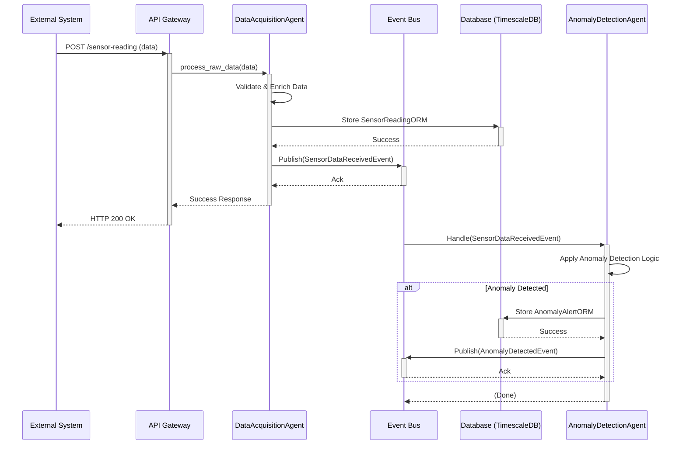

# Smart Maintenance SaaS - Architecture

## 1. Overview

The Smart Maintenance SaaS platform employs a microservices-inspired, event-driven architecture centered around a multi-agent system. This design promotes modularity, scalability, and resilience. Core components communicate asynchronously via an Event Bus, allowing for decoupled services and flexible workflow orchestration.

## 2. Core Components

### 2.1. API Gateway (FastAPI)

* **Purpose:** Serves as the primary entry point for all external interactions (UI, third-party systems).
* **Responsibilities:** Request validation, authentication, authorization, routing to appropriate internal services/agents.
* **Technology:** FastAPI.

### 2.2. Event Bus

* **Purpose:** Facilitates asynchronous communication between agents and other services.
* **Responsibilities:** Manages event subscriptions and publications. Ensures reliable event delivery (initially in-memory, with plans for Kafka/Redis for persistence and scalability).
* **Implementation:** `core.events.event_bus.EventBus`.
* **Key Events:** (Refer to Event Catalog in `smart-maintenance-saas/README.md`)
  * `BaseEventModel`
  * `SensorDataReceivedEvent`
  * `DataProcessedEvent`
  * `AnomalyDetectedEvent`
  * `AgentStatusUpdateEvent`

### 2.3. Agent System

The heart of the platform, consisting of specialized agents built upon a common base.

* **`BaseAgent` (`apps.agents.base_agent.BaseAgent`)**:
  * **Purpose:** Abstract base class providing foundational capabilities for all agents.
  * **Responsibilities:**
    * Lifecycle management (`start`, `stop`).
    * Core event handling (`handle_event`, `_publish_event`).
    * Capability registration and advertisement.
    * Health status reporting (`get_health`).
  * **Key Methods:** `process` (abstract, for agent-specific logic), `register_capabilities`, `start`, `stop`, `handle_event`, `get_health`.

* **`AgentRegistry` (`core.agent_registry.AgentRegistry`)**:
  * **Purpose:** Singleton service for discovering and managing active agent instances.
  * **Responsibilities:** Allows agents to register themselves and other components to look up agents by ID.

* **Specialized Agents (Examples - to be expanded):**
  * `DataAcquisitionAgent`: Ingests data from various sources.
  * `AnomalyDetectionAgent`: Analyzes data for anomalies.
  * `MaintenanceSchedulerAgent`: Optimizes maintenance schedules.
  * (More agents for prediction, learning, decision support, etc.)

### 2.4. Data Persistence Layer

* **Purpose:** Stores all relevant data, including sensor readings, asset information, anomalies, and maintenance tasks.
* **Technologies:**
  * **PostgreSQL with TimescaleDB:** For efficient storage and querying of time-series sensor data. Hypertables are used for `sensor_readings`.
  * **SQLAlchemy:** ORM for interacting with the database.
  * **Alembic:** For database schema migrations.
* **Key ORM Models:** (`core.database.orm_models`)
  * `SensorReadingORM`
  * `AnomalyAlertORM`
  * `MaintenanceTaskORM`

### 2.5. Configuration Management

* **Purpose:** Manages application settings.
* **Technology:** Pydantic `BaseSettings` (`core.config.settings.Settings`).
* **Source:** Environment variables and `.env` files.

### 2.6. Logging

* **Purpose:** Provides structured, centralized logging.
* **Technology:** `python-json-logger` (`core.logging_config.py`).

## 3. Data Flow (Example: Sensor Data Ingestion & Anomaly Detection)

1. **Ingestion:** External system (or simulator) sends sensor data to the `/api/v1/ingestion/sensor-reading/` endpoint on the FastAPI API Gateway.
2. **API Handling:** The API Gateway validates the request and might publish a raw data event or directly call the `DataAcquisitionAgent`.
3. **Data Acquisition:** The `DataAcquisitionAgent` receives the data.
   * It validates, cleans, and potentially enriches the data (e.g., adding asset context).
   * It publishes a `SensorDataReceivedEvent` (or `DataProcessedEvent`) to the Event Bus.
   * It stores the processed sensor reading in the TimescaleDB via `CRUDSensorReading`.
4. **Anomaly Detection:** An `AnomalyDetectionAgent`, subscribed to `SensorDataReceivedEvent` (or `DataProcessedEvent`), receives the new data.
   * It applies its anomaly detection algorithms (e.g., threshold checks, statistical models).
   * If an anomaly is detected, it publishes an `AnomalyDetectedEvent` to the Event Bus.
   * It stores the anomaly details in the database via `CRUDAnomalyAlert`.
5. **Further Processing:** Other agents (e.g., `NotificationAgent`, `MaintenanceSchedulerAgent`) can subscribe to `AnomalyDetectedEvent` to trigger further actions like sending alerts or creating maintenance tasks.

## 4. Diagrams

*(Placeholder for diagrams. Consider adding: Component Diagram, Sequence Diagram for key workflows)*

### 4.1. High-Level Component Diagram

```mermaid
graph TD
    UI[User Interface / External Systems] --> API[API Gateway (FastAPI)]

    subgraph Backend Services
        API --> EventBus[Event Bus]

        EventBus -->|Events| DAA[Data Acquisition Agent]
        DAA -->|Store Data| DB[(TimescaleDB/PostgreSQL)]
        DAA -->|Publish Processed| EventBus

        EventBus -->|Events| ADA[Anomaly Detection Agent]
        ADA -->|Store Anomalies| DB
        ADA -->|Publish Anomaly| EventBus

        EventBus -->|Events| MSA[Maintenance Scheduler Agent]
        MSA -->|Store Tasks| DB
        MSA -->|Publish Task| EventBus

        EventBus -->|Events| OtherAgents[...]

        BaseAgent[BaseAgent] -- Inherited by --> DAA
        BaseAgent -- Inherited by --> ADA
        BaseAgent -- Inherited by --> MSA
        BaseAgent -- Inherited by --> OtherAgents

        AgentRegistry[Agent Registry] -- Manages --> DAA
        AgentRegistry -- Manages --> ADA
        AgentRegistry -- Manages --> MSA
        AgentRegistry -- Manages --> OtherAgents
    end

    style API fill:#f9f,stroke:#333,stroke-width:2px
    style EventBus fill:#ccf,stroke:#333,stroke-width:2px
    style DB fill:#lightgrey,stroke:#333,stroke-width:2px
    style BaseAgent fill:#e6ffcc,stroke:#333,stroke-width:1px
    style AgentRegistry fill:#ffe6cc,stroke:#333,stroke-width:1px
```

### 4.2. Sequence Diagram: Sensor Data Ingestion & Anomaly Detection



## 5. Scalability and Resilience

* **Scalability:** Agents can be scaled independently. The Event Bus can be scaled out (e.g., using Kafka).
* **Resilience:** Decoupling via the Event Bus means failure in one agent doesn't necessarily bring down the entire system. Retry mechanisms and dead-letter queues can be implemented.

## 6. Future Considerations

* Persistent Event Bus (Kafka, Redis Streams).
* Service Discovery (Consul, etcd) if moving beyond a single-node deployment for agents.
* Distributed Tracing.
* More sophisticated Agent capabilities (learning, planning).
