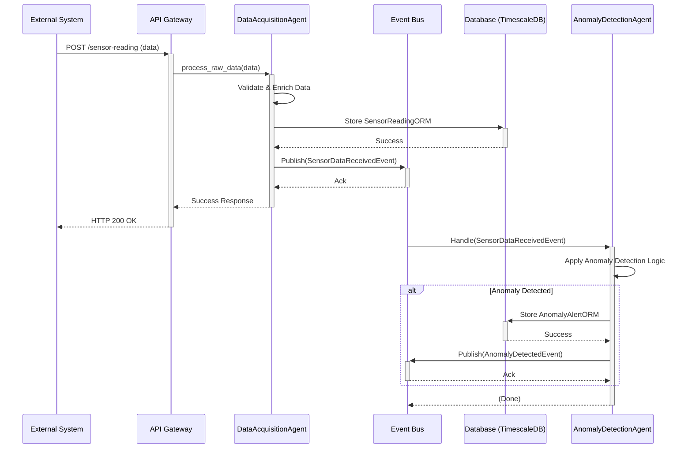
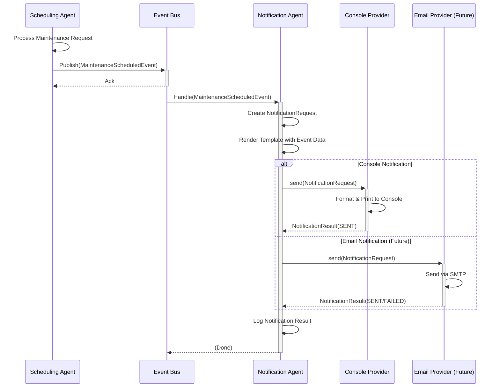

# Smart Maintenance SaaS - Architecture

## 1. Overview

The Smart Maintenance SaaS platform employs a microservices-inspired, event-driven architecture centered around a multi-agent system. This design promotes modularity, scalability, and resilience. Core components communicate asynchronously via an Event Bus, allowing for decoupled services and flexible workflow orchestration.

## 2. Core Components

### 2.1. API Gateway (FastAPI)

* **Purpose:** Serves as the primary entry point for all external interactions (UI, third-party systems).
* **Responsibilities:** Request validation, authentication, authorization, routing to appropriate internal services/agents.
* **Technology:** FastAPI.

### 2.2. Event Bus

* **Purpose:** Facilitates asynchronous communication between agents and other services.
* **Responsibilities:** Manages event subscriptions and publications. Ensures reliable event delivery (initially in-memory, with plans for Kafka/Redis for persistence and scalability).
* **Implementation:** `core.events.event_bus.EventBus`.
* **Key Events:** (Refer to Event Catalog in `smart-maintenance-saas/README.md`)
  * `BaseEventModel`
  * `SensorDataReceivedEvent`
  * `DataProcessedEvent`
  * `AnomalyDetectedEvent`
  * `AnomalyValidatedEvent`
  * `MaintenancePredictedEvent`
  * `MaintenanceScheduledEvent`
  * `AgentStatusUpdateEvent`

### 2.3. Agent System

The heart of the platform, consisting of specialized agents built upon a common base.

* **`BaseAgent` (`apps.agents.base_agent.BaseAgent`)**:
  * **Purpose:** Abstract base class providing foundational capabilities for all agents.
  * **Responsibilities:**
    * Lifecycle management (`start`, `stop`).
    * Core event handling (`handle_event`, `_publish_event`).
    * Capability registration and advertisement.
    * Health status reporting (`get_health`).
  * **Key Methods:** `process` (abstract, for agent-specific logic), `register_capabilities`, `start`, `stop`, `handle_event`, `get_health`.

* **`AgentRegistry` (`core.agent_registry.AgentRegistry`)**:
  * **Purpose:** Singleton service for discovering and managing active agent instances.
  * **Responsibilities:** Allows agents to register themselves and other components to look up agents by ID.

* **Specialized Agents (Examples - to be expanded):**
  * `DataAcquisitionAgent`: Ingests data from various sources.
  * `AnomalyDetectionAgent`: Analyzes data for anomalies.
  * `ValidationAgent`: Validates and enriches anomaly alerts.
  * `PredictionAgent`: Provides predictive maintenance recommendations using ML.
  * `SchedulingAgent`: Optimizes maintenance task scheduling and technician assignments.
  * `NotificationAgent`: Sends notifications through multiple channels (console, email, SMS, etc.) based on maintenance scheduling events and other system events.
  * (More agents for learning, decision support, etc.)

### 2.4. Data Persistence Layer

* **Purpose:** Stores all relevant data, including sensor readings, asset information, anomalies, and maintenance tasks.
* **Technologies:**
  * **PostgreSQL with TimescaleDB:** For efficient storage and querying of time-series sensor data. Hypertables are used for `sensor_readings`.
  * **SQLAlchemy:** ORM for interacting with the database.
  * **Alembic:** For database schema migrations.
* **Key ORM Models:** (`core.database.orm_models`)
  * `SensorReadingORM`
  * `AnomalyAlertORM`
  * `MaintenanceTaskORM`

### 2.5. Configuration Management

* **Purpose:** Manages application settings.
* **Technology:** Pydantic `BaseSettings` (`core.config.settings.Settings`).
* **Source:** Environment variables and `.env` files.

### 2.6. Logging

* **Purpose:** Provides structured, centralized logging.
* **Technology:** `python-json-logger` (`core.logging_config.py`).

## 3. Data Flow (Example: Sensor Data Ingestion & Anomaly Detection)

1. **Ingestion:** External system (or simulator) sends sensor data to the `/api/v1/ingestion/sensor-reading/` endpoint on the FastAPI API Gateway.
2. **API Handling:** The API Gateway validates the request and might publish a raw data event or directly call the `DataAcquisitionAgent`.
3. **Data Acquisition:** The `DataAcquisitionAgent` receives the data.
   * It validates, cleans, and potentially enriches the data (e.g., adding asset context).
   * It publishes a `SensorDataReceivedEvent` (or `DataProcessedEvent`) to the Event Bus.
   * It stores the processed sensor reading in the TimescaleDB via `CRUDSensorReading`.
4. **Anomaly Detection:** An `AnomalyDetectionAgent`, subscribed to `SensorDataReceivedEvent` (or `DataProcessedEvent`), receives the new data.
   * It applies its anomaly detection algorithms (e.g., threshold checks, statistical models).
   * If an anomaly is detected, it publishes an `AnomalyDetectedEvent` to the Event Bus.
   * It stores the anomaly details in the database via `CRUDAnomalyAlert`.
5. **Further Processing:** Other agents (e.g., `NotificationAgent`, `MaintenanceSchedulerAgent`) can subscribe to `AnomalyDetectedEvent` to trigger further actions like sending alerts or creating maintenance tasks.

### 3.1. Notification Flow (Maintenance Scheduling Events)

1. **Maintenance Scheduling:** The `SchedulingAgent` processes maintenance requests and publishes a `MaintenanceScheduledEvent` to the Event Bus with scheduling details.
2. **Notification Handling:** The `NotificationAgent`, subscribed to `MaintenanceScheduledEvent`, receives the event.
   * It creates a `NotificationRequest` with appropriate message content based on scheduling success/failure.
   * It uses template rendering to format maintenance details (equipment ID, technician, timing, etc.).
3. **Multi-Channel Delivery:** The agent uses configured notification providers to deliver notifications:
   * `ConsoleNotificationProvider`: For development/testing (prints to console).
   * Future providers: Email, SMS, WhatsApp, Slack for production use.
4. **Result Tracking:** Each notification attempt returns a `NotificationResult` with delivery status, timing, and error details if applicable.

## 4. Diagrams

*(Placeholder for diagrams. Consider adding: Component Diagram, Sequence Diagram for key workflows)*

### 4.1. High-Level Component Diagram

```mermaid
graph TD
    UI[User Interface / External Systems] --> API[API Gateway (FastAPI)]

    subgraph Backend Services
        API --> EventBus[Event Bus]

        EventBus -->|Events| DAA[Data Acquisition Agent]
        DAA -->|Store Data| DB[(TimescaleDB/PostgreSQL)]
        DAA -->|Publish Processed| EventBus

        EventBus -->|Events| ADA[Anomaly Detection Agent]
        ADA -->|Store Anomalies| DB
        ADA -->|Publish Anomaly| EventBus

        EventBus -->|Events| MSA[Maintenance Scheduler Agent]
        MSA -->|Store Tasks| DB
        MSA -->|Publish Task| EventBus

        EventBus -->|Events| NA[Notification Agent]
        NA -->|Send Notifications| NotificationProviders[Console/Email/SMS/WhatsApp]

        EventBus -->|Events| OtherAgents[...]

        BaseAgent[BaseAgent] -- Inherited by --> DAA
        BaseAgent -- Inherited by --> ADA
        BaseAgent -- Inherited by --> MSA
        BaseAgent -- Inherited by --> NA
        BaseAgent -- Inherited by --> OtherAgents

        AgentRegistry[Agent Registry] -- Manages --> DAA
        AgentRegistry -- Manages --> ADA
        AgentRegistry -- Manages --> MSA
        AgentRegistry -- Manages --> NA
        AgentRegistry -- Manages --> OtherAgents
    end

    style API fill:#f9f,stroke:#333,stroke-width:2px
    style EventBus fill:#ccf,stroke:#333,stroke-width:2px
    style DB fill:#lightgrey,stroke:#333,stroke-width:2px
    style BaseAgent fill:#e6ffcc,stroke:#333,stroke-width:1px
    style AgentRegistry fill:#ffe6cc,stroke:#333,stroke-width:1px
```

### 4.2. Sequence Diagram: Sensor Data Ingestion & Anomaly Detection



### 4.3. Sequence Diagram: Maintenance Scheduling & Notification Flow



## 5. Machine Learning Considerations

### 5.1. Model Lifecycle and Training Strategy

#### Current Implementation Limitations

The current implementation of the `AnomalyDetectionAgent` includes simplifications suitable for initial development and testing, but with known limitations for production use:

**StandardScaler Fitting:**

* Currently re-fits (`fit_transform`) on individual incoming `DataProcessedEvent` features
* For single data points, this normalizes only to that specific point (mean=0, std=1)
* Lacks stable baseline for "normal" data distribution needed for effective scaling

**IsolationForest Training:**

* Trained (`fit`) using scaled features from the very first `DataProcessedEvent`
* Model's definition of "normal" behavior based on single, potentially unrepresentative data point
* Results in poor generalization and unreliable anomaly detection

#### Why Current Simplifications Are Not Ideal for Production

1. **Lack of Representativeness:** Models trained on isolated or first-encountered data points cannot learn the true underlying distribution of normal operational data. This leads to poor generalization and unreliable anomaly detection.

2. **No Baseline for Normality:** The StandardScaler needs to be fitted on a dataset representing normal behavior to learn its mean and standard deviation. These learned parameters are then used to transform new data, comparing it against that established baseline.

3. **Model Instability:** The IsolationForest model will be highly unstable and biased if trained on insufficient or non-representative data.

4. **Ignoring Sensor Specificity:** Different sensors, even of the same type, can have unique operating profiles. A model trained on data from one sensor (or the first encountered data from any sensor) may not be appropriate for others.

5. **Inefficiency:** While not a major concern with single data points, repeatedly fitting models is computationally more expensive than fitting once and then predicting many times.

#### A More Robust Approach for Production

**Offline Training Phase:**

1. **Data Collection:** Curate a substantial historical dataset that accurately represents normal operating conditions for various sensors or equipment types. This dataset should be large enough to capture typical variations.

2. **Data Labeling (Optional but Recommended):** If possible, label periods of known anomalies in your historical data. This is crucial for evaluation but not strictly for unsupervised models like Isolation Forest (which learns from unlabelled, assumed-normal data).

3. **Preprocessing:** Clean the data (handle missing values, outliers if they are not the target anomalies for this specific model).

4. **Model Fitting:**

   * **StandardScaler:** Fit the scaler on the entire normal training dataset for each sensor type (or group) to learn its characteristic mean and variance.
   * **IsolationForest:** Train the IsolationForest model on the scaled normal training dataset.

5. **Model Serialization & Registry:** Save (serialize) the fitted scalers and trained models (e.g., using joblib or pickle). Store these in a model registry (like MLflow, or a structured file storage like S3) versioned and accessible by the AnomalyDetectionAgent.

**Online Prediction Phase (in AnomalyDetectionAgent):**

1. **Model Loading:** On startup, or when processing data for a specific sensor type for the first time, the agent should load the appropriate pre-trained scaler and Isolation Forest model from the registry.

2. **Transform:** Use the loaded (and already fitted) StandardScaler to transform (not fit_transform) the features of new incoming sensor data.

3. **Predict:** Feed the scaled features to the loaded (and already trained) IsolationForest model to get predict() and decision_function() outputs.

**Sensor-Specific Models:**

* Maintain separate scalers and models for different sensor types (e.g., temperature_scaler.joblib, temperature_iforest.joblib).
* The AnomalyDetectionAgent would select the correct model files based on the sensor_type (or even sensor_id for highly critical/unique sensors) of the incoming SensorReading.
* The historical_data_store approach for the statistical model is a good parallel for managing parameters/models per sensor.

**Periodic Retraining and Monitoring (MLOps):**

* Implement a strategy for periodically retraining models using fresh data to adapt to evolving equipment behavior (concept drift).
* Monitor model performance in production (using metrics like Precision, Recall, F1-score if feedback/labels are available) to identify when retraining is necessary.

### 5.2. Performance Metrics: Precision, Recall, and F1-score

To evaluate the effectiveness of the AnomalyDetectionAgent, especially once it's more mature or if you have labeled data (knowing actual past anomalies), you can use standard classification metrics:

**Classification Framework:**

* **True Positive (TP):** An actual anomaly that the agent correctly flagged as an anomaly.
* **False Positive (FP):** A normal data point that the agent incorrectly flagged as an anomaly (a false alarm).
* **True Negative (TN):** A normal data point that the agent correctly identified as normal.
* **False Negative (FN):** An actual anomaly that the agent failed to detect and flagged as normal (a missed detection).

Based on these, the key metrics are:

#### Precision

* **Formula:** TP / (TP + FP)
* **In Context:** "Of all the alerts our AnomalyDetectionAgent generated, what percentage were actual equipment problems?"
* **Significance:** High precision minimizes wasted resources spent investigating false alarms and builds trust in the system.

#### Recall (or Sensitivity)

* **Formula:** TP / (TP + FN)
* **In Context:** "Of all the actual equipment problems that occurred, what percentage did our AnomalyDetectionAgent successfully detect?"
* **Significance:** High recall is crucial for a predictive maintenance system, as the primary goal is to catch impending failures. Missed detections (FN) can lead to unexpected downtime and higher costs.

#### F1-score

* **Formula:** 2 × (Precision × Recall) / (Precision + Recall)
* **In Context:** A single metric that provides a balance between Precision and Recall.
* **Significance:** Useful when there's a trade-off. For instance, being extremely sensitive to catch all anomalies (high recall) might lead to more false alarms (lower precision). The F1-score helps find a good compromise.

#### How These Metrics Would Be Used

**Model Selection & Tuning:** When experimenting with different anomaly detection algorithms or tuning parameters (like the contamination factor in Isolation Forest or the sigma value in the statistical model), these metrics, calculated on a labeled validation dataset, would guide decisions.

**Performance Monitoring:** If a feedback mechanism is in place (e.g., maintenance logs confirming if an alert corresponded to a real issue), these metrics can be tracked over time to monitor the agent's performance in production and signal when models might need retraining or adjustment.

**Business Value Justification:** Correlating these metrics with operational costs (e.g., cost of a missed failure vs. cost of investigating a false alarm) can help in optimizing the system for business objectives.

## 6. Scalability and Resilience

* **Scalability:** Agents can be scaled independently. The Event Bus can be scaled out (e.g., using Kafka).
* **Resilience:** Decoupling via the Event Bus means failure in one agent doesn't necessarily bring down the entire system. Retry mechanisms and dead-letter queues can be implemented.

## 7. Future Considerations

* Persistent Event Bus (Kafka, Redis Streams).
* Service Discovery (Consul, etcd) if moving beyond a single-node deployment for agents.
* Distributed Tracing.
* More sophisticated Agent capabilities (learning, planning).
