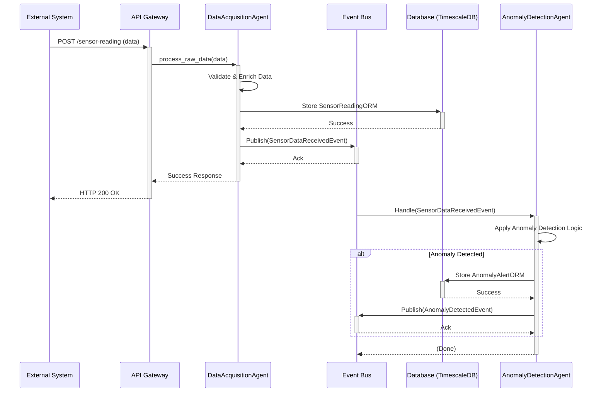
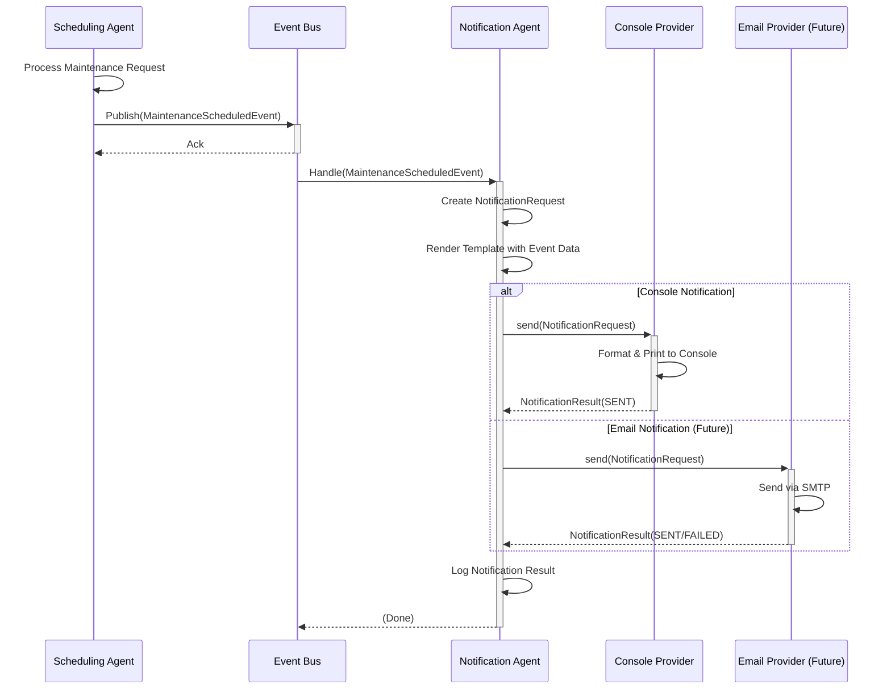
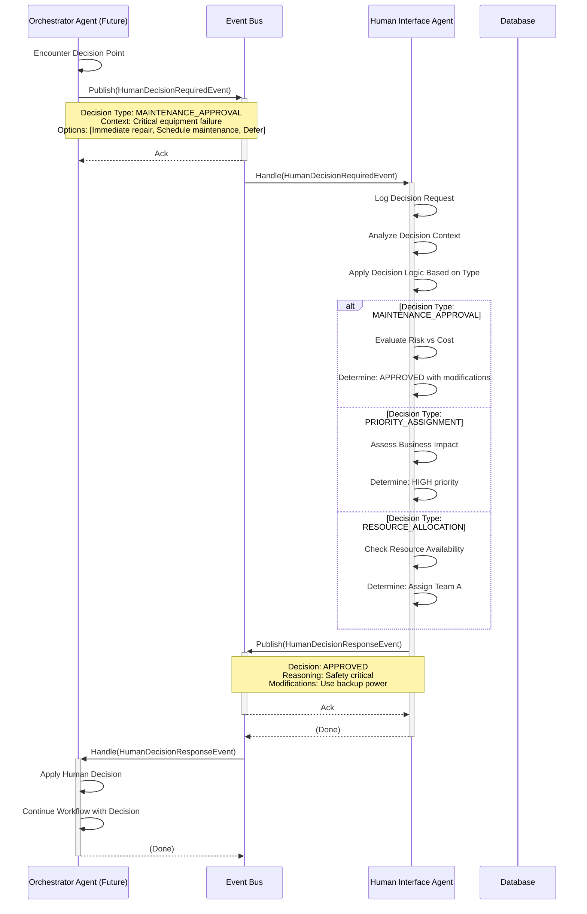

# Smart Maintenance SaaS - Architecture

## 1. Overview

The Smart Maintenance SaaS platform employs a microservices-inspired, event-driven architecture centered around a multi-agent system. This design promotes modularity, scalability, and resilience. Core components communicate asynchronously via an Event Bus, allowing for decoupled services and flexible workflow orchestration.

## 2. Core Components

### 2.1. API Gateway (FastAPI)

* **Purpose:** Serves as the primary entry point for all external interactions (UI, third-party systems).
* **Responsibilities:** Request validation, authentication, authorization, routing to appropriate internal services/agents.
* **Technology:** FastAPI.

### 2.2. Event Bus

* **Purpose:** Facilitates asynchronous communication between agents and other services.
* **Responsibilities:** Manages event subscriptions and publications. Ensures reliable event delivery (initially in-memory, with plans for Kafka/Redis for persistence and scalability).
* **Implementation:** `core.events.event_bus.EventBus`.
* **Key Events:** (Refer to Event Catalog in `smart-maintenance-saas/README.md`)
  * `BaseEventModel`
  * `SensorDataReceivedEvent`
  * `DataProcessedEvent`
  * `AnomalyDetectedEvent`
  * `AnomalyValidatedEvent`
  * `MaintenancePredictedEvent`
  * `MaintenanceScheduledEvent`
  * `AgentStatusUpdateEvent`
  * `HumanDecisionRequiredEvent`
  * `HumanDecisionResponseEvent`

### 2.3. Agent System

The heart of the platform, consisting of specialized agents built upon a common base.

* **`BaseAgent` (`apps.agents.base_agent.BaseAgent`)**:
  * **Purpose:** Abstract base class providing foundational capabilities for all agents.
  * **Responsibilities:**
    * Lifecycle management (`start`, `stop`).
    * Core event handling (`handle_event`, `_publish_event`).
    * Capability registration and advertisement.
    * Health status reporting (`get_health`).
  * **Key Methods:** `process` (abstract, for agent-specific logic), `register_capabilities`, `start`, `stop`, `handle_event`, `get_health`.

* **`AgentRegistry` (`core.agent_registry.AgentRegistry`)**:
  * **Purpose:** Singleton service for discovering and managing active agent instances.
  * **Responsibilities:** Allows agents to register themselves and other components to look up agents by ID.

For detailed descriptions of each agent's roles and responsibilities, please see the [Implemented Agents & Their Roles section in the main project README](../README.md#implemented-agents--their-roles).

* **`HumanInterfaceAgent` (`apps.agents.interface.human_interface_agent.HumanInterfaceAgent`)**:
  * **Purpose:** Manages human-in-the-loop decision points. In dev/test, simulates human decisions; in production, integrates with actual human interfaces.
  * **Responsibilities:** Processes `HumanDecisionRequiredEvent`, applies logic (or awaits human input), and publishes `HumanDecisionResponseEvent`.
  * *For full details, see README.*

* **Specialized Agents:**
  * `DataAcquisitionAgent`: Ingests, validates, and enriches sensor data.
  * `AnomalyDetectionAgent`: Detects anomalies using ML and statistical models.
  * `ValidationAgent`: Validates detected anomalies using rules and historical context.
  * `OrchestratorAgent`: **CENTRAL COORDINATOR** - Manages workflows and coordinates decisions between agents.
  * `LearningAgent`: Manages knowledge using RAG, learning from system feedback.
  * `PredictionAgent`: Predicts failures and recommends maintenance using ML.
  * `SchedulingAgent`: Schedules maintenance tasks and assigns technicians.
  * `NotificationAgent`: Sends notifications about system events and maintenance.
  * `ReportingAgent`: Generates analytics reports and visualizations.
  * (More agents for learning, decision support, etc., will be detailed in the README as implemented.)

### 2.4. Data Persistence Layer

* **Purpose:** Stores all relevant data, including sensor readings, asset information, anomalies, and maintenance tasks.
* **Technologies:** The core data persistence technologies are detailed in the [Tech Stack](../README.md#tech-stack) section of the main project documentation.
* **Key ORM Models:** (`core.database.orm_models`)
  * `SensorReadingORM`
  * `AnomalyAlertORM`
  * `MaintenanceTaskORM`

### 2.5. Configuration Management

* **Purpose:** Manages application settings.
* **Technology:** Pydantic `BaseSettings` (`core.config.settings.Settings`).
* **Source:** Environment variables and `.env` files.

### 2.6. Logging

* **Purpose:** Provides structured, centralized logging.
* **Technology:** `python-json-logger` (`core.logging_config.py`).

### 2.7. OrchestratorAgent - Central Workflow Coordinator

* **Purpose:** Acts as the central nervous system of the Smart Maintenance platform, orchestrating complex event-driven workflows and coordinating decision-making across all system agents.
* **Key Responsibilities & Capabilities:** Manages end-to-end maintenance workflows, coordinates decision-making (human vs. automated), manages state, and facilitates cross-agent communication.
* **Implementation:** `apps.agents.core.orchestrator_agent.OrchestratorAgent`
* *For a detailed description, see the [OrchestratorAgent section in the README](../README.md#orchestratoragent-appsagentscoreorchestratoragentpy).*

## 3. Data Flow (Example: Sensor Data Ingestion & Anomaly Detection)

1. **Ingestion:** External system (or simulator) sends sensor data to the `/api/v1/ingestion/sensor-reading/` endpoint on the FastAPI API Gateway.
2. **API Handling:** The API Gateway validates the request and might publish a raw data event or directly call the `DataAcquisitionAgent`.
3. **Data Acquisition:** The `DataAcquisitionAgent` receives the data.
   * It validates, cleans, and potentially enriches the data (e.g., adding asset context).
   * It publishes a `SensorDataReceivedEvent` (or `DataProcessedEvent`) to the Event Bus.
   * It stores the processed sensor reading in the TimescaleDB via `CRUDSensorReading`.
4. **Anomaly Detection:** An `AnomalyDetectionAgent`, subscribed to `SensorDataReceivedEvent` (or `DataProcessedEvent`), receives the new data.
   * It applies its anomaly detection algorithms (e.g., threshold checks, statistical models).
   * If an anomaly is detected, it publishes an `AnomalyDetectedEvent` to the Event Bus.
   * It stores the anomaly details in the database via `CRUDAnomalyAlert`.
5. **Further Processing:** Other agents (e.g., `NotificationAgent`, `MaintenanceSchedulerAgent`) can subscribe to `AnomalyDetectedEvent` to trigger further actions like sending alerts or creating maintenance tasks.

### 3.1. Notification Flow (Maintenance Scheduling Events)

The `SchedulingAgent` publishes `MaintenanceScheduledEvent`. The `NotificationAgent` subscribes to this, formats a message, and sends it via configured providers (e.g., console).
* *For detailed descriptions of these agents, see the [README section on Implemented Agents](../README.md#implemented-agents--their-roles).*

### 3.2. Human-in-the-Loop Decision Flow

The `OrchestratorAgent` typically identifies situations requiring human input and publishes a `HumanDecisionRequiredEvent`. The `HumanInterfaceAgent` processes this event, simulating or awaiting actual human input, and then publishes a `HumanDecisionResponseEvent`. This allows the `OrchestratorAgent` or other relevant agents to continue the workflow based on the human decision.
* *For a detailed description of the `HumanInterfaceAgent` and `OrchestratorAgent`, see the [README section on Implemented Agents](../README.md#implemented-agents--their-roles).*

## 4. Diagrams

*(Placeholder for diagrams. Consider adding: Component Diagram, Sequence Diagram for key workflows)*

### 4.1. High-Level Component Diagram

```mermaid
graph TD
    UI[User Interface / External Systems] --> API[API Gateway (FastAPI)]

    subgraph Backend Services
        API --> EventBus[Event Bus]
        API -->|Direct Calls| RA[Reporting Agent]

        EventBus -->|Events| DAA[Data Acquisition Agent]
        DAA -->|Store Data| DB[(TimescaleDB/PostgreSQL)]
        DAA -->|Publish Processed| EventBus

        EventBus -->|Events| ADA[Anomaly Detection Agent]
        ADA -->|Store Anomalies| DB
        ADA -->|Publish Anomaly| EventBus

        EventBus -->|Events| MSA[Maintenance Scheduler Agent]
        MSA -->|Store Tasks| DB
        MSA -->|Publish Task| EventBus

        EventBus -->|Events| NA[Notification Agent]
        NA -->|Send Notifications| NotificationProviders[Console/Email/SMS/WhatsApp]

        EventBus -->|Events| HIA[Human Interface Agent]
        HIA -->|Simulate Human Decision| EventBus

        RA -->|Query Data| DB
        RA -->|Generate Reports| ReportOutput[Reports & Charts]

        EventBus -->|Events| OtherAgents[...]

        BaseAgent[BaseAgent] -- Inherited by --> DAA
        BaseAgent -- Inherited by --> ADA
        BaseAgent -- Inherited by --> MSA
        BaseAgent -- Inherited by --> NA
        BaseAgent -- Inherited by --> RA
        BaseAgent -- Inherited by --> HIA
        BaseAgent -- Inherited by --> OtherAgents

        AgentRegistry[Agent Registry] -- Manages --> DAA
        AgentRegistry -- Manages --> ADA
        AgentRegistry -- Manages --> MSA
        AgentRegistry -- Manages --> NA
        AgentRegistry -- Manages --> RA
        AgentRegistry -- Manages --> HIA
        AgentRegistry -- Manages --> OtherAgents
    end

    style API fill:#f9f,stroke:#333,stroke-width:2px
    style EventBus fill:#ccf,stroke:#333,stroke-width:2px
    style DB fill:#lightgrey,stroke:#333,stroke-width:2px
    style BaseAgent fill:#e6ffcc,stroke:#333,stroke-width:1px
    style AgentRegistry fill:#ffe6cc,stroke:#333,stroke-width:1px
    style HIA fill:#ffccff,stroke:#333,stroke-width:2px
```

### 4.2. Sequence Diagram: Sensor Data Ingestion & Anomaly Detection



### 4.3. Sequence Diagram: Maintenance Scheduling & Notification Flow



### 4.4. Sequence Diagram: Human-in-the-Loop Decision Flow



## 5. Machine Learning Considerations

### 5.1. Model Lifecycle and Training Strategy

#### Current Implementation Limitations

The current implementation of the `AnomalyDetectionAgent` includes simplifications suitable for initial development and testing, but with known limitations for production use:

**StandardScaler Fitting:**

* Currently re-fits (`fit_transform`) on individual incoming `DataProcessedEvent` features
* For single data points, this normalizes only to that specific point (mean=0, std=1)
* Lacks stable baseline for "normal" data distribution needed for effective scaling

**IsolationForest Training:**

* Trained (`fit`) using scaled features from the very first `DataProcessedEvent`
* Model's definition of "normal" behavior based on single, potentially unrepresentative data point
* Results in poor generalization and unreliable anomaly detection

#### Why Current Simplifications Are Not Ideal for Production

1. **Lack of Representativeness:** Models trained on isolated or first-encountered data points cannot learn the true underlying distribution of normal operational data. This leads to poor generalization and unreliable anomaly detection.

2. **No Baseline for Normality:** The StandardScaler needs to be fitted on a dataset representing normal behavior to learn its mean and standard deviation. These learned parameters are then used to transform new data, comparing it against that established baseline.

3. **Model Instability:** The IsolationForest model will be highly unstable and biased if trained on insufficient or non-representative data.

4. **Ignoring Sensor Specificity:** Different sensors, even of the same type, can have unique operating profiles. A model trained on data from one sensor (or the first encountered data from any sensor) may not be appropriate for others.

5. **Inefficiency:** While not a major concern with single data points, repeatedly fitting models is computationally more expensive than fitting once and then predicting many times.

#### A More Robust Approach for Production

**Offline Training Phase:**

1. **Data Collection:** Curate a substantial historical dataset that accurately represents normal operating conditions for various sensors or equipment types. This dataset should be large enough to capture typical variations.

2. **Data Labeling (Optional but Recommended):** If possible, label periods of known anomalies in your historical data. This is crucial for evaluation but not strictly for unsupervised models like Isolation Forest (which learns from unlabelled, assumed-normal data).

3. **Preprocessing:** Clean the data (handle missing values, outliers if they are not the target anomalies for this specific model).

4. **Model Fitting:**

   * **StandardScaler:** Fit the scaler on the entire normal training dataset for each sensor type (or group) to learn its characteristic mean and variance.
   * **IsolationForest:** Train the IsolationForest model on the scaled normal training dataset.

5. **Model Serialization & Registry:** Save (serialize) the fitted scalers and trained models (e.g., using joblib or pickle). Store these in a model registry (like MLflow, or a structured file storage like S3) versioned and accessible by the AnomalyDetectionAgent.

**Online Prediction Phase (in AnomalyDetectionAgent):**

1. **Model Loading:** On startup, or when processing data for a specific sensor type for the first time, the agent should load the appropriate pre-trained scaler and Isolation Forest model from the registry.

2. **Transform:** Use the loaded (and already fitted) StandardScaler to transform (not fit_transform) the features of new incoming sensor data.

3. **Predict:** Feed the scaled features to the loaded (and already trained) IsolationForest model to get predict() and decision_function() outputs.

**Sensor-Specific Models:**

* Maintain separate scalers and models for different sensor types (e.g., temperature_scaler.joblib, temperature_iforest.joblib).
* The AnomalyDetectionAgent would select the correct model files based on the sensor_type (or even sensor_id for highly critical/unique sensors) of the incoming SensorReading.
* The historical_data_store approach for the statistical model is a good parallel for managing parameters/models per sensor.

**Periodic Retraining and Monitoring (MLOps):**

* Implement a strategy for periodically retraining models using fresh data to adapt to evolving equipment behavior (concept drift).
* Monitor model performance in production (using metrics like Precision, Recall, F1-score if feedback/labels are available) to identify when retraining is necessary.

### 5.2. Performance Metrics: Precision, Recall, and F1-score

To evaluate the effectiveness of the AnomalyDetectionAgent, especially once it's more mature or if you have labeled data (knowing actual past anomalies), you can use standard classification metrics:

**Classification Framework:**

* **True Positive (TP):** An actual anomaly that the agent correctly flagged as an anomaly.
* **False Positive (FP):** A normal data point that the agent incorrectly flagged as an anomaly (a false alarm).
* **True Negative (TN):** A normal data point that the agent correctly identified as normal.
* **False Negative (FN):** An actual anomaly that the agent failed to detect and flagged as normal (a missed detection).

Based on these, the key metrics are:

#### Precision

* **Formula:** TP / (TP + FP)
* **In Context:** "Of all the alerts our AnomalyDetectionAgent generated, what percentage were actual equipment problems?"
* **Significance:** High precision minimizes wasted resources spent investigating false alarms and builds trust in the system.

#### Recall (or Sensitivity)

* **Formula:** TP / (TP + FN)
* **In Context:** "Of all the actual equipment problems that occurred, what percentage did our AnomalyDetectionAgent successfully detect?"
* **Significance:** High recall is crucial for a predictive maintenance system, as the primary goal is to catch impending failures. Missed detections (FN) can lead to unexpected downtime and higher costs.

#### F1-score

* **Formula:** 2 × (Precision × Recall) / (Precision + Recall)
* **In Context:** A single metric that provides a balance between Precision and Recall.
* **Significance:** Useful when there's a trade-off. For instance, being extremely sensitive to catch all anomalies (high recall) might lead to more false alarms (lower precision). The F1-score helps find a good compromise.

#### How These Metrics Would Be Used

**Model Selection & Tuning:** When experimenting with different anomaly detection algorithms or tuning parameters (like the contamination factor in Isolation Forest or the sigma value in the statistical model), these metrics, calculated on a labeled validation dataset, would guide decisions.

**Performance Monitoring:** If a feedback mechanism is in place (e.g., maintenance logs confirming if an alert corresponded to a real issue), these metrics can be tracked over time to monitor the agent's performance in production and signal when models might need retraining or adjustment.

**Business Value Justification:** Correlating these metrics with operational costs (e.g., cost of a missed failure vs. cost of investigating a false alarm) can help in optimizing the system for business objectives.

### 5.3. Reporting and Analytics Flow

The `ReportingAgent` generates reports and visualizations. It can be triggered via API or scheduled jobs.
* *For a detailed description, see the [ReportingAgent section in the README](../README.md#reportingagent-appsagentsdecisionreportingagentpy).*

## 5.4. LearningAgent: RAG-Based Knowledge Management

The **LearningAgent** uses a Retrieval-Augmented Generation (RAG) approach with ChromaDB and SentenceTransformers for knowledge management. It learns from system events like `SystemFeedbackReceivedEvent` to provide context and historical insights.
* *For a detailed description, see the [LearningAgent section in the README](../README.md#learningagent-appsagentslearninglearningagentpy).*

## 6. Scalability and Resilience

* **Scalability:** Agents can be scaled independently. The Event Bus can be scaled out (e.g., using Kafka).
* **Resilience:** Decoupling via the Event Bus means failure in one agent doesn't necessarily bring down the entire system. Retry mechanisms and dead-letter queues can be implemented.

## 7. Future Considerations

* Persistent Event Bus (Kafka, Redis Streams).
* Service Discovery (Consul, etcd) if moving beyond a single-node deployment for agents.
* Distributed Tracing.
* More sophisticated Agent capabilities (learning, planning).

## 8. Architectural Evolution: Custom Foundation vs. Advanced Frameworks

### Strategic Implementation Approach

Our long-term architectural vision for the Smart Maintenance SaaS platform encompasses an "Enhanced Tech Stack" that includes powerful frameworks like **CrewAI**, **LangGraph**, and **Temporal.io**, along with advanced communication protocols such as **Google's A2A** and **Anthropic's Model Context Protocol (MCP)**. These technologies represent the cutting edge of multi-agent systems, workflow orchestration, and AI-powered collaboration.

However, our current implementation deliberately employs a custom, foundational approach built around:

- **Custom BaseAgent Class**: Provides core lifecycle management, event handling, and capability registration for all specialized agents
- **Custom EventBus**: Manages asynchronous, event-driven communication between agents using Pydantic-defined models for type safety and validation
- **Emergent Workflow Patterns**: System orchestration that emerges naturally from direct publish-subscribe relationships between agents

### Rationale: Why Custom Foundation First

This custom approach represents a **deliberate strategic decision** for our initial 14-day implementation sprint, driven by several key considerations:

#### 1. Accelerated Core Functionality Delivery
Building on a custom foundation allowed us to prioritize and rapidly develop the essential functional capabilities of individual agents—data acquisition, anomaly detection, validation, and predictive maintenance. Rather than investing significant time in framework integration, we could focus on delivering working AI and ML capabilities that demonstrate immediate business value.

#### 2. Maintained Development Momentum
Our approach builds upon the existing, battle-tested codebase without the disruption of integrating large new frameworks mid-sprint. This preserved development velocity during a critical timeline where proving core functionality was paramount.

#### 3. Managed Complexity Appropriately
Advanced frameworks like Temporal.io and LangGraph bring sophisticated capabilities but also introduce substantial architectural complexity. Deferring this complexity until we have a solid understanding of our specific orchestration needs reduces the risk of over-engineering and helps maintain project timeline commitments.

#### 4. Risk Mitigation
By establishing a working system first, we create a stable foundation that can be incrementally enhanced rather than risking a "big bang" integration approach that could compromise the entire deliverable.

### The Path Forward: Strategic Framework Integration

This custom foundation approach is **not an abandonment** of our architectural vision, but rather a pragmatic, phased evolution strategy:

#### Strategic Introduction Points

Advanced frameworks will be introduced strategically when their specific advantages solve clear, emergent problems identified through real system operation:

**The Orchestrator Agent (Day 10) as a Critical Decision Point**: The development of our planned OrchestratorAgent represents the natural inflection point to critically assess the system's orchestration needs. As workflow complexity grows beyond simple event chains, this is when dedicated engines like **Temporal.io** for robust workflow management or **LangGraph** for state-machine-based agent coordination will be rigorously evaluated.

#### Framework-Specific Adoption Criteria

**CrewAI Integration**: Will be considered when we develop complex, collaborative, LLM-powered agent teams that require sophisticated role assignment, task delegation, and collaborative reasoning capabilities beyond our current event-driven patterns.

**Model Context Protocol (MCP)**: Will be integrated when our agents require standardized, sophisticated "tool use" capabilities, particularly for LLM-based agents that need to interact with external systems, APIs, and databases in a structured, protocol-driven manner.

**Temporal.io**: Will be evaluated for complex, long-running workflows that require durability guarantees, advanced retry logic, versioning, and sophisticated state management beyond what our current EventBus provides.

**LangGraph**: Will be considered for agents requiring complex state machines, conditional branching, and sophisticated decision trees that go beyond simple publish-subscribe patterns.

#### Selective Adoption Philosophy

Rather than wholesale framework adoption, we will implement a **selective integration approach**:

1. **Proof of Concept Validation**: New frameworks will be validated through isolated proof-of-concept implementations
2. **Incremental Migration**: Critical components will be migrated gradually, maintaining system stability
3. **Hybrid Architecture**: We will maintain our custom components where they provide sufficient value while selectively upgrading high-complexity areas
4. **Continuous Evaluation**: Regular assessment of framework benefits against our evolving system complexity

### Summary: Pragmatic Evolution Strategy

Our architectural strategy balances **speed of delivery with long-term architectural excellence** through a pragmatic, iterative approach. We are building robust core features on our solid, custom foundation first, while systematically planning to incorporate specialized, advanced frameworks as our system's complexity and operational requirements evolve.

This approach ensures we deliver immediate business value while positioning the platform for sophisticated future capabilities. Rather than betting everything on framework selection upfront, we are letting real-world usage patterns and operational requirements guide our architectural evolution—a strategy that maximizes both short-term delivery success and long-term architectural soundness.

The result is a system that can demonstrate immediate ROI while maintaining the flexibility to evolve into a best-in-class, enterprise-grade platform leveraging the most appropriate advanced technologies for each specific challenge we encounter.
