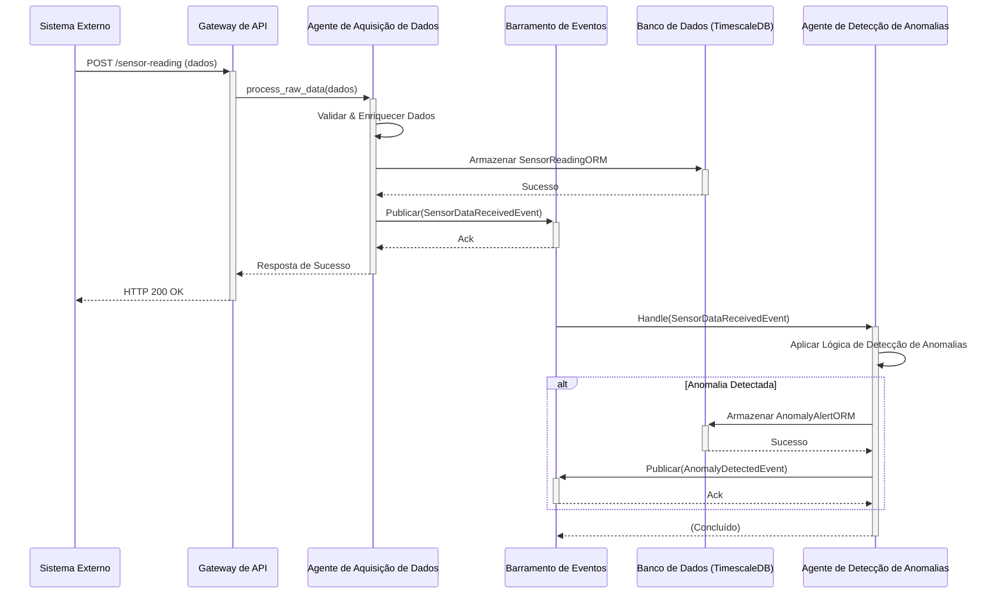
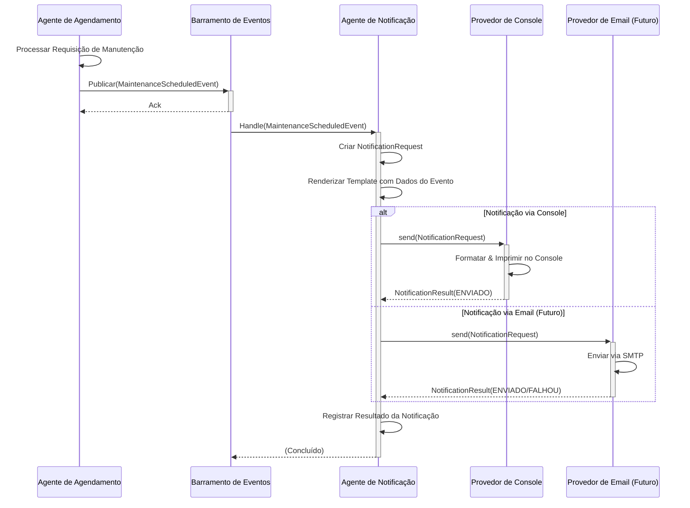
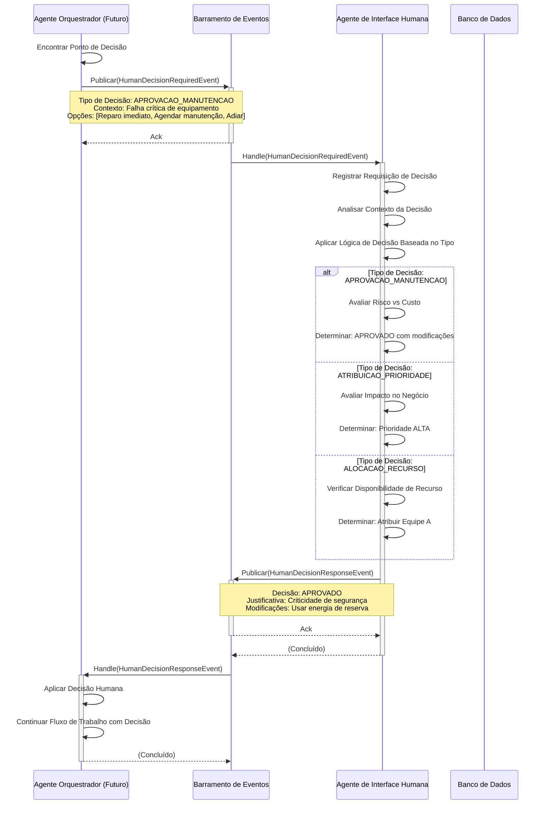

# Smart Maintenance SaaS - Arquitetura

## 1. Visão Geral

A plataforma Smart Maintenance SaaS emprega uma arquitetura orientada a eventos, inspirada em microsserviços e centrada em um sistema multiagente. Este design promove modularidade, escalabilidade e resiliência. Os componentes principais comunicam-se de forma assíncrona através de um Barramento de Eventos (Event Bus), permitindo serviços desacoplados e orquestração flexível de fluxos de trabalho.

## 2. Componentes Principais

### 2.1. Gateway de API (FastAPI)

* **Propósito:** Serve como ponto de entrada primário para todas as interações externas (IU, sistemas de terceiros).
* **Responsabilidades:** Validação de requisições, autenticação, autorização, roteamento para os serviços/agentes internos apropriados.
* **Tecnologia:** FastAPI.

### 2.2. Barramento de Eventos (Event Bus)

* **Propósito:** Facilita a comunicação assíncrona entre agentes e outros serviços.
* **Responsabilidades:** Gerencia inscrições e publicações de eventos. Garante a entrega confiável de eventos (inicialmente em memória, com planos para Kafka/Redis para persistência e escalabilidade).
* **Implementação:** `core.events.event_bus.EventBus`.
* **Eventos Chave:** (Consulte o Catálogo de Eventos em `smart-maintenance-saas/README.md`)
  * `BaseEventModel`
  * `SensorDataReceivedEvent`
  * `DataProcessedEvent`
  * `AnomalyDetectedEvent`
  * `AnomalyValidatedEvent`
  * `MaintenancePredictedEvent`
  * `MaintenanceScheduledEvent`
  * `AgentStatusUpdateEvent`
  * `HumanDecisionRequiredEvent`
  * `HumanDecisionResponseEvent`

### 2.3. Sistema de Agentes

O coração da plataforma, consistindo em agentes especializados construídos sobre uma base comum.

* **`BaseAgent` (`apps.agents.base_agent.BaseAgent`)**:
  * **Propósito:** Classe base abstrata que fornece capacidades fundamentais para todos os agentes.
  * **Responsabilidades:**
    * Gerenciamento do ciclo de vida (`start`, `stop`).
    * Manipulação central de eventos (`handle_event`, `_publish_event`).
    * Registro e anúncio de capacidades.
    * Relatório de status de saúde (`get_health`).
  * **Métodos Chave:** `process` (abstrato, para lógica específica do agente), `register_capabilities`, `start`, `stop`, `handle_event`, `get_health`.

* **`AgentRegistry` (`core.agent_registry.AgentRegistry`)**:
  * **Propósito:** Serviço singleton para descobrir e gerenciar instâncias de agentes ativos.
  * **Responsabilidades:** Permite que agentes se registrem e que outros componentes procurem agentes por ID.

Para descrições detalhadas das funções e responsabilidades de cada agente, consulte a seção [Agentes Implementados & Seus Papéis no README principal do projeto](../README.md#agentes-implementados--seus-papéis-versão-em-português).

* **`HumanInterfaceAgent` (`apps.agents.interface.human_interface_agent.HumanInterfaceAgent`)**:
  * **Propósito:** Gerencia pontos de decisão humano-no-loop. Em desenvolvimento/teste, simula decisões humanas; em produção, integra-se com interfaces humanas reais.
  * **Responsabilidades:** Processa `HumanDecisionRequiredEvent`, aplica lógica (ou aguarda entrada humana) e publica `HumanDecisionResponseEvent`.
  * *Para detalhes completos, consulte o README.*

* **Agentes Especializados:**
  * `DataAcquisitionAgent`: Ingesta, valida e enriquece dados de sensores.
  * `AnomalyDetectionAgent`: Detecta anomalias usando ML e modelos estatísticos.
  * `ValidationAgent`: Valida anomalias detectadas usando regras e contexto histórico.
  * `OrchestratorAgent`: **COORDENADOR CENTRAL** - Gerencia fluxos de trabalho e coordena decisões entre agentes.
  * `LearningAgent`: Gerencia conhecimento usando RAG, aprendendo com o feedback do sistema.
  * `PredictionAgent`: Prevê falhas e recomenda manutenção usando ML.
  * `SchedulingAgent`: Agenda tarefas de manutenção e atribui técnicos.
  * `NotificationAgent`: Envia notificações sobre eventos do sistema e manutenção.
  * `ReportingAgent`: Gera relatórios analíticos e visualizações.
  * (Mais agentes para aprendizado, suporte à decisão, etc., serão detalhados no README conforme implementados.)

### 2.4. Camada de Persistência de Dados

* **Propósito:** Armazena todos os dados relevantes, incluindo leituras de sensores, informações de ativos, anomalias e tarefas de manutenção.
* **Tecnologias:** As tecnologias centrais de persistência de dados são detalhadas na seção [Tech Stack](../README.md#tech-stack) da documentação principal do projeto.
* **Modelos ORM Chave:** (`core.database.orm_models`)
  * `SensorReadingORM`
  * `AnomalyAlertORM`
  * `MaintenanceTaskORM`

### 2.5. Gerenciamento de Configuração

* **Propósito:** Gerencia as configurações da aplicação.
* **Tecnologia:** Pydantic `BaseSettings` (`core.config.settings.Settings`).
* **Fonte:** Variáveis de ambiente e arquivos `.env`.

### 2.6. Logging

* **Propósito:** Fornece logging estruturado e centralizado.
* **Tecnologia:** `python-json-logger` (`core.logging_config.py`).

### 2.7. OrchestratorAgent - Coordenador Central de Fluxos de Trabalho

* **Propósito:** Atua como o sistema nervoso central da plataforma Smart Maintenance, orquestrando fluxos de trabalho complexos orientados a eventos e coordenando a tomada de decisão entre todos os agentes do sistema.
* **Principais Responsabilidades & Capacidades:** Gerencia fluxos de trabalho de manutenção de ponta a ponta, coordena a tomada de decisão (humana vs. automatizada), gerencia o estado e facilita a comunicação entre agentes.
* **Implementação:** `apps.agents.core.orchestrator_agent.OrchestratorAgent`
* *Para uma descrição detalhada, consulte a [seção do OrchestratorAgent no README](../README.md#orchestratoragent-appsagentscoreorchestratoragentpy) (link para a seção em inglês, idealmente deveria apontar para a tradução se disponível).*

## 3. Fluxo de Dados (Exemplo: Ingestão de Dados de Sensores & Detecção de Anomalias)

1.  **Ingestão:** Um sistema externo (ou simulador) envia dados de sensores para o endpoint `/api/v1/ingestion/sensor-reading/` no Gateway de API FastAPI.
2.  **Manipulação pela API:** O Gateway de API valida a requisição e pode publicar um evento de dados brutos ou chamar diretamente o `DataAcquisitionAgent`.
3.  **Aquisição de Dados:** O `DataAcquisitionAgent` recebe os dados.
    *   Ele valida, limpa e potencialmente enriquece os dados (ex: adicionando contexto do ativo).
    *   Publica um `SensorDataReceivedEvent` (ou `DataProcessedEvent`) para o Barramento de Eventos.
    *   Armazena a leitura processada do sensor no TimescaleDB via `CRUDSensorReading`.
4.  **Detecção de Anomalias:** Um `AnomalyDetectionAgent`, inscrito no `SensorDataReceivedEvent` (ou `DataProcessedEvent`), recebe os novos dados.
    *   Aplica seus algoritmos de detecção de anomalias (ex: verificações de limiar, modelos estatísticos).
    *   Se uma anomalia é detectada, publica um `AnomalyDetectedEvent` para o Barramento de Eventos.
    *   Armazena os detalhes da anomalia no banco de dados via `CRUDAnomalyAlert`.
5.  **Processamento Adicional:** Outros agentes (ex: `NotificationAgent`, `MaintenanceSchedulerAgent`) podem se inscrever no `AnomalyDetectedEvent` para disparar ações adicionais como enviar alertas ou criar tarefas de manutenção.

### 3.1. Fluxo de Notificação (Eventos de Agendamento de Manutenção)

O `SchedulingAgent` publica `MaintenanceScheduledEvent`. O `NotificationAgent` se inscreve nisso, formata uma mensagem e a envia através dos provedores configurados (ex: console).
* *Para descrições detalhadas desses agentes, consulte a [seção sobre Agentes Implementados no README](../README.md#agentes-implementados--seus-papéis-versão-em-português).*

### 3.2. Fluxo de Decisão Humano-no-Loop

O `OrchestratorAgent` tipicamente identifica situações que requerem entrada humana e publica um `HumanDecisionRequiredEvent`. O `HumanInterfaceAgent` processa este evento, simulando ou aguardando uma entrada humana real, e então publica um `HumanDecisionResponseEvent`. Isso permite que o `OrchestratorAgent` ou outros agentes relevantes continuem o fluxo de trabalho com base na decisão humana.
* *Para uma descrição detalhada do `HumanInterfaceAgent` e `OrchestratorAgent`, consulte a [seção sobre Agentes Implementados no README](../README.md#agentes-implementados--seus-papéis-versão-em-português).*

## 4. Diagramas

*(Espaço reservado para diagramas. Considere adicionar: Diagrama de Componentes, Diagrama de Sequência para fluxos de trabalho chave)*

### 4.1. Diagrama de Componentes de Alto Nível

```mermaid
graph TD
    UI[Interface do Usuário / Sistemas Externos] --> API[Gateway de API (FastAPI)]

    subgraph Serviços de Backend
        API --> EventBus[Barramento de Eventos]
        API -->|Chamadas Diretas| RA[Agente de Relatórios]

        EventBus -->|Eventos| DAA[Agente de Aquisição de Dados]
        DAA -->|Armazenar Dados| DB[(TimescaleDB/PostgreSQL)]
        DAA -->|Publicar Processado| EventBus

        EventBus -->|Eventos| ADA[Agente de Detecção de Anomalias]
        ADA -->|Armazenar Anomalias| DB
        ADA -->|Publicar Anomalia| EventBus

        EventBus -->|Eventos| MSA[Agente Agendador de Manutenção]
        MSA -->|Armazenar Tarefas| DB
        MSA -->|Publicar Tarefa| EventBus

        EventBus -->|Eventos| NA[Agente de Notificação]
        NA -->|Enviar Notificações| NotificationProviders[Console/Email/SMS/WhatsApp]

        EventBus -->|Eventos| HIA[Agente de Interface Humana]
        HIA -->|Simular Decisão Humana| EventBus

        RA -->|Consultar Dados| DB
        RA -->|Gerar Relatórios| ReportOutput[Relatórios & Gráficos]

        EventBus -->|Eventos| OtherAgents[Outros Agentes...]

        BaseAgent[BaseAgent] -- Herdado por --> DAA
        BaseAgent -- Herdado por --> ADA
        BaseAgent -- Herdado por --> MSA
        BaseAgent -- Herdado por --> NA
        BaseAgent -- Herdado por --> RA
        BaseAgent -- Herdado por --> HIA
        BaseAgent -- Herdado por --> OtherAgents

        AgentRegistry[Registro de Agentes] -- Gerencia --> DAA
        AgentRegistry -- Gerencia --> ADA
        AgentRegistry -- Gerencia --> MSA
        AgentRegistry -- Gerencia --> NA
        AgentRegistry -- Gerencia --> RA
        AgentRegistry -- Gerencia --> HIA
        AgentRegistry -- Gerencia --> OtherAgents
    end

    style API fill:#f9f,stroke:#333,stroke-width:2px
    style EventBus fill:#ccf,stroke:#333,stroke-width:2px
    style DB fill:#lightgrey,stroke:#333,stroke-width:2px
    style BaseAgent fill:#e6ffcc,stroke:#333,stroke-width:1px
    style AgentRegistry fill:#ffe6cc,stroke:#333,stroke-width:1px
    style HIA fill:#ffccff,stroke:#333,stroke-width:2px
```

### 4.2. Diagrama de Sequência: Ingestão de Dados de Sensores & Detecção de Anomalias



### 4.3. Diagrama de Sequência: Fluxo de Agendamento de Manutenção & Notificação



### 4.4. Diagrama de Sequência: Fluxo de Decisão Humano-no-Loop



## 5. Considerações sobre Machine Learning

### 5.1. Ciclo de Vida do Modelo e Estratégia de Treinamento

#### Limitações da Implementação Atual

A implementação atual do `AnomalyDetectionAgent` inclui simplificações adequadas para desenvolvimento e testes iniciais, mas com limitações conhecidas para uso em produção:

**Ajuste do StandardScaler:**

* Atualmente reajusta (`fit_transform`) em características de `DataProcessedEvent` individuais recebidas.
* Para pontos de dados únicos, isso normaliza apenas para aquele ponto específico (média=0, desvio padrão=1).
* Carece de uma linha de base estável para a distribuição de dados "normais" necessária para um escalonamento eficaz.

**Treinamento do IsolationForest:**

* Treinado (`fit`) usando características escalonadas do primeiro `DataProcessedEvent` recebido.
* A definição do modelo de comportamento "normal" é baseada em um único ponto de dados, potencialmente não representativo.
* Resulta em má generalização e detecção de anomalias não confiável.

#### Por que as Simplificações Atuais Não São Ideais para Produção

1.  **Falta de Representatividade:** Modelos treinados em pontos de dados isolados ou encontrados pela primeira vez não conseguem aprender a verdadeira distribuição subjacente dos dados operacionais normais. Isso leva a uma má generalização e detecção de anomalias não confiável.
2.  **Sem Linha de Base para Normalidade:** O StandardScaler precisa ser ajustado em um conjunto de dados que represente o comportamento normal para aprender sua média e desvio padrão. Esses parâmetros aprendidos são então usados para transformar novos dados, comparando-os com essa linha de base estabelecida.
3.  **Instabilidade do Modelo:** O modelo IsolationForest será altamente instável e enviesado se treinado com dados insuficientes ou não representativos.
4.  **Ignorando a Especificidade do Sensor:** Diferentes sensores, mesmo do mesmo tipo, podem ter perfis operacionais únicos. Um modelo treinado com dados de um sensor (ou os primeiros dados encontrados de qualquer sensor) pode não ser apropriado para outros.
5.  **Ineficiência:** Embora não seja uma grande preocupação com pontos de dados únicos, ajustar modelos repetidamente é computacionalmente mais caro do que ajustar uma vez e depois prever muitas vezes.

#### Uma Abordagem Mais Robusta para Produção

**Fase de Treinamento Offline:**

1.  **Coleta de Dados:** Curar um conjunto de dados histórico substancial que represente com precisão as condições operacionais normais para vários sensores ou tipos de equipamento. Este conjunto de dados deve ser grande o suficiente para capturar variações típicas.
2.  **Rotulagem de Dados (Opcional, mas Recomendado):** Se possível, rotular períodos de anomalias conhecidas em seus dados históricos. Isso é crucial para avaliação, mas não estritamente para modelos não supervisionados como Isolation Forest (que aprende com dados não rotulados, assumidos como normais).
3.  **Pré-processamento:** Limpar os dados (lidar com valores ausentes, outliers se não forem as anomalias alvo para este modelo específico).
4.  **Ajuste do Modelo:**
    *   **StandardScaler:** Ajustar o scaler em todo o conjunto de dados de treinamento normal para cada tipo de sensor (ou grupo) para aprender sua média e variância características.
    *   **IsolationForest:** Treinar o modelo IsolationForest no conjunto de dados de treinamento normal escalonado.
5.  **Serialização & Registro de Modelos:** Salvar (serializar) os scalers ajustados e modelos treinados (ex: usando joblib ou pickle). Armazená-los em um registro de modelos (como MLflow, ou um armazenamento de arquivos estruturado como S3) versionado e acessível pelo `AnomalyDetectionAgent`.

**Fase de Predição Online (no `AnomalyDetectionAgent`):**

1.  **Carregamento do Modelo:** Na inicialização, ou ao processar dados para um tipo de sensor específico pela primeira vez, o agente deve carregar o scaler pré-treinado apropriado e o modelo Isolation Forest do registro.
2.  **Transformação:** Usar o StandardScaler carregado (e já ajustado) para transformar (não `fit_transform`) as características dos novos dados de sensores recebidos.
3.  **Predição:** Alimentar as características escalonadas ao modelo IsolationForest carregado (e já treinado) para obter as saídas `predict()` e `decision_function()`.

**Modelos Específicos por Sensor:**

*   Manter scalers e modelos separados para diferentes tipos de sensores (ex: `temperature_scaler.joblib`, `temperature_iforest.joblib`).
*   O `AnomalyDetectionAgent` selecionaria os arquivos de modelo corretos com base no `sensor_type` (ou mesmo `sensor_id` para sensores altamente críticos/únicos) da `SensorReading` recebida.
*   A abordagem `historical_data_store` para o modelo estatístico é um bom paralelo para gerenciar parâmetros/modelos por sensor.

**Retreinamento Periódico e Monitoramento (MLOps):**

*   Implementar uma estratégia para retreinar modelos periodicamente usando dados recentes para se adaptar ao comportamento evolutivo do equipamento (concept drift).
*   Monitorar o desempenho do modelo em produção (usando métricas como Precisão, Recall, F1-score se feedback/rótulos estiverem disponíveis) para identificar quando o retreinamento é necessário.

### 5.2. Métricas de Desempenho: Precisão, Recall e F1-score

Para avaliar a eficácia do `AnomalyDetectionAgent`, especialmente quando estiver mais maduro ou se você tiver dados rotulados (conhecendo anomalias passadas reais), você pode usar métricas de classificação padrão:

**Estrutura de Classificação:**

*   **Verdadeiro Positivo (VP):** Uma anomalia real que o agente sinalizou corretamente como uma anomalia.
*   **Falso Positivo (FP):** Um ponto de dados normal que o agente sinalizou incorretamente como uma anomalia (um alarme falso).
*   **Verdadeiro Negativo (VN):** Um ponto de dados normal que o agente identificou corretamente como normal.
*   **Falso Negativo (FN):** Uma anomalia real que o agente não conseguiu detectar e sinalizou como normal (uma detecção perdida).

Com base nestes, as métricas chave são:

#### Precisão (Precision)

*   **Fórmula:** VP / (VP + FP)
*   **No Contexto:** "De todos os alertas que nosso `AnomalyDetectionAgent` gerou, qual porcentagem eram problemas reais do equipamento?"
*   **Significado:** Alta precisão minimiza o desperdício de recursos gastos investigando alarmes falsos e constrói confiança no sistema.

#### Recall (Sensibilidade)

*   **Fórmula:** VP / (VP + FN)
*   **No Contexto:** "De todos os problemas reais do equipamento que ocorreram, qual porcentagem nosso `AnomalyDetectionAgent` detectou com sucesso?"
*   **Significado:** Alto recall é crucial para um sistema de manutenção preditiva, pois o objetivo principal é capturar falhas iminentes. Detecções perdidas (FN) podem levar a paradas inesperadas e custos mais altos.

#### F1-score

*   **Fórmula:** 2 × (Precisão × Recall) / (Precisão + Recall)
*   **No Contexto:** Uma única métrica que fornece um equilíbrio entre Precisão e Recall.
*   **Significado:** Útil quando há um trade-off. Por exemplo, ser extremamente sensível para capturar todas as anomalias (alto recall) pode levar a mais alarmes falsos (menor precisão). O F1-score ajuda a encontrar um bom compromisso.

#### Como Essas Métricas Seriam Usadas

**Seleção & Ajuste de Modelos:** Ao experimentar diferentes algoritmos de detecção de anomalias ou ajustar parâmetros (como o fator de contaminação no Isolation Forest ou o valor sigma no modelo estatístico), essas métricas, calculadas em um conjunto de dados de validação rotulado, guiariam as decisões.

**Monitoramento de Desempenho:** Se um mecanismo de feedback estiver implementado (ex: logs de manutenção confirmando se um alerta correspondeu a um problema real), essas métricas podem ser rastreadas ao longo do tempo para monitorar o desempenho do agente em produção e sinalizar quando os modelos podem precisar de retreinamento ou ajuste.

**Justificativa de Valor de Negócio:** Correlacionar essas métricas com custos operacionais (ex: custo de uma falha perdida vs. custo de investigar um alarme falso) pode ajudar a otimizar o sistema para objetivos de negócio.

### 5.3. Fluxo de Relatórios e Análises

O `ReportingAgent` gera relatórios e visualizações. Pode ser acionado via API ou tarefas agendadas.
* *Para uma descrição detalhada, consulte a [seção do ReportingAgent no README](../README.md#reportingagent-appsagentsdecisionreportingagentpy) (link para a seção em inglês).*

## 5.3. LearningAgent: Gerenciamento de Conhecimento Baseado em RAG
*(Nota: Esta é a segunda seção numerada 5.3 no documento original)*

O **LearningAgent** usa uma abordagem de Geração Aumentada por Recuperação (RAG) com ChromaDB e SentenceTransformers para gerenciamento de conhecimento. Ele aprende com eventos do sistema como `SystemFeedbackReceivedEvent` para fornecer contexto e insights históricos.
* *Para uma descrição detalhada, consulte a [seção do LearningAgent no README](../README.md#learningagent-appsagentslearninglearningagentpy) (link para a seção em inglês).*

## 6. Escalabilidade e Resiliência

*   **Escalabilidade:** Agentes podem ser escalados independentemente. O Barramento de Eventos pode ser expandido (ex: usando Kafka).
*   **Resiliência:** O desacoplamento via Barramento de Eventos significa que a falha em um agente não necessariamente derruba todo o sistema. Mecanismos de nova tentativa e filas de mensagens mortas (dead-letter queues) podem ser implementados.

## 7. Considerações Futuras

*   Barramento de Eventos Persistente (Kafka, Redis Streams).
*   Descoberta de Serviços (Consul, etcd) se evoluir para além de uma implantação de nó único para agentes.
*   Rastreamento Distribuído.
*   Capacidades de Agente mais sofisticadas (aprendizado, planejamento).

## 8. Evolução Arquitetural: Fundação Customizada vs. Frameworks Avançados

### Abordagem Estratégica de Implementação

Nossa visão arquitetural de longo prazo para a plataforma Smart Maintenance SaaS engloba uma "Pilha Tecnológica Aprimorada" que inclui frameworks poderosos como **CrewAI**, **LangGraph** e **Temporal.io**, juntamente com protocolos de comunicação avançados como o **A2A do Google** e o **Protocolo de Contexto de Modelo (MCP) da Anthropic**. Essas tecnologias representam a vanguarda dos sistemas multiagente, orquestração de fluxos de trabalho e colaboração impulsionada por IA.

No entanto, nossa implementação atual emprega deliberadamente uma abordagem customizada e fundamental construída em torno de:

-   **Classe BaseAgent Customizada**: Fornece gerenciamento de ciclo de vida central, manipulação de eventos e registro de capacidades para todos os agentes especializados.
-   **EventBus Customizado**: Gerencia a comunicação assíncrona orientada a eventos entre agentes usando modelos definidos por Pydantic para segurança de tipo e validação.
-   **Padrões de Fluxo de Trabalho Emergentes**: Orquestração de sistema que emerge naturalmente de relações diretas de publicação-assinatura entre agentes.

### Justificativa: Por Que Primeiro uma Fundação Customizada

Esta abordagem customizada representa uma **decisão estratégica deliberada** para nosso sprint inicial de implementação de 14 dias, impulsionada por várias considerações chave:

#### 1. Entrega Acelerada de Funcionalidade Essencial
Construir sobre uma fundação customizada nos permitiu priorizar e desenvolver rapidamente as capacidades funcionais essenciais de agentes individuais — aquisição de dados, detecção de anomalias, validação e manutenção preditiva. Em vez de investir tempo significativo na integração de frameworks, pudemos focar na entrega de capacidades de IA e ML funcionais que demonstram valor de negócio imediato.

#### 2. Momentum de Desenvolvimento Mantido
Nossa abordagem se baseia no código existente e testado em batalha, sem a interrupção da integração de grandes novos frameworks no meio do sprint. Isso preservou a velocidade de desenvolvimento durante um cronograma crítico onde provar a funcionalidade central era primordial.

#### 3. Complexidade Gerenciada Apropriadamente
Frameworks avançados como Temporal.io e LangGraph trazem capacidades sofisticadas, mas também introduzem complexidade arquitetural substancial. Adiar essa complexidade até que tenhamos um entendimento sólido de nossas necessidades específicas de orquestração reduz o risco de superengenharia e ajuda a manter os compromissos do cronograma do projeto.

#### 4. Mitigação de Riscos
Ao estabelecer um sistema funcional primeiro, criamos uma fundação estável que pode ser aprimorada incrementalmente, em vez de arriscar uma abordagem de integração "big bang" que poderia comprometer toda a entrega.

### O Caminho a Seguir: Integração Estratégica de Frameworks

Esta abordagem de fundação customizada **não é um abandono** de nossa visão arquitetural, mas sim uma estratégia pragmática de evolução em fases:

#### Pontos Estratégicos de Introdução

Frameworks avançados serão introduzidos estrategicamente quando suas vantagens específicas resolverem problemas claros e emergentes identificados através da operação real do sistema:

**O OrchestratorAgent (Dia 10) como um Ponto de Decisão Crítico**: O desenvolvimento do nosso `OrchestratorAgent` planejado representa o ponto de inflexão natural para avaliar criticamente as necessidades de orquestração do sistema. À medida que a complexidade do fluxo de trabalho cresce além de simples cadeias de eventos, é quando motores dedicados como **Temporal.io** para gerenciamento robusto de fluxos de trabalho ou **LangGraph** para coordenação de agentes baseada em máquinas de estado serão rigorosamente avaliados.

#### Critérios de Adoção Específicos por Framework

**Integração CrewAI**: Será considerada quando desenvolvermos equipes de agentes complexas, colaborativas e alimentadas por LLM que exijam atribuição de papéis sofisticada, delegação de tarefas e capacidades de raciocínio colaborativo além dos nossos padrões atuais orientados a eventos.

**Protocolo de Contexto de Modelo (MCP)**: Será integrado quando nossos agentes exigirem capacidades padronizadas e sofisticadas de "uso de ferramentas", particularmente para agentes baseados em LLM que precisam interagir com sistemas externos, APIs e bancos de dados de maneira estruturada e orientada por protocolo.

**Temporal.io**: Será avaliado para fluxos de trabalho complexos e de longa duração que exigem garantias de durabilidade, lógica de nova tentativa avançada, versionamento e gerenciamento de estado sofisticado além do que nosso EventBus atual fornece.

**LangGraph**: Será considerado para agentes que exigem máquinas de estado complexas, ramificações condicionais e árvores de decisão sofisticadas que vão além de simples padrões de publicação-assinatura.

#### Filosofia de Adoção Seletiva

Em vez de uma adoção completa de frameworks, implementaremos uma **abordagem de integração seletiva**:

1.  **Validação de Prova de Conceito**: Novos frameworks serão validados através de implementações isoladas de prova de conceito.
2.  **Migração Incremental**: Componentes críticos serão migrados gradualmente, mantendo a estabilidade do sistema.
3.  **Arquitetura Híbrida**: Manteremos nossos componentes customizados onde eles fornecem valor suficiente, enquanto atualizamos seletivamente áreas de alta complexidade.
4.  **Avaliação Contínua**: Avaliação regular dos benefícios do framework em relação à complexidade evolutiva do nosso sistema.

### Resumo: Estratégia de Evolução Pragmática

Nossa estratégia arquitetural equilibra **velocidade de entrega com excelência arquitetural de longo prazo** através de uma abordagem pragmática e iterativa. Estamos construindo primeiro funcionalidades centrais robustas em nossa sólida fundação customizada, enquanto planejamos sistematicamente incorporar frameworks avançados e especializados à medida que a complexidade e os requisitos operacionais do nosso sistema evoluem.

Esta abordagem garante que entregamos valor de negócio imediato enquanto posicionamos a plataforma para capacidades futuras sofisticadas. Em vez de apostar tudo na seleção de frameworks desde o início, estamos deixando que os padrões de uso do mundo real e os requisitos operacionais guiem nossa evolução arquitetural — uma estratégia que maximiza tanto o sucesso da entrega a curto prazo quanto a solidez arquitetural a longo prazo.

O resultado é um sistema que pode demonstrar ROI imediato enquanto mantém a flexibilidade para evoluir para uma plataforma de nível empresarial, líder de mercado, aproveitando as tecnologias avançadas mais apropriadas para cada desafio específico que encontrarmos.
