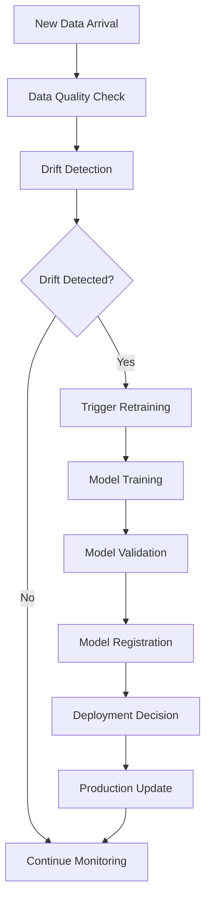

# Smart Maintenance SaaS - Complete Documentation Index

## Core Documentation

### Getting Started

- **[Main README](../../../README.md)** - Project overview, quick start, and repository structure
- **[Backend README](../../../README.md)** - Docker deployment and getting started guide
- **[Development Orientation](../DEVELOPMENT_ORIENTATION.md)** - Development guidelines and best practices

### Project History & Changelog

- **[30-Day Sprint Changelog](../30-day-sprint-changelog.md)** - Complete development history and daily progress
- **[Final Sprint Summary](../final_30_day_sprint.md)** - Executive summary of sprint achievements

## System Architecture & Design

### Architecture Documentation

- **[System and Architecture](../SYSTEM_AND_ARCHITECTURE.md)** - Comprehensive system architecture and design patterns
- **[System Screenshots](../SYSTEM_SCREENSHOTS.md)** - Visual documentation of system interfaces
- **[System Capabilities Unified System Documentation UI Redesign](../SYSTEM_CAPABILITIES_AND_UI_REDESIGN.md)** - Comprehensive system state and analysis
- **[Microservice Migration Strategy](../MICROSERVICE_MIGRATION_STRATEGY.md)** - Future architecture evolution plans

### Database Design

- **[Database Documentation](../db/README.md)** - Database schema and design documentation
- **[Database ERD](../db/erd.dbml)** - Entity Relationship Diagram source
- **[Database ERD (PNG)](../db/erd.png)** - Entity Relationship Diagram visualization
- **[Database ERD (Dark Mode)](../db/erd_darkmode.png)** - Entity Relationship Diagram (dark theme)
- **[Database Schema](../db/schema.sql)** - Complete SQL schema definition

## API & Integration

### API Documentation

- **[API Reference](../api.md)** - Complete REST API documentation and examples

## Performance & Testing

### Performance Documentation

- **[Performance Baseline](../PERFORMANCE_BASELINE.md)** - Performance metrics and SLO targets
- **[Day 17 Load Test Report](../DAY_17_LOAD_TEST_REPORT.md)** - Comprehensive load testing results (103.8 RPS)
- **[Day 18 Performance Results](../DAY_18_PERFORMANCE_RESULTS.md)** - TimescaleDB optimization results
- **[Load Testing Instructions](../LOAD_TESTING_INSTRUCTIONS.md)** - Guide for running performance tests

### Testing Documentation

- **[Test Documentation](../../tests/README.md)** - Test organization and execution guide
- **[Coverage Improvement Plan](../COVERAGE_IMPROVEMENT_PLAN.md)** - Test coverage strategy and current status

## Machine Learning & Data Science

### ML Documentation

- **[ML Documentation](./README.md)** - Machine learning models and pipelines
- **[Models Summary](../MODELS_SUMMARY.md)** - Overview of all 17+ production models
- **[Intelligent Model Selection (Live)](../MODELS_SUMMARY.md#intelligent-dynamic-model-selection-live-system)** - Dynamic recommendations by sensor type via MLflow tags
- **[Project Gauntlet Plan](../PROJECT_GAUNTLET_PLAN.md)** - Real-world dataset integration execution

## Security & Operations

### Security Documentation

- **[Security Documentation](../SECURITY.md)** - Security architecture and implementation
- **[Security Audit Checklist](../SECURITY_AUDIT_CHECKLIST.md)** - Comprehensive security audit framework

### Service Documentation

- **[Anomaly Service](../../services/anomaly_service/README.md)** - Future anomaly detection microservice
- **[Prediction Service](../../services/prediction_service/README.md)** - Future ML prediction microservice

---

*This index is automatically maintained and appears at the top of all documentation files for easy navigation.*

---

# Machine Learning Pipeline Documentation

## Overview

The Smart Maintenance SaaS ML pipeline provides comprehensive predictive maintenance capabilities through anomaly detection, forecasting, and automated drift monitoring. The system leverages MLflow for model lifecycle management and implements production-grade automation for continuous model improvement.

## Architecture Components

### 1. ML Model Registry (MLflow)
- **MLflow Tracking Server**: Centralized experiment tracking and model versioning
- **Artifact Storage**: Persistent model storage with `/mlruns` volume mounting
- **Model Registry**: Production model deployment and versioning
- **Backend Store**: SQLite database for metadata persistence

### 2. Core ML Models

#### Anomaly Detection Models
- **Isolation Forest**: Primary anomaly detection for sensor data
- **One-Class SVM**: Alternative anomaly detection algorithm
- **LSTM Autoencoder**: Deep learning-based anomaly detection for time series
- **Features**: Statistical, frequency domain, and time-based features
- **Training Data**: Historical sensor readings with labeled anomalies

#### Forecasting Models
- **Prophet**: Time series forecasting for maintenance scheduling
- **ARIMA**: Traditional time series analysis
- **LightGBM**: Gradient boosting for multi-variate forecasting
- **Features**: Seasonal patterns, trend analysis, external factors

#### Sound Analysis Models (MIMII Dataset)
- **MFCC Feature Extraction**: Mel-frequency cepstral coefficients
- **Audio Anomaly Detection**: Machine sound analysis
- **Frequency Domain Analysis**: FFT-based feature engineering
- **Real-time Audio Processing**: Streaming audio analysis capabilities

### 3. Automated Drift Monitoring System

#### Drift Detection Agent (`scripts/run_drift_check_agent.py`)
**Purpose**: Continuously monitor model performance and detect data drift

**Key Features**:
- **Scheduled Monitoring**: Configurable cron-based drift detection (default: every 6 hours)
- **Statistical Drift Detection**: KS test, PSI, and distribution comparison
- **Performance Degradation Tracking**: Model accuracy monitoring over time
- **Redis Event Publishing**: Publishes `DriftDetectedEvent` when drift exceeds threshold
- **Slack Integration**: Real-time alerts via webhook notifications
- **MLflow Integration**: Model version tracking and comparison

**Configuration**:
```yaml
environment:
  - DRIFT_CHECK_ENABLED=true
  - DRIFT_CHECK_SCHEDULE="0 */6 * * *"  # Every 6 hours
  - DRIFT_THRESHOLD=0.05  # 5% drift threshold
  - SLACK_WEBHOOK_URL=${SLACK_WEBHOOK_URL}
  - MLFLOW_TRACKING_URI=http://mlflow:5000
```

**Drift Detection Methods**:
1. **Population Stability Index (PSI)**: Measures distribution shifts
2. **Kolmogorov-Smirnov Test**: Statistical distribution comparison
3. **Feature Drift Analysis**: Individual feature distribution changes
4. **Model Performance Monitoring**: Accuracy/precision degradation tracking

#### Model Retraining Agent (`scripts/retrain_models_on_drift.py`)
**Purpose**: Automatically trigger model retraining when significant drift is detected

**Key Features**:
- **Event-Driven Architecture**: Consumes `DriftDetectedEvent` from Redis
- **Intelligent Retraining Policies**: Cooldown periods and concurrent job limits
- **Makefile Integration**: Triggers existing training pipelines via subprocess
- **Multi-Model Support**: Configurable model retraining (anomaly, forecast)
- **State Management**: Tracks retraining history and active jobs
- **Completion Events**: Publishes `ModelRetrainingCompletedEvent`

**Configuration**:
```yaml
environment:
  - RETRAINING_ENABLED=true
  - RETRAINING_COOLDOWN_HOURS=24  # 24-hour cooldown between retraining
  - MAX_CONCURRENT_RETRAINING=1   # Limit concurrent jobs
  - MODELS_TO_RETRAIN=anomaly:train-anomaly,forecast:train-forecast
  - TRAINING_TIMEOUT_MINUTES=60   # 1-hour training timeout
```

**Retraining Workflow**:
1. **Drift Event Reception**: Listen for Redis events on `drift_events` channel
2. **Policy Validation**: Check cooldown periods and resource availability
3. **Model Retraining**: Execute `make train-anomaly` and `make train-forecast`
4. **Version Management**: New models registered in MLflow with timestamp
5. **Completion Notification**: Publish success/failure events to Redis

### 4. Data Pipeline Architecture

#### Feature Engineering Pipeline
```python
# Time-based features
- rolling_mean_{window}
- rolling_std_{window}  
- lag_features_{lag}
- rate_of_change
- moving_average_convergence_divergence

# Frequency domain features  
- fft_magnitude_peaks
- spectral_centroid
- spectral_rolloff
- zero_crossing_rate

# Statistical features
- kurtosis, skewness
- percentile_features
- entropy_measures
```

#### Data Validation and Quality
- **Schema Validation**: Pydantic models for data consistency
- **Outlier Detection**: Statistical and ML-based outlier identification  
- **Missing Data Handling**: Interpolation and imputation strategies
- **Data Drift Monitoring**: Continuous validation of input data distributions

### 5. Model Performance Monitoring

#### Key Metrics Tracked
- **Anomaly Detection**: Precision, Recall, F1-Score, AUC-ROC
- **Forecasting**: MAE, RMSE, MAPE, directional accuracy
- **Drift Detection**: PSI scores, KS test p-values, feature importance shifts
- **System Performance**: Inference latency, throughput, resource utilization

#### MLflow Experiment Tracking
```python
# Example experiment logging
with mlflow.start_run():
    # Model training
    model = IsolationForest(contamination=0.1)
    model.fit(X_train)
    
    # Metrics logging
    mlflow.log_metrics({
        "precision": precision_score(y_test, predictions),
        "recall": recall_score(y_test, predictions),
        "f1_score": f1_score(y_test, predictions)
    })
    
    # Model registration
    mlflow.sklearn.log_model(
        model, 
        "isolation_forest_model",
        registered_model_name="anomaly_detection_v1"
    )
```

### 6. Production Deployment Strategy

#### Model Serving Architecture
- **FastAPI Endpoints**: RESTful API for model inference
- **Async Processing**: Non-blocking inference with Redis queuing
- **Load Balancing**: Multiple API instances for high availability
- **Caching**: Redis-based prediction caching for performance

#### A/B Testing Framework
- **Champion/Challenger**: Automatic traffic splitting between model versions
- **Performance Comparison**: Real-time metric comparison
- **Automatic Promotion**: Best-performing models promoted to production
- **Rollback Capability**: Instant rollback to previous versions

#### Model Versioning Strategy
```
Models Registry Structure:
├── anomaly_detection/
│   ├── v1.0.0 (baseline)
│   ├── v1.1.0 (improved features)
│   └── v2.0.0 (neural network)
├── forecasting/
│   ├── prophet_v1.0.0
│   ├── prophet_v1.1.0
│   └── lightgbm_v1.0.0
└── sound_analysis/
    ├── mfcc_classifier_v1.0.0
    └── autoencoder_v1.0.0
```

### 7. Automated ML Lifecycle

#### Continuous Integration/Continuous Deployment (CI/CD)
1. **Data Validation**: Automated data quality checks
2. **Model Training**: Scheduled retraining on new data
3. **Model Evaluation**: Automated performance benchmarking
4. **Deployment Pipeline**: Automated model promotion to production
5. **Monitoring**: Continuous performance and drift monitoring

#### Event-Driven Automation


### 8. Configuration Management

#### Environment Variables
```bash
# MLflow Configuration
MLFLOW_TRACKING_URI=http://mlflow:5000
MLFLOW_S3_ENDPOINT_URL=http://mlflow:5000

# Drift Monitoring
DRIFT_CHECK_ENABLED=true
DRIFT_CHECK_SCHEDULE="0 */6 * * *"
DRIFT_THRESHOLD=0.05
DRIFT_EVENT_CHANNEL=drift_events

# Retraining Configuration  
RETRAINING_ENABLED=true
RETRAINING_COOLDOWN_HOURS=24
MAX_CONCURRENT_RETRAINING=1
MODELS_TO_RETRAIN=anomaly:train-anomaly,forecast:train-forecast

# Notification Configuration
SLACK_WEBHOOK_URL=${SLACK_WEBHOOK_URL}
```

#### Model Training Configuration
```python
# anomaly_config.yaml
model_config:
  isolation_forest:
    contamination: 0.1
    n_estimators: 100
    random_state: 42
  
  feature_engineering:
    window_sizes: [5, 10, 20]
    lag_features: [1, 3, 6, 12]
    statistical_features: true
    frequency_features: true

# forecast_config.yaml  
forecast_config:
  prophet:
    yearly_seasonality: true
    weekly_seasonality: true
    daily_seasonality: false
    changepoint_prior_scale: 0.05
  
  horizon_days: 30
  confidence_interval: 0.95
```

### 9. Model Interpretability and Explainability

#### Feature Importance Analysis
- **SHAP Values**: Model-agnostic explanations
- **Permutation Importance**: Feature contribution analysis
- **Partial Dependence Plots**: Feature effect visualization
- **LIME**: Local interpretable model explanations

#### Anomaly Explanation
```python
# Example anomaly explanation
def explain_anomaly(model, instance, feature_names):
    explainer = shap.Explainer(model)
    shap_values = explainer(instance)
    
    explanation = {
        "anomaly_score": model.decision_function([instance])[0],
        "contributing_features": {
            feature_names[i]: float(shap_values.values[0][i])
            for i in shap_values.values[0].argsort()[-5:][::-1]
        },
        "threshold": model.offset_
    }
    return explanation
```

### 10. Performance Optimization

#### Model Optimization Techniques
- **Feature Selection**: Recursive feature elimination
- **Hyperparameter Tuning**: Optuna-based optimization
- **Model Compression**: Quantization and pruning
- **Ensemble Methods**: Model stacking and voting

#### Inference Optimization
- **Batch Prediction**: Vectorized operations for multiple predictions
- **Model Caching**: In-memory model storage for fast access
- **Async Processing**: Non-blocking prediction pipelines
- **GPU Acceleration**: CUDA support for deep learning models

### 11. Security and Compliance

#### Data Privacy
- **Data Anonymization**: PII removal and pseudonymization
- **Encryption**: At-rest and in-transit data encryption
- **Access Control**: Role-based model and data access
- **Audit Logging**: Complete ML operation audit trails

#### Model Security
- **Model Signing**: Cryptographic model validation
- **Input Validation**: Malicious input detection
- **Adversarial Robustness**: Defense against adversarial attacks
- **Model Watermarking**: Intellectual property protection

### 12. Troubleshooting and Maintenance

#### Common Issues and Solutions

**Issue: Model Loading Failures**
```bash
# Diagnostic commands
docker compose exec api python -c "
import mlflow.sklearn
model = mlflow.sklearn.load_model('models:/anomaly_detection/latest')
print('Model loaded successfully')
"

# Check MLflow connectivity
curl -f http://localhost:5000/health
```

**Issue: Drift Detection Not Triggering**
```bash
# Check drift agent logs
docker compose logs drift_agent

# Verify Redis connectivity
docker compose exec drift_agent python -c "
import redis
r = redis.from_url('redis://redis:6379/0')
print('Redis ping:', r.ping())
"
```

**Issue: Retraining Failures**
```bash
# Check retraining agent status
docker compose logs retrain_agent

# Verify Makefile targets
docker compose exec retrain_agent make -n train-anomaly
```

#### Monitoring Commands
```bash
# MLflow health check
curl -f http://localhost:5000/health

# Check model registry
docker compose exec api python -c "
from mlflow.tracking import MlflowClient
client = MlflowClient('http://mlflow:5000')
models = client.search_registered_models()
print(f'Registered models: {len(models)}')
"

# Verify automation services
docker compose ps | grep -E "(drift_agent|retrain_agent)"
```

### 13. Future Enhancements

#### Planned Features
- **AutoML Integration**: Automated model architecture search
- **Federated Learning**: Distributed model training across sensors
- **Real-time Streaming**: Apache Kafka integration for live predictions
- **Advanced Drift Detection**: Multivariate drift detection methods
- **Model Ensemble Automation**: Dynamic ensemble composition

#### Research Areas
- **Causal Inference**: Understanding cause-effect relationships in maintenance
- **Transfer Learning**: Cross-domain model adaptation
- **Uncertainty Quantification**: Prediction confidence estimation
- **Continual Learning**: Models that adapt without catastrophic forgetting

---

## Quick Start Guide

### 1. Start ML Services
```bash
docker compose up -d mlflow drift_agent retrain_agent
```

### 2. Train Initial Models
```bash
docker compose exec api make train-anomaly
docker compose exec api make train-forecast
```

### 3. Verify Automation
```bash
# Check drift monitoring
docker compose logs drift_agent

# Check retraining readiness
docker compose logs retrain_agent
```

### 4. Monitor Performance
```bash
# MLflow UI
open http://localhost:5000

# Check model versions
docker compose exec api python -c "
from mlflow.tracking import MlflowClient
client = MlflowClient('http://mlflow:5000')
for model in client.search_registered_models():
    versions = client.search_model_versions(f\"name='{model.name}'\")
    print(f'{model.name}: {len(versions)} versions')
"
```

The ML pipeline is now fully automated with drift detection, model retraining, and comprehensive monitoring capabilities. All components are production-ready and follow industry best practices for MLOps deployment.