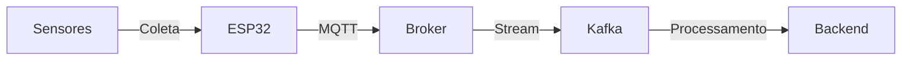
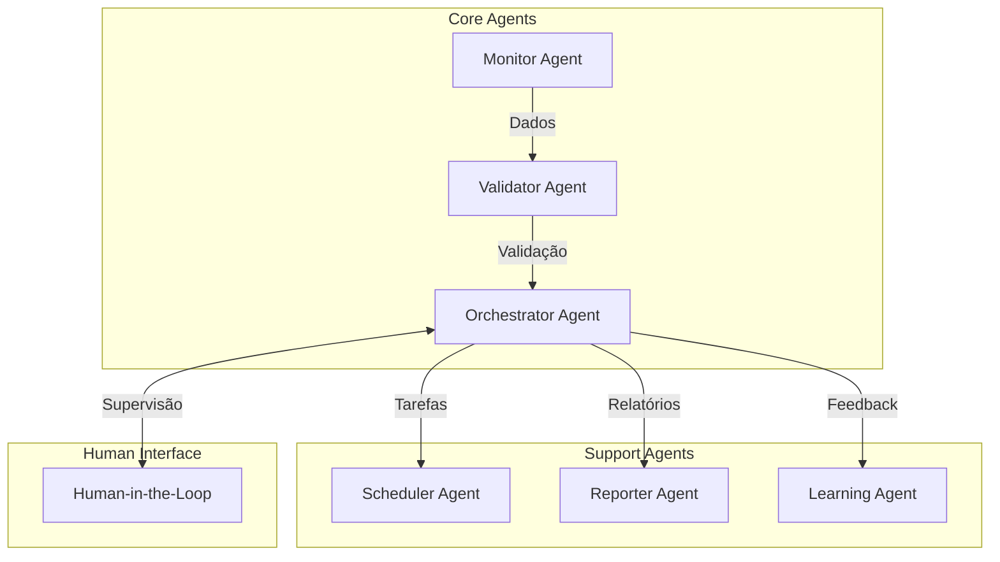
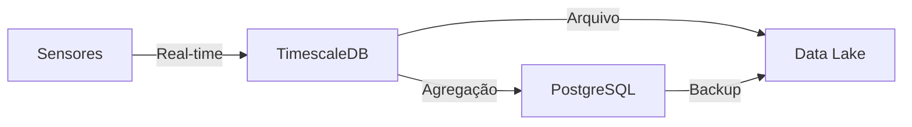
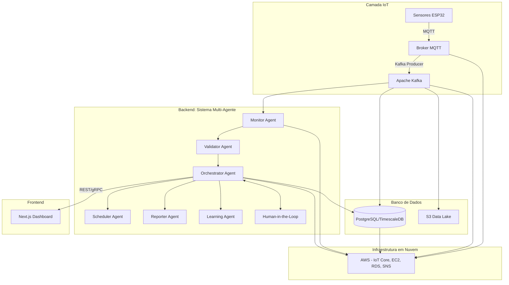
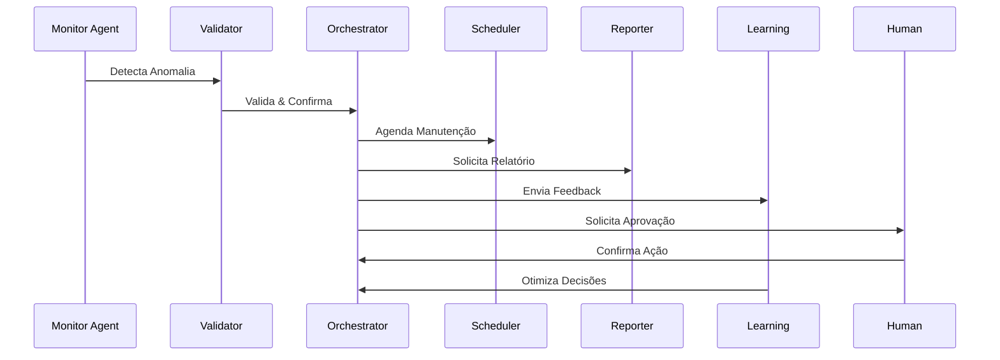
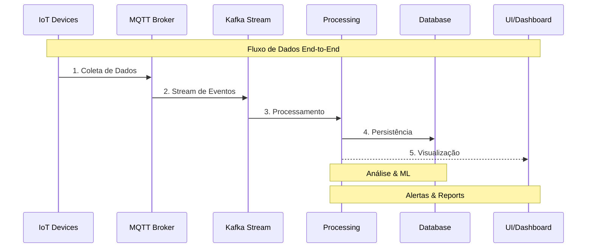

# 🏭 Smart Maintenance SaaS
### Documentação Final – Fase 1

A **Smart Maintenance SaaS** é uma plataforma multi-agentic de última geração, construída sobre três pilares fundamentais:

#### 1. Infraestrutura Cloud-Native 🌐

- **Multi-Tenant**: Isolamento seguro de dados por cliente
- **Escalabilidade**: Design horizontal e vertical
- **Alta Disponibilidade**: Redundância e failover

#### 2. Sistema Multi-Agent Avançado 

- **Orquestração**: Protocolos A2A (Agent to Agent) do Google
- **Contextualização**: Anthropic's MCP (Model Context Protocol) para integração de ferramentas
- **Comunicação**: ACP para consistência de mensagens

#### 3. Integração IoT & IA 💡

- **Edge Computing**: Processamento na borda
- **Machine Learning**: Modelos preditivos
- **Human-in-the-Loop**: Supervisão inteligente

| Informação | Detalhe |
|------------|---------|
| **Autor** | Yan Pimentel Cotta |
| **RM** | 562836 |
| **Entrega** | 08 de Maio de 2025 |
| **Versão** | 1.3 |

---

## 📋 1. Introdução

Este documento consolida a Fase 1 do projeto **Smart Maintenance SaaS**, uma solução inovadora de manutenção preditiva para o setor industrial, desenvolvida em parceria com a **Hermes Reply**. Nosso objetivo é atender ao desafio FIAP , entregando uma proposta técnica robusta, clara e profissional, digna de apresentação a uma grande empresa de tecnologia.

### 1.1 Contextualização do Problema

#### Desafios Atuais 🔍

Empresas industriais enfrentam desafios críticos em suas operações:

- **Interrupções Não Planejadas** ⚠️
  - Paradas inesperadas na produção
  - Perda significativa de produtividade
  - Custos elevados de manutenção corretiva

- **Limitações das Abordagens Tradicionais** 📉
  - Manutenção reativa ineficiente
  - Previsão imprecisa de falhas
  - Intervenções desnecessárias ou tardias

#### Oportunidade com Indústria 4.0 🚀

A integração de tecnologias modernas oferece soluções inovadoras:

- **IoT** - Monitoramento em tempo real
- **IA** - Análise preditiva avançada
- **Big Data** - Análise de dados em tempo real

Esta convergência tecnológica permite uma transformação na gestão de ativos, promovendo uma manutenção verdadeiramente proativa e inteligente.

### 1.2 Objetivo do Projeto

#### Visão Geral 🎯

Desenvolver uma plataforma SaaS Multi-Agentic de última geração para manutenção preditiva industrial.

#### Objetivos Específicos ✨

1. **Monitoramento IoT** 📡
   - Coleta contínua de dados via sensores
   - Processamento em tempo real
   - Análise de métricas críticas

2. **Inteligência Artificial** 🤖
   - Detecção de anomalias via ML
   - Previsão de falhas com modelos avançados
   - Aprendizado contínuo e adaptativo

3. **Sistema Multi-Agêntico** 🔄
   - Orquestração via MCP e A2A
   - Integração com LangChain e CrewAI
   - Automação de decisões complexas

4. **Interface Moderna** 💻
   - Dashboard interativo em tempo real
   - Relatórios inteligentes automatizados
   - UX/UI otimizada para operadores

5. **Infraestrutura Robusta** 🏗️
   - Arquitetura escalável horizontalmente
   - Segurança em múltiplas camadas
   - Alta disponibilidade garantida

### 1.3 Entregável da Fase 1
Esta documentação detalha a metodologia, o **technology stack**, o **pipeline de dados**, a **arquitetura do sistema** e a validação dos requisitos da Fase 1. **Inclui três representações visuais** (diagramas Mermaid) e um plano de desenvolvimento.

---

## 2. Arquitetura do Sistema

### 2.1 Visão Geral
A **Smart Maintenance SaaS** é uma plataforma multi-agentic baseada em nuvem, projetada para suportar múltiplos clientes com isolamento de dados seguro. Ela utiliza uma arquitetura modular com um sistema multi-agente no backend, orquestrado por protocolos avançados como **Google’s Agent-to-Agent (A2A)**, **Model Context Protocol (MCP)** e **Agent Communication Protocol (ACP)**. A solução integra **IoT**, **IA** e capacidades de **human-in-the-loop**, oferecendo monitoramento em tempo real, análise preditiva, agendamento automatizado e relatórios inteligentes.

### 2.2 Componentes da Arquitetura 🔧

#### 2.2.1 Camada IoT 📡

##### Funcionalidade Principal

Coleta e processamento de dados em tempo real de sensores industriais, com capacidade de edge computing.

##### Stack Tecnológico

| Componente | Tecnologia | Propósito |
|------------|------------|-----------|
| **Hardware** | ESP32 | Aquisição de dados (temperatura, vibração, pressão) |
| **Protocolo** | MQTT | Transmissão leve e eficiente de dados |
| **Streaming** | Apache Kafka | Pipeline de dados tolerante a falhas |
| **Edge** | AWS IoT Greengrass | Pré-processamento na borda |

##### Fluxo de Dados

#### 2.2.2 Backend: Sistema Multi-Agente 🤖

##### Sistema de Processamento Inteligente

O coração do sistema é composto por uma arquitetura multi-agente avançada que processa dados, detecta anomalias, prevê falhas e automatiza fluxos de trabalho críticos.

##### Stack de IA & Comunicação

| Categoria | Tecnologia | Finalidade |
|-----------|------------|------------|
| **Protocolos** | Google A2A, MCP, ACP | Comunicação segura e tool-calling |
| **Frameworks** | LangChain, CrewAI, AutoGen | Implementação de agentes |
| **Modelos** | OpenAI API / LLaMA / DeepSeek | Processamento de linguagem natural |
| **APIs** | FastAPI | Interface RESTful |
| **Comunicação** | gRPC | Microsserviços eficientes |

##### Arquitetura de Agentes

- **Agentes**:
  - **Monitor Agent**: Detecta anomalias com modelos de ML (e.g., Isolation Forest, Autoencoders, Random Forest, SVM, etc).
  - **Validator Agent**: Confirma anomalias com lógica híbrida (regras + inferência bayesiana).
  - **Orchestrator Agent**: Coordena agentes usando aprendizado por reforço (RL)para otimizar decisões.
  - **Scheduler Agent**: Agenda manutenções via APIs externas utilizando MCP (Model Context Protocol) (e.g., Google Calendar, WhatsApp para contatar engineers, etc).
  - **Reporter Agent**: Gera relatórios e envia e-mails (e.g., Gmail API; ou sistema de software proprietário).
  - **Learning Agent**: Otimiza o sistema com base em dados históricos e feedback utilizando RAG (Retrieval Augmented Generation) com uma database vetorial como FAISS.
  - **Human-in-the-Loop**: Permite intervenção humana em decisões críticas com suporte humano via frontend.

#### 2.2.3 Frontend 💻

##### Interface de Usuário Moderna

Dashboard interativo que combina monitoramento em tempo real com controles intuitivos para supervisão humana.

##### Stack Frontend

| Tecnologia | Versão | Propósito |
|------------|---------|-----------|
| **Next.js** | 14+ | SSR & Performance |
| **TypeScript** | 5+ | Type Safety |
| **Tailwind** | 3+ | UI Responsivo |
| **D3.js** | 7+ | Visualização Avançada |

##### Recursos de Interface

- **Monitoramento Real-Time** 📊
  - Dashboards dinâmicos
  - Métricas em tempo real
  - Gráficos interativos

- **Controles de Supervisão** 🎮
  - Aprovação de decisões
  - Ajuste de parâmetros
  - Intervenção manual

- **Visualização de Dados** 📈
  - Análise de tendências
  - Detecção de anomalias
  - Previsões de falha

#### 2.2.4 Banco de Dados 💾

##### Arquitetura de Dados

Sistema híbrido que combina banco relacional, séries temporais e data lake para máxima eficiência e escalabilidade.

##### Componentes de Armazenamento

| Componente | Tecnologia | Uso |
|------------|------------|-----|
| **RDBMS** | PostgreSQL | Dados estruturados, relacionamentos |
| **Time Series** | TimescaleDB | Métricas de sensores, séries temporais |
| **Data Lake** | Amazon S3 | Histórico bruto, backups |

##### Fluxos de Dados

#### 2.2.5 Infraestrutura Cloud ☁️

##### Arquitetura AWS-Native

Infraestrutura cloud-native projetada para alta disponibilidade, escalabilidade e segurança.

##### Componentes Cloud

| Serviço | Propósito | Características |
|---------|-----------|-----------------|
| **IoT Core** | Gerenciamento IoT | MQTT, Device Shadow |
| **EC2/ECS** | Computação | Auto-scaling, Load Balancing |
| **RDS** | Banco de Dados | Alta Disponibilidade, Backup |
| **Lambda** | Serverless | Eventos, Integrações |
| **SNS** | Notificações | Push, Email, SMS |

##### Containerização & Orquestração

- **Docker** 🐳
  - Microsserviços isolados
  - Build reproduzível
  - Deploy consistente

- **Kubernetes** ⚓
  - Auto-scaling
  - Self-healing
  - Rolling updates

### 2.3 Diagrama de Arquitetura Geral

---

## 3. Stack Tecnológico 🛠️

### Visão Geral das Tecnologias

Nossa stack foi cuidadosamente selecionada para garantir escalabilidade, manutenibilidade e inovação.

### 🔧 Componentes Principais

#### IoT & Edge Computing 📡

- **Hardware & Protocolos**
  - `ESP32` - Microcontroladores robustos
  - `MQTT` - Comunicação IoT otimizada
  - `Apache Kafka` - Streaming de dados
  - `AWS IoT Greengrass` - Edge computing

#### Backend & IA 🧠

- **Core & APIs**
  - `Python` & `FastAPI` - Base robusta
  - `gRPC` - Comunicação eficiente
  - `LangChain/CrewAI` - Framework de agentes
  - `A2A/MCP/ACP` - Protocolos Google e Anthropic

#### Frontend & UX 🎨

- **Framework & UI**
  - `Next.js` - SSR & performance
  - `TypeScript` - Type safety
  - `Tailwind CSS` - Design moderno
  - `D3.js` - Visualizações dinâmicas

#### Dados & Storage 💾

- **Persistência**
  - `PostgreSQL` - Base relacional
  - `TimescaleDB` - Séries temporais
  - `Amazon S3` - Data Lake escalável

#### Cloud & DevOps ☁️

- **Infraestrutura**
  - `AWS Suite` - Core services
  - `Docker` & `Kubernetes` - Containerização
  - `Terraform` - IaC

#### ML & Analytics 📊

- **Machine Learning**
  - `TensorFlow/PyTorch` - Deep Learning
  - `Scikit-learn` - ML clássico
  - `MLflow` - MLOps
  - `SageMaker` - Automação

#### Observabilidade 📈

- **Monitoramento**
  - `Prometheus` - Métricas
  - `Grafana` - Visualização
  - `AWS CloudWatch` - Logs

#### Segurança 🔒

- **Proteção & Auth**
  - `AWS Cognito` - IAM
  - `OAuth2/JWT` - Autenticação
  - `mTLS/TLS` - Criptografia
  - `At-rest Encryption` - Dados

### 3.1 Protocolos de Agentes
- **Google’s A2A**: Comunicação bidirecional confiável entre agentes via **gRPC** com **mTLS**.
- **MCP**: Troca de contexto de modelos e acesso a ferramentas externas (e.g., APIs de calendário, whatsapp, e e-mail).
- **ACP**: Orquestra mensagens, mantendo histórico e consistência.

---

## 4. Funcionalidade

## 4. Funcionalidades e Fluxos 🔄

### 4.1 Recursos Principais ⭐

#### Processamento em Tempo Real
- **Ingestão Contínua** via Apache Kafka
- **Análise Streaming** com KSQL/Flink
- **Processamento Distribuído** escalável

#### Análise Preditiva Avançada
- **Modelos ML** adaptáveis (LSTM, Random Forest)
- **AutoML** com IBM Watson
- **Otimização Contínua** de parâmetros

#### Sistema de Alertas
- **Notificações** via AWS SNS
- **Multicanal**: Email, SMS, WhatsApp
- **Priorização** inteligente

#### Manutenção Inteligente
- **Agendamento** otimizado por GA
- **Integração** com sistemas externos
- **Gestão** de recursos

#### Interface Interativa
- **Dashboard** em tempo real
- **Controles** intuitivos
- **Visualizações** dinâmicas

#### Relatórios Avançados
- **Insights** via NLP
- **Recomendações** automáticas
- **Análise** preditiva

### 4.2 Workflow Multi-Agent 🤖

#### Detalhamento do Fluxo

| Agente | Função | Interações |
|--------|--------|------------|
| **Monitor** | Detecção | Sensores → Validator |
| **Validator** | Confirmação | Monitor → Orchestrator |
| **Orchestrator** | Coordenação | Todos os Agentes |
| **Scheduler** | Agendamento | Orchestrator → APIs |
| **Reporter** | Relatórios | Orchestrator → Usuários |
| **Learning** | Otimização | Feedback → Sistema |
| **Human** | Supervisão | Interface → Orchestrator |

---

## 5. Visualizações do Sistema 📊

### 5.1 Arquitetura Multi-Agente

#### Diagrama de Interação entre Agentes

```mermaid
graph TD
    subgraph "Core System"
        A[Monitor Agent] -->|A2A| B[Validator Agent]
        B -->|A2A| C[Orchestrator Agent]
        C -->|A2A| D[Scheduler Agent]
        C -->|A2A| E[Reporter Agent]
        C -->|A2A| F[Learning Agent]
    end
    
    subgraph "External"
        H[External APIs]
    end
    
    subgraph "Human Control"
        G[Human-in-Loop]
    end
    
    C <--> G
    D -->|Calendar| H
    E -->|Email/SMS| H
    
    style A fill:#ff9900,stroke:#fff,stroke-width:2px
    style B fill:#00aa41,stroke:#fff,stroke-width:2px
    style C fill:#232f3e,stroke:#fff,stroke-width:2px
    style G fill:#cc2939,stroke:#fff,stroke-width:2px
```

### 5.2 Pipeline de Dados em Tempo Real

#### Fluxo de Processamento de Dados

#### Legendas & Detalhes

| Componente | Função | Tecnologias |
|------------|---------|-------------|
| **IoT Devices** | Coleta de dados | ESP32, Sensores |
| **MQTT Broker** | Comunicação | Mosquitto, AWS IoT |
| **Kafka Stream** | Processamento | KSQL, Flink |
| **Processing** | Análise | ML Models, Agents |
| **Database** | Armazenamento | TimescaleDB, S3 |
| **UI/Dashboard** | Visualização | Next.js, D3.js |

## 7. Diferenciais & Evolução 🚀

### 7.1 Destaques Técnicos

#### Processamento Avançado
- 🔄 **Kafka + KSQL/Flink**
  - Stream processing escalável
  - Análise em tempo real
  - Alta throughput

#### IA & Aprendizado
- 🧠 **Learning Agent**
  - Adaptação contínua
  - Feedback loop
  - Otimização automática

#### Edge Computing
- ⚡ **AWS IoT Greengrass**
  - Baixa latência
  - Processamento local
  - Economia de banda

#### Segurança
- 🔒 **Blockchain (Futuro)**
  - Auditoria imutável
  - Rastreabilidade
  - Compliance

### 7.2 Roadmap de Evolução

#### Fase 2: Aprimoramentos

1. **ML & Analytics**
   - Integração AutoML
   - Modelos customizados
   - Pipeline MLOps

2. **Data & Storage**
   - Data Lake S3
   - Retenção inteligente
   - Analytics avançado

3. **Arquitetura**
   - Microserviços gRPC
   - Escalabilidade horizontal
   - Resiliência distribuída

---

## 9. Conclusão 🎯

### Smart Maintenance SaaS: Inovação na Indústria 4.0

### 9.1 Resumo de Conquistas

- ✅ **Arquitetura Multi-Agent** consolidada
- ✅ **Stack Tecnológico** de ponta
- ✅ **Pipeline de Dados** otimizado
- ✅ **Protocolos** padronizados
- ✅ **Documentação** completa

### 9.2 Diferenciais do Projeto

1. **Inovação Tecnológica** 🚀
   - Arquitetura Multi-Agent avançada
   - Edge Computing otimizado
   - Machine Learning state-of-the-art

2. **Escalabilidade** ⚡
   - Design cloud-native
   - Microsserviços modulares
   - Processamento distribuído

3. **Manutenibilidade** 🛠️
   - Código documentado
   - Padrões modernos
   - DevOps ready

### 9.3 Próximos Passos

Aguardamos o feedback da **Hermes Reply** e tutores da **FIAP** para:
- Refinamento da arquitetura
- Ajustes no design técnico
- Início da implementação

---

**Projeto desenvolvido por:**  
Yan Pimentel Cotta (RM: 562836)

FIAP x Hermes Reply Challenge | Maio 2025

