# 🏭 Smart Maintenance SaaS
### Documentação Final – Fase 1

## 📑 Índice

### 📋 1. [Introdução](#-1-introdução)
- [Contextualização](#11-contextualização-do-problema)
- [Objetivos](#12-objetivo-do-projeto)
- [Entregáveis](#13-entregável-da-fase-1)

### 🏗️ 2. [Arquitetura](#2-arquitetura-do-sistema)
- [Visão Geral](#21-visão-geral)
- [Componentes](#22-componentes-da-arquitetura-)
  - [IoT](#221-camada-iot-)
  - [Backend](#222-backend-sistema-multi-agente-)
  - [Frontend](#223-frontend-)
  - [Database](#224-banco-de-dados-)
  - [Cloud](#225-infraestrutura-cloud-)
- [Diagrama Geral](#23-diagrama-de-arquitetura-geral)

### 🛠️ 3. [Stack Tecnológico](#3-stack-tecnológico-)
- [Protocolos](#31-protocolos-de-agentes)

### 🔄 4. [Funcionalidades](#4-funcionalidades-e-fluxos-)
- [Recursos Core](#41-recursos-principais-)
- [Workflow](#42-workflow-multi-agent-)

### 📊 5. [Visualizações](#5-visualizações-do-sistema-)
- [Arquitetura Multi-Agente](#51-arquitetura-multi-agente)
- [Pipeline de Dados](#52-pipeline-de-dados-em-tempo-real)

### 🚀 6. [Diferenciais](#7-diferenciais--evolução-)
- [Destaques](#71-destaques-técnicos-)
- [Roadmap](#72-roadmap-de-evolução)

### ✨ 7. [Conclusão](#9-conclusão-)
- [Conquistas](#91-resumo-de-conquistas)
- [Diferenciais](#92-diferenciais-do-projeto)
- [Próximos Passos](#93-próximos-passos)

| Informação | Detalhe |
|------------|---------|
| **Autor** | Yan Pimentel Cotta |
| **RM** | 562836 |
| **Entrega** | 08 de Maio de 2025 |
| **Versão** | 1.3 |

---

## 📋 1. Introdução

Este documento consolida a Fase 1 do projeto **Smart Maintenance SaaS**, uma solução inovadora de manutenção preditiva para o setor industrial, desenvolvida em parceria com a **Hermes Reply**. Nosso objetivo é atender ao desafio FIAP , entregando uma proposta técnica robusta, clara e profissional, digna de apresentação a uma grande empresa de tecnologia.

### 1.1 Contextualização do Problema

#### Desafios Atuais 🔍

Empresas industriais enfrentam desafios críticos em suas operações:

- **Interrupções Não Planejadas** ⚠️
  - Paradas inesperadas na produção
  - Perda significativa de produtividade
  - Custos elevados de manutenção corretiva

- **Limitações das Abordagens Tradicionais** 📉
  - Manutenção reativa ineficiente
  - Previsão imprecisa de falhas
  - Intervenções desnecessárias ou tardias

#### Oportunidade com Indústria 4.0 🚀

A integração de tecnologias modernas oferece soluções inovadoras:

- **IoT** - Monitoramento em tempo real
- **IA** - Análise preditiva avançada
- **Big Data** - Análise de dados em tempo real

Esta convergência tecnológica permite uma transformação na gestão de ativos, promovendo uma manutenção verdadeiramente proativa e inteligente.

### 1.2 Objetivo do Projeto

#### Visão Geral 🎯

Desenvolver uma plataforma SaaS Multi-Agentic de última geração para manutenção preditiva industrial.

#### Objetivos Específicos ✨

1. **Monitoramento IoT** 📡
   - Coleta contínua de dados via sensores
   - Processamento em tempo real
   - Análise de métricas críticas

2. **Inteligência Artificial** 🤖
   - Detecção de anomalias via ML
   - Previsão de falhas com modelos avançados
   - Aprendizado contínuo e adaptativo

3. **Sistema Multi-Agêntico** 🔄
   - Orquestração via MCP e A2A
   - Integração com LangChain e CrewAI
   - Automação de decisões complexas

4. **Interface Moderna** 💻
   - Dashboard interativo em tempo real
   - Relatórios inteligentes automatizados
   - UX/UI otimizada para operadores

5. **Infraestrutura Robusta** 🏗️
   - Arquitetura escalável horizontalmente
   - Segurança em múltiplas camadas
   - Alta disponibilidade garantida

### 1.3 Entregável da Fase 1
Esta documentação detalha a metodologia, o **technology stack**, o **pipeline de dados**, a **arquitetura do sistema** e a validação dos requisitos da Fase 1. **Inclui três representações visuais** (diagramas Mermaid) e um plano de desenvolvimento.

---

## 2. Arquitetura do Sistema

### 2.1 Visão Geral
A **Smart Maintenance SaaS** é uma plataforma multi-agentic baseada em nuvem, projetada para suportar múltiplos clientes com isolamento de dados seguro. Ela utiliza uma arquitetura modular com um sistema multi-agente no backend, orquestrado por protocolos avançados como **Google’s Agent-to-Agent (A2A)**, **Model Context Protocol (MCP)** e **Agent Communication Protocol (ACP)**. A solução integra **IoT**, **IA** e capacidades de **human-in-the-loop**, oferecendo monitoramento em tempo real, análise preditiva, agendamento automatizado e relatórios inteligentes.

### 2.2 Componentes da Arquitetura 🔧

#### 2.2.1 Camada IoT 📡

##### Funcionalidade Principal

Coleta e processamento de dados em tempo real de sensores industriais, com capacidade de edge computing.

##### Stack Tecnológico

| Componente | Tecnologia | Propósito |
|------------|------------|-----------|
| **Hardware** | ESP32 | Aquisição de dados (temperatura, vibração, pressão) |
| **Protocolo** | MQTT | Transmissão leve e eficiente de dados |
| **Streaming** | Apache Kafka | Pipeline de dados tolerante a falhas |
| **Edge** | AWS IoT Greengrass | Pré-processamento na borda |

##### Fluxo de Dados

#### 2.2.2 Backend: Sistema Multi-Agente 🤖

##### Sistema de Processamento Inteligente

O coração do sistema é composto por uma arquitetura multi-agente avançada que processa dados, detecta anomalias, prevê falhas e automatiza fluxos de trabalho críticos.

##### Stack de IA & Comunicação

| Categoria | Tecnologia | Finalidade |
|-----------|------------|------------|
| **Protocolos** | Google A2A, MCP, ACP | Comunicação segura e tool-calling |
| **Frameworks** | LangChain, CrewAI, AutoGen | Implementação de agentes |
| **Modelos** | OpenAI API / LLaMA / DeepSeek | Processamento de linguagem natural |
| **APIs** | FastAPI | Interface RESTful |
| **Comunicação** | gRPC | Microsserviços eficientes |

##### Arquitetura de Agentes

```mermaid
graph TD
    subgraph "Core Agents"
        MA[Monitor Agent]
        VA[Validator Agent]
        OA[Orchestrator Agent]
    end
    subgraph "Support Agents"
        SA[Scheduler Agent]
        RA[Reporter Agent]
        LA[Learning Agent]
    end
    subgraph "Human Interface"
        HI[Human-in-the-Loop]
    end
    MA -->|Dados| VA
    VA -->|Validação| OA
    OA -->|Tarefas| SA
    OA -->|Relatórios| RA
    OA -->|Feedback| LA
    OA <-->|Supervisão| HI
```

- **Agentes**:
  - **Monitor Agent**: Detecta anomalias com modelos de ML (e.g., Isolation Forest, Autoencoders, Random Forest, SVM, etc).
  - **Validator Agent**: Confirma anomalias com lógica híbrida (regras + inferência bayesiana).
  - **Orchestrator Agent**: Coordena agentes usando aprendizado por reforço (RL)para otimizar decisões.
  - **Scheduler Agent**: Agenda manutenções via APIs externas utilizando MCP (Model Context Protocol) (e.g., Google Calendar, WhatsApp para contatar engineers, etc).
  - **Reporter Agent**: Gera relatórios e envia e-mails (e.g., Gmail API; ou sistema de software proprietário).
  - **Learning Agent**: Otimiza o sistema com base em dados históricos e feedback utilizando RAG (Retrieval Augmented Generation) com uma database vetorial como FAISS.
  - **Human-in-the-Loop**: Permite intervenção humana em decisões críticas com suporte humano via frontend.

#### 2.2.3 Frontend 💻

##### Interface de Usuário Moderna

Dashboard interativo que combina monitoramento em tempo real com controles intuitivos para supervisão humana.

##### Stack Frontend

| Tecnologia | Versão | Propósito |
|------------|---------|-----------|
| **Next.js** | 14+ | SSR & Performance |
| **TypeScript** | 5+ | Type Safety |
| **Tailwind** | 3+ | UI Responsivo |
| **D3.js** | 7+ | Visualização Avançada |

##### Recursos de Interface

- **Monitoramento Real-Time** 📊
  - Dashboards dinâmicos
  - Métricas em tempo real
  - Gráficos interativos

- **Controles de Supervisão** 🎮
  - Aprovação de decisões
  - Ajuste de parâmetros
  - Intervenção manual

- **Visualização de Dados** 📈
  - Análise de tendências
  - Detecção de anomalias
  - Previsões de falha

#### 2.2.4 Banco de Dados 💾

##### Arquitetura de Dados

Sistema híbrido que combina banco relacional, séries temporais e data lake para máxima eficiência e escalabilidade.

##### Componentes de Armazenamento

| Componente | Tecnologia | Uso |
|------------|------------|-----|
| **RDBMS** | PostgreSQL | Dados estruturados, relacionamentos |
| **Time Series** | TimescaleDB | Métricas de sensores, séries temporais |
| **Data Lake** | Amazon S3 | Histórico bruto, backups |

##### Fluxos de Dados

```mermaid
graph LR
    S[Sensores] -->|Real-time| T[TimescaleDB]
    T -->|Agregação| P[PostgreSQL]
    T -->|Arquivo| L[Data Lake]
    P -->|Backup| L
```

#### 2.2.5 Infraestrutura Cloud ☁️

##### Arquitetura AWS-Native

Infraestrutura cloud-native projetada para alta disponibilidade, escalabilidade e segurança.

##### Componentes Cloud

| Serviço | Propósito | Características |
|---------|-----------|-----------------|
| **IoT Core** | Gerenciamento IoT | MQTT, Device Shadow |
| **EC2/ECS** | Computação | Auto-scaling, Load Balancing |
| **RDS** | Banco de Dados | Alta Disponibilidade, Backup |
| **Lambda** | Serverless | Eventos, Integrações |
| **SNS** | Notificações | Push, Email, SMS |

##### Containerização & Orquestração

- **Docker** 🐳
  - Microsserviços isolados
  - Build reproduzível
  - Deploy consistente

- **Kubernetes** ⚓
  - Auto-scaling
  - Self-healing
  - Rolling updates

### 2.3 Diagrama de Arquitetura Geral

---

## 3. Stack Tecnológico 🛠️

### Visão Geral das Tecnologias

Nossa stack foi cuidadosamente selecionada para garantir escalabilidade, manutenibilidade e inovação.

### 🔧 Componentes Principais

#### IoT & Edge Computing 📡

- **Hardware & Protocolos**
  - `ESP32` - Microcontroladores robustos
  - `MQTT` - Comunicação IoT otimizada
  - `Apache Kafka` - Streaming de dados
  - `AWS IoT Greengrass` - Edge computing

#### Backend & IA 🧠

- **Core & APIs**
  - `Python` & `FastAPI` - Base robusta
  - `gRPC` - Comunicação eficiente
  - `LangChain/CrewAI` - Framework de agentes
  - `A2A/MCP/ACP` - Protocolos Google e Anthropic

#### Frontend & UX 🎨

- **Framework & UI**
  - `Next.js` - SSR & performance
  - `TypeScript` - Type safety
  - `Tailwind CSS` - Design moderno
  - `D3.js` - Visualizações dinâmicas

#### Dados & Storage 💾

- **Persistência**
  - `PostgreSQL` - Base relacional
  - `TimescaleDB` - Séries temporais
  - `Amazon S3` - Data Lake escalável

#### Cloud & DevOps ☁️

- **Infraestrutura**
  - `AWS Suite` - Core services
  - `Docker` & `Kubernetes` - Containerização
  - `Terraform` - IaC

#### ML & Analytics 📊

- **Machine Learning**
  - `TensorFlow/PyTorch` - Deep Learning
  - `Scikit-learn` - ML clássico
  - `MLflow` - MLOps
  - `SageMaker` - Automação

#### Observabilidade 📈

- **Monitoramento**
  - `Prometheus` - Métricas
  - `Grafana` - Visualização
  - `AWS CloudWatch` - Logs

#### Segurança 🔒

- **Proteção & Auth**
  - `AWS Cognito` - IAM
  - `OAuth2/JWT` - Autenticação
  - `mTLS/TLS` - Criptografia
  - `At-rest Encryption` - Dados

### 3.1 Protocolos de Agentes
- **Google’s A2A**: Comunicação bidirecional confiável entre agentes via **gRPC** com **mTLS**.
- **MCP**: Troca de contexto de modelos e acesso a ferramentas externas (e.g., APIs de calendário, whatsapp, e e-mail).
- **ACP**: Orquestra mensagens, mantendo histórico e consistência.

---

## 4. Funcionalidade

## 4. Funcionalidades e Fluxos 🔄

### 4.1 Recursos Principais ⭐

#### Processamento em Tempo Real
- **Ingestão Contínua** via Apache Kafka
- **Análise Streaming** com KSQL/Flink
- **Processamento Distribuído** escalável

#### Análise Preditiva Avançada
- **Modelos ML** adaptáveis (LSTM, Random Forest)
- **AutoML** com IBM Watson
- **Otimização Contínua** de parâmetros

#### Sistema de Alertas
- **Notificações** via AWS SNS
- **Multicanal**: Email, SMS, WhatsApp
- **Priorização** inteligente

#### Manutenção Inteligente
- **Agendamento** otimizado por GA
- **Integração** com sistemas externos
- **Gestão** de recursos

#### Interface Interativa
- **Dashboard** em tempo real
- **Controles** intuitivos
- **Visualizações** dinâmicas

#### Relatórios Avançados
- **Insights** via NLP
- **Recomendações** automáticas
- **Análise** preditiva

### 4.2 Workflow Multi-Agent 🤖

```mermaid
sequenceDiagram
    participant MA as Monitor Agent
    participant VA as Validator
    participant OA as Orchestrator
    participant SA as Scheduler
    participant RA as Reporter
    participant LA as Learning
    participant HI as Human

    MA->>VA: Detecta Anomalia
    VA->>OA: Valida & Confirma
    OA->>SA: Agenda Manutenção
    OA->>RA: Solicita Relatório
    OA->>LA: Envia Feedback
    OA->>HI: Solicita Aprovação
    HI->>OA: Confirma Ação
    LA->>OA: Otimiza Decisões
```

#### Detalhamento do Fluxo

| Agente | Função | Interações |
|--------|--------|------------|
| **Monitor** | Detecção | Sensores → Validator |
| **Validator** | Confirmação | Monitor → Orchestrator |
| **Orchestrator** | Coordenação | Todos os Agentes |
| **Scheduler** | Agendamento | Orchestrator → APIs |
| **Reporter** | Relatórios | Orchestrator → Usuários |
| **Learning** | Otimização | Feedback → Sistema |
| **Human** | Supervisão | Interface → Orchestrator |

---

## 5. Visualizações do Sistema 📊

### 5.1 Arquitetura Multi-Agente

#### Diagrama de Interação entre Agentes

### 5.2 Pipeline de Dados em Tempo Real

#### Fluxo de Processamento de Dados

```mermaid
sequenceDiagram
    participant S as IoT Devices
    participant M as MQTT Broker
    participant K as Kafka Stream
    participant P as Processing
    participant D as Database
    participant U as UI/Dashboard
    
    Note over S,U: Fluxo de Dados End-to-End
    
    S->>M: 1. Coleta de Dados
    M->>K: 2. Stream de Eventos
    K->>P: 3. Processamento
    P->>D: 4. Persistência
    P-->>U: 5. Visualização
    
    Note over P,D: Análise & ML
    Note over P,U: Alertas & Reports
```

#### Legendas & Detalhes

| Componente | Função | Tecnologias |
|------------|---------|-------------|
| **IoT Devices** | Coleta de dados | ESP32, Sensores |
| **MQTT Broker** | Comunicação | Mosquitto, AWS IoT |
| **Kafka Stream** | Processamento | KSQL, Flink |
| **Processing** | Análise | ML Models, Agents |
| **Database** | Armazenamento | TimescaleDB, S3 |
| **UI/Dashboard** | Visualização | Next.js, D3.js |

## 7. Diferenciais & Evolução 🚀

### 7.1 Destaques Técnicos

#### Processamento Avançado
- 🔄 **Kafka + KSQL/Flink**
  - Stream processing escalável
  - Análise em tempo real
  - Alta throughput

#### IA & Aprendizado
- 🧠 **Learning Agent**
  - Adaptação contínua
  - Feedback loop
  - Otimização automática

#### Edge Computing
- ⚡ **AWS IoT Greengrass**
  - Baixa latência
  - Processamento local
  - Economia de banda

#### Segurança
- 🔒 **Blockchain (Futuro)**
  - Auditoria imutável
  - Rastreabilidade
  - Compliance

### 7.2 Roadmap de Evolução

#### Fase 2: Aprimoramentos

1. **ML & Analytics**
   - Integração AutoML
   - Modelos customizados
   - Pipeline MLOps

2. **Data & Storage**
   - Data Lake S3
   - Retenção inteligente
   - Analytics avançado

3. **Arquitetura**
   - Microserviços gRPC
   - Escalabilidade horizontal
   - Resiliência distribuída

---

## 9. Conclusão 🎯

### Smart Maintenance SaaS: Inovação na Indústria 4.0

### 9.1 Resumo de Conquistas

- ✅ **Arquitetura Multi-Agent** consolidada
- ✅ **Stack Tecnológico** de ponta
- ✅ **Pipeline de Dados** otimizado
- ✅ **Protocolos** padronizados
- ✅ **Documentação** completa

### 9.2 Diferenciais do Projeto

1. **Inovação Tecnológica** 🚀
   - Arquitetura Multi-Agent avançada
   - Edge Computing otimizado
   - Machine Learning state-of-the-art

2. **Escalabilidade** ⚡
   - Design cloud-native
   - Microsserviços modulares
   - Processamento distribuído

3. **Manutenibilidade** 🛠️
   - Código documentado
   - Padrões modernos
   - DevOps ready

### 9.3 Próximos Passos

Aguardamos o feedback da **Hermes Reply** e tutores da **FIAP** para:
- Refinamento da arquitetura
- Ajustes no design técnico
- Início da implementação

---

**Projeto desenvolvido por:**  
Yan Pimentel Cotta (RM: 562836)

FIAP x Hermes Reply Challenge | Maio 2025

